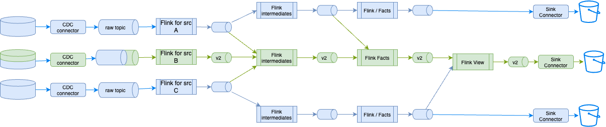

# Blue/Green Deployment Testing

The goals of the process presented in this note are to:

1. Reduce the impact on continuously running Flink statements: do not redeploy them when not necessary
1. Reduce the cost of dual environments, and running parallel logic
1. Simplify the overall deployment of Flink statement changes, and authorize quicker deployment time
1. Avoid redeploying stateful processing with big state to construct

## Context

In a classical blue-green deployment for ETL jobs, the CI/CD process updates everything and once the batch is done, the consumer of the data products, switches to new content. 

The following figure illustrates this approach at a high level:

<figure markdown="span">

<caption>**Figure 1**: Blue-Green for batch processing</caption>
</figure>

The processing includes reloading the data from the CDC output topics, using S3 Sink Connector to new bucket folder, then re-run the batch processing to create the gold records for consumption by the query engine to serve data to the business intelligence dashboard. When the blue data set is ready the query engine uses another location.

While in real-time processing the concept of blue-green deployment should be limited to the Flink pipeline impacted, as presented in [the pipeline management chapter](./pipeline_mgr.md).

The following figure illustrates a steady state of Flink statements processing data across source, intermediate, and fact tables. Raw data originates from Change Data Capture on a transactional database or from event-driven microservices utilizing the [transactional outbox pattern](https://jbcodeforce.github.io/eda-studies/patterns/#transactional-outbox). Given the volume of data injected into these raw topics and the necessity of retaining historical data for extended periods, these topics should be rarely re-created.

<figure markdown="span">

<caption>**Figure 2**:Real-time processing with Apache Flink within a Data Stream Plarform</caption>
</figure>

*To simplify the diagram above the sink connectors to the bucket and Iceberg or Delta Lake format are not presented, but it is assumed that they support upsert semantic.* 

Iceberg or Delta Lake tables, stored in Apache Parquet format, are directly queried by the query engine. Each pipeline writes records in table format to object storage, such as an S3 bucket, with tables partitioned within folders.

For example, the goal is to modify only the purple statements and redeploy them as part of a blue-green deployment. The general strategy for query evolution involves replacing the existing statement and its corresponding tables with a new statement and new tables. A straightforward approach is to use a release branch for a short period, modify the purple Flink statements, and then deploy them to development, testing, staging, and production environments. Once validated, these statements can be merged into the `main` branch.

<figure markdown="span">

<caption>**Figure 3**:Branching for Flink Statement updates</caption>
</figure>

Once unit tested, the pipeline deployment tool can deploy all impacted Flink statements without affecting existing "green" statements. The figure below illustrates changes to the internal logic of one intermediate statement and the fact creation statements. This approach can also be applied to dimension creation statements.

<figure markdown="span">

<caption>**Figure 4**:Flink logic update and impacted statements</caption>
</figure>

The Flink statement to create the intermediate table needs to have a new table name for the output processing. Both DDL and DML are changed. 

```sql
--- DDL intermediate table
create table int_sometable_v2 (
    --- all columns, new columns, ...
)
```

and the from and joins use existing source tables:

```sql
-- DML intermediate table
insert into int_sometable_v2 
select 
...
from src_a ...
join src_b ... 
join src_c  ...
```

The Flink Fact creation statement needs to modify the input table names and the output table names as join statements are stateful, and descendants needs to be modified. 

```sql
--- DML Fact table
insert into fact_table_name_v2
select 
...
from int_sometable_v2 
join int_table_name
```

For the 'view' creation, the Flink statement may be impacted as one of its source table is modified. So the same logic, as above, applies.

As a Data engineer during the tuning on the impacted statements, the pipeline dependencies can help assessing which statements to change. (e.g. `shift_left pipeline build-execution-plan --table-name <flink-intermediate> --may-start-descendants`) or the command: 

An other example, related to schema evolution occurs when the transactional data source changes. In this case, it is assumed the modifications are schema compatible with Full Transitive semantic. 

<figure markdown="span">

<caption>**Figure 5**: Transactional data change: schema evolution</caption>
</figure>

The CDC topic will contain records with both old and new schemas. The initial Flink statement, responsible for creating the source topic, is affected as it must now process new columns. This statement, which handles deduplication, filtering, primary key redefinition, and field encryption, is designed to process both the previous and new schema versions. Since this statement creates new records and reloads from the earliest offset, it will generate a version 2 of its output table, consequently impacting all its downstream dependencies.

???- info "Shift left commands to support the b/g deployment"
    * get config.yaml files for each target environment
    * set CONFIG_FILE environment variable accordingly
    * Verify impacted tables
    * Define the list of sink tables to modify


## Testing the blue/green deployment

### Intermediate statement update (Fig. 4)

1. Deploy a data product with n statements from source to facts and views
1. Send a sample of synthetic test data to source topics, validate they reach sink tables
1. Create a branch in git to support statement modification
1. Change intermediate statements to add a simple field or computation. It should create a v2.
1. Deploy from this branch to the target Confluent Cloud environment using `shift_left pipeline deploy --table-list-file-name statements-to-deploy.txt`
1. Verify no duplicate records are created from the new deployment in the output tables

### End to end update (Fig. 5)

This use case addresses schema modification from the source transactional database.

1. Change source SQL table by adding a column with default value, and with real value
1. Verify the CDC inject new records 

### Test rollback procedures
