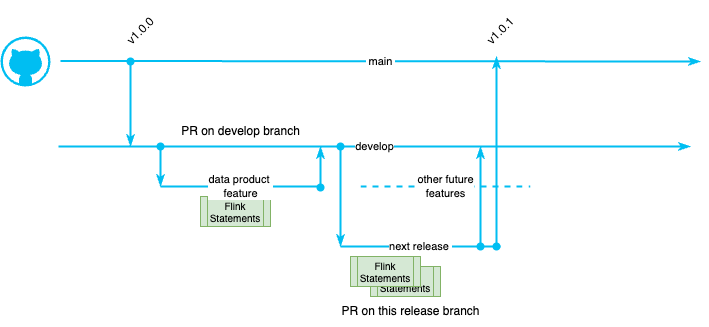

# Blue/Green Deployment Testing

The goals of the process presented in this note are to:

1. Reduce the impact on continuously running Flink statements: do not redeploy them when not necessary
1. Reduce the cost of dual environments (Kafka clusters, connectors), and running parallel logic
1. Simplify the overall deployment of Flink statements, and authorize quicker deployment time
1. Avoid redeploying stateful processing with big state to construct when not necessary

## Context

In a classical blue-green deployment, for ETL jobs, the CI/CD process updates everything and once the batch is done, the consumer of the data products, switches to new content. The following figure illustrates this approach at a high level:

<figure markdown="span">

<caption>**Figure 1**: Blue-Green for batch processing</caption>
</figure>
*Blue is the **production**, Green is the new logic to deploy*

The processing includes:

* reloading the data from the CDC output topics, 
* change S3 Sink Connector to write to new bucket folders
* re-run the batch processing to create the bronze, silver and gold records for consumption by the query engine to serve data to the business intelligence dashboard. 

When the blue data set is ready the query engine switch to an other location.

While in real-time processing the concept of blue-green deployment should only be limited to the Flink pipeline impacted, as presented in [the pipeline management chapter](./pipeline_mgr.md).

The following figure illustrates the Flink statements processing data across source, intermediate, and fact tables. 

<figure markdown="span">

<caption>**Figure 2**:Real-time processing with Apache Flink within a Data Stream Plarform</caption>
</figure>

On the left side, Raw data originates from Change Data Capture of a transactional database or from event-driven microservices utilizing the [transactional outbox pattern](https://jbcodeforce.github.io/eda-studies/patterns/#transactional-outbox). Given the volume of data injected into these raw topics and the need to retain historical data for extended periods, these topics should be rarely re-created.

*To simplify the diagram above the sink Kafka connectors to the object storage buckets and Iceberg or Delta Lake format are not presented, but it is assumed that those connectors support upsert semantic.* 

On right side, Iceberg or Delta Lake tables, stored in Apache Parquet format, are directly queried by the query engine. Each pipeline writes records in table format to object storage, such as an S3 bucket, with data partitioned within folders.

### Git flow process

As Flink SQLs are managed in a git repository, the process starts by the identification of the files modified from a certain time on a given branch.

As an example, the code release goal is to modify only the purple statements and redeploy them as part of a blue-green deployment. 

The general strategy for query evolution involves replacing the existing statement and its corresponding tables with a new statement and new tables. A straightforward approach is to use a release branch for a short time period, modify the purple Flink statements, and then deploy those statements to the development, staging environments. Once validated, these statements can be merged into the `main` branch where production deploymment may be done. 

The gitflow process may look like:

* **main branch**: This branch always reflects the production-ready, stable code. Only thoroughly tested and finalized code is merged into `main`. Commits are tagged in `main` with version numbers for easy tracking of releases.
* **develop branch**: This branch serves as the integration point for all new features and ongoing development. **Feature branches** are created from the `develop` branch and merged back into it after completion and PR review.
* Creating a **Release Branch**: When a set of features in develop is deemed ready for release, a new release branch is created from `develop`. This branch allows for final testing, bug fixes, and release-specific tasks without interrupting the ongoing development work in develop.
* **Finalizing the Release**: Only bug fixes and necessary adjustments are made on the `release` branch. New feature development is strictly avoided.
* **Merging and Tagging**: Once the release branch is stable and ready for production deployment, it's merged into two places:

    * `main`: The release branch is merged into main, effectively updating the production-ready code with the new release.
    * `develop`: The release branch is also merged back into develop to ensure that any bug fixes or changes made during the release preparation are incorporated into the ongoing development work.

* **Tagging**: After merging into main, the merge commit is tagged with a version number (e.g., v1.0.0) to mark the specific release point in the repository's history.
* **Cleanup**: After the release is finalized and merged, the release branch can be safely deleted

<figure markdown="span">

<caption>**Figure 3**:GitFlow branching for Flink Statement updates</caption>
</figure>

An alternate approach is to work directly to the `main` branch:

<figure markdown="span">

<caption>**Figure 3-bis**:Branching from main, for Flink Statement updates</caption>
</figure>

### Flink pipelines deployment

To illustrate the needs, we will start by this flink pipeline topology, running in production:

<figure markdown="span">
{ width=800 }
<caption>**Figure 4**:Current Flink Statements in production</caption>
</figure>

The process needs to get the list of changed flink statements from a given tag or date on a given git branch. The shift left tool can get the list of statements modified from a date:
    
```sh
# At the project folder level do:
shift_left project list-modified-files --project-path . --file-filter sql --since 2025-09-10 main
```

The above command may list that the tables: `int 3`, `fact 3` were modified and `view 1` was added. 

<figure markdown="span">
{ width=800 }
<caption>**Figure 4**:Flink logic update and impacted statements</caption>
</figure>

The command creates two files under the $HOME/.shift_left folder: 

| File name | Type |<div style="width:600px">Content</div> |
| --- | --- | --- |
| modified_flink_files.txt | json | contains a filelist with element like: <code>{"table_name": "p1_dim_c2",</br>"file_modified_url": "...pipelines/dimensions/p1/dim_c2/sql-scripts/ddl.dim_c2.sql",</br>"same_sql_content": false,"running": false }</code> |
| modified_flink_files_short.txt | txt | list of table name only |

In this then possible to assess the execution plan with:

```sql
shift_left pipeline build-execution-plan --table-list-file-name  ~/.shift_left/modified_flink_files_short.txt
```

To support blue-green deployment at the statement level, the table names need to be changed. 

The DDL Flink statements need to have a new table name with the next version postfix (e.g. int_3_v2). 

```sql
--- DDL intermediate table
create table int_3_v2 (
    --- all columns, new columns, ...
)
```
The DML with the `insert into` table name also needs to be modified.

```sql
-- DML intermediate table
insert into int_3_v2 
select 
...
from src_a ...
join src_b ... 
join src_c  ...
```

Any children of the modified statement needs to take into account the new table name. For example the fact table needs to use the new versioned intermediate table:

```sql
--- DML Fact table
insert into fact_3_v2
select 
...
from int_3_v2 
join int_1
```

For the 'view' creation, the Flink statement may be impacted as one of its source table is modified. So the same renaming logic applies.

During the tuning on the impacted statements, the pipeline dependencies can help assessing which statements to change. (e.g. `shift_left pipeline build-execution-plan --table-name <flink-intermediate> --may-start-descendants`).

The list of impacted table can be specified in a text file and specified as parameter to the deployment:

```sh
shift_left pipeline deploy --table-list-file-name statement_list.txt --may-start-descendants
```

## Different deployment scenarios

To demonstrate blue/green deployment we will take the [flink_project_demos git repo](https://github.com/jbcodeforce/flink_project_demos) as a source of a real-time processing using a Kimball structure.

???- info "Access to the the flink demos repository"
    Clone the [https://github.com/jbcodeforce/flink_project_demos](https://github.com/jbcodeforce/flink_project_demos).
    Set environment variables like:
    ```sh
    export FLINK_PROJECT=$HOME/Code/flink_project_demos/flink_data_products/
    export PIPELINES=$FLINK_PROJECT/pipelines
    ```


### Deploying a Fact or Dimension

The Fact or Dimension table deployment, means deploying an isolated sub-tree of a full pipeline, but with very limited set of children: mainly views or other facts. The scenario will be the same for new table deployment or update existing deployment. 

In the figure below, the new or to update fact is `fact_1`, with two dimensions as parents and one view as children. 

<figure markdown="span">

</figure>

The white flink statements are running, they could be part of the same product or not (common tables). The running ancestors to the `fact_1`

The commands to start the Flink ancestors that are not already running and the descendants look like:

```sh
# 1- always look at the execution plan
shift_left pipeline build-execution-plan --table-name fact_1 --may-start-descendants
# 2- deploy
shift_left pipeline deploy --table-name fact_1 --may-start-descendants
```

Recall that may-start-descendant will start statement within the same product. 

### Deploy a data product

As a data product, we mean, one to many Flink statements, integrated in a pipeline to serve a business/analytic data product. 

There are already existing 

## Source schema evolution 

In this example, we consider source schema evolution occurs when the transactional data source changes. In this case, it is assumed the modifications are schema compatible with Full Transitive semantic. 

<figure markdown="span">

<caption>**Figure 5**: Transactional data change: schema evolution</caption>
</figure>

The CDC topic will contain records with both old and new schemas. The initial Flink statement, responsible for creating the source topic, is affected as it must now process new columns. This statement, which handles deduplication, filtering, primary key redefinition, and field encryption, is designed to process both the previous and new schema versions. Since this statement creates new records and reloads from the earliest offset, it will generate a version 2 of its output table, consequently impacting all its downstream dependencies.

???- info "Shift left commands to support the b/g deployment"
    * get config.yaml files for each target environment
    * set CONFIG_FILE environment variable accordingly
    * Verify impacted tables
    * Define the list of sink tables to modify


## Testing the blue/green deployment

### Pre-deployment activities

* Get the **list of Pull Requests** to integrate in the release. (` git ls-remote origin 'pull/*/head'`)
* Get the **list of Flink modified tables** cross PRs to work on, using git commands
* **Create release branch** ('git checkout -b v1.0.1)
* Modify each Flink statement for the modified table so the DDLs and `insert into` of the DLMs use the new version postfix
* Propagate to the children Flink Statements to consume from the new versioned tables, continue recursively to the sink Kafka Connector.
* Get the list of tables impacted, review execution plan
* Verify resource (compute pool and CFU usage) availability
* Deploy to stage environment: an environment with existing Flink statements already running
    ```sh
    shift_left pipeline deploy --table-list-file-name statements-to-deploy.txt`
    ```

###  Data Quality Validation

The tools and practices need to address:

* **Schema Compatibility Checks:** Validate that new table versions maintain backward compatibility
* **Data Lineage Validation:** Ensure data flows correctly through the new pipeline versions
* **Record Count Validation:** Compare record counts between blue/green versions
* **Data Freshness Checks:** Validate that data processing latency hasn't increased

### Integration tests

Generate comprehensive test data for blue-green validation

* Send a sample of synthetic test data to source topics, validate they reach sink tables
* Verify no duplicate records are created from the new deployment in the output tables
* Validate all source records are processed
* Compare aggregations between blue/green versions
* Ensure event time processing remains consistent

### Test rollback procedures
