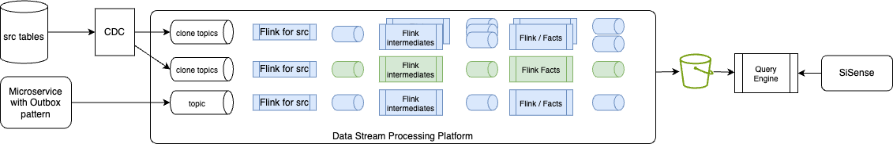
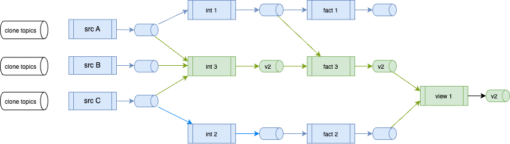

# Blue/Green Deployment Testing

In a classical blue-green deployment for ETL jobs, the CI/CD process updates everything and once the batch is done, the consumer of the data product, switches to new content. 

The following figure illustrates this approach at a high level:

<figure markdown="span">

<caption>**Figure 1**: Blue-Green for batch processing</caption>
</figure>

The processing includes reloading the data from the CDC output topics, using S3 Sink Connector to new bucket folder, then re-run the batch processing to create the gold records for consumption by the query engine to serve data to the business intelligence dashboard. When the blue data set is ready the query engine uses another location.


While in real-time processing the concept of blue-green deployment should be limited to the Flink pipeline impacted, as presented in [the pipeline management chapter](./pipeline_mgr.md).

The following figure presents a steady state of running Flink statements processing data in a source, intermediates, facts tables. The raw data comes from Change Data Capture on transactional database or from the event-driven microservice using the [transactional outbox pattern](https://jbcodeforce.github.io/eda-studies/patterns/#transactional-outbox). Due to the amount of data ingected in those raw topics, and the fact that historical data needs to be kept for a long period, those topics should be rarely re-created. 

<figure markdown="span">

<caption>**Figure 2**:Real-time processing with Apache Flink within a Data Stream Plarform</caption>
</figure>

*To simplify the diagram above the sink connectors to the bucket and Iceberg or Delta Lake format are not presented, but it is assumed that they support upsert semantic.* 

The Iceberg or Delta Lake tables are in Apache Parquet format and directly queried by the query engine. Each pipeline is writing records in table format, with an object storage like S3 bucket. Tables are partitioned within folders. 

As an example, the goal is to modify the purple statements and only redeploy them as part of the blue green deployment. The general strategy for query evolution is to replace the existing statement and the corresponding tables it maintains with a new statement and new tables. A simple approach is to use a release branch, for a short time period, modify the purple Flink statements, perform the deployments to dev, test, staging then production. Validated statements can be merged to `main` branch. 

<figure markdown="span">

<caption>**Figure 3**:Branching for Flink Statement updates</caption>
</figure>

Once unit tested, the pipeline deployment tool can deploy all the impacted Flink statements without impacting existing green statements. The figure below illustrates change to the internal logic to one intermediate statement, and fact creation statements. It can apply to dimension creation statement too. 

<figure markdown="span">

<caption>**Figure 4**:Flink logic update and impacted statements</caption>
</figure>

The Flink statement to create the intermediate table needs to have a new table name for the output processing. Both DDL and DML are changed. 

```sql
--- DDL intermediate table
create table int_sometable_v2 (
    --- all columns, new columns, ...
)
```

and the from and joins use existing source tables:

```sql
-- DML intermediate table
insert into int_sometable_v2 
select 
...
from src_a ...
join src_b ... 
join src_c  ...
```

The Flink Fact creation statement needs to modify the input table names and the output table names as join statements are stateful, and descendants needs to be modified. 

```sql
--- DML Fact table
insert into fact_table_name_v2
select 
...
from int_sometable_v2 
join int_table_name
```

For the 'view' creation, the Flink statement may be impacted as one of its source table is modified. So the same logic, as above, applies.

As a Data engineer during the tuning on the impacted statements, the pipeline dependencies can help assessing which statements to change. (e.g. `shift_left pipeline build-execution-plan --table-name <flink-intermediate> --may-start-descendants`) or the command: 

An other example, related to schema evolution occurs when the transactional data source changes. In this case, it is assumed the modifications are schema compatible with Full Transitive semantic. 

<figure markdown="span">

<caption>**Figure 5**: Transactional data change: schema evolution</caption>
</figure>

The CDC topic will have records with old and new schemas. The first Flink statement, used to create source topic, using deduplication logic, filtering, primary key re-definition, field encryption... is impacted as it needs to process new columns, but is able to process schema in previous version with the new version. As this statement is creating new records and will reload from the earliest offset then it create a version 2 of its output table and therefore all its descendants will be impacted.

???- info "Shift left commands to support the b/g deployment"
    * get config.yaml files for each target environment
    * set CONFIG_FILE environment variable accordingly
    * Verify impacted tables
    * Define the list of sink tables to modify


## Testing the blue/green deployment

### Intermediate statement update (Fig. 4)

1. Deploy a data product with n statements from source to facts and views
1. Send a sample of synthetic test data to source topics, validate they reach sink tables
1. Create a branch in git to support statement modification
1. Change intermediate statements to add a simple field or computation. It should create a v2.
1. Deploy from this branch to the target Confluent Cloud environment using `shift_left pipeline deploy --table-list-file-name statements-to-deploy.txt`

    * Test parallel deployment of new version
    * Verify zero-downtime deployment
    * Test rollback procedures
    * Validate state migration between versions

### End to end update (Fig. 5)