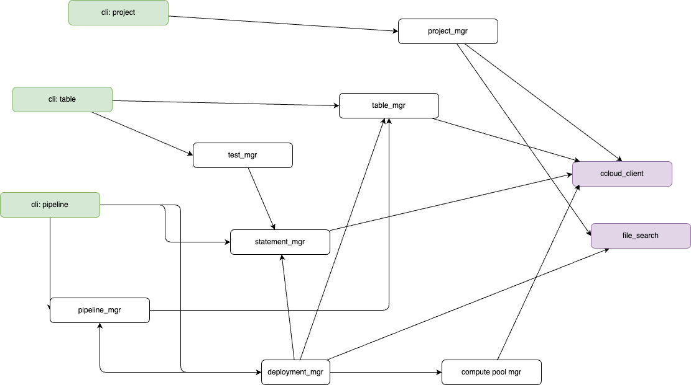

# Code structure and development practices

This chapter is about code design, code organization.

## The components

The `shift_left` CLI includes three main sections: 1/ project, 2/ table and 3/ pipeline

Those layers organize the code to support the main set of commands used during the development and maintenance of a Flink project.



The green components are the ones exposing features and commands to the end user via the CLI. The set of commands are documented [here](../command.md). This command documentation is created automatically.

The white components are a set of services to support the end-user facing commands and to offer functions to other services. They try to group concerns related to the following resources:

* Project
* Table
* Pipeline
* Flink Statement
* Confluent Cloud compute pools
* Tests for test harness
* Deployment and execution plan to manage execution plans.

Finally a set of lower level utilities are used to do some integration with local files and remote REST API.

### Code organization


The cli.py is based of [typer module](https://typer.tiangolo.com/) and is the top level access to the cli execution.

```sh
│   └── shift_left
│       ├── __init__.py
│       ├── cli.py
│       ├── cli_commands
│       │   ├── pipeline.py
│       │   ├── project.py
│       │   └── table.py
│       └── core
│           ├── __init__.py
│           ├── compute_pool_mgr.py
│           ├── connector_mgr.py
│           ├── deployment_mgr.py
│           ├── metric_mgr.py
│           ├── models
│           │   ├── __init__.py
│           │   ├── flink_compute_pool_model.py
│           │   └── flink_statement_model.py
│           ├── pipeline_mgr.py
│           ├── process_src_tables.py
│           ├── project_manager.py
│           ├── statement_mgr.py
│           ├── table_mgr.py
│           ├── templates
│           │   ├── common.mk
│           │   ├── config_tmpl.yaml
│           │   ├── create_table_skeleton.jinja
│           │   ├── dedup_dml_skeleton.jinja
│           │   ├── dml_src_tmpl.jinja
│           │   ├── makefile_ddl_dml_tmpl.jinja
│           │   ├── test_dedup_statement.jinja
│           │   └── tracking_tmpl.jinja
│           ├── test_mgr.py
│           └── utils
│               ├── __init__.py
│               ├── app_config.py
│               ├── ccloud_client.py
│               ├── file_search.py
│               ├── flink_sql_code_agent_lg.py
│               ├── ksql_code_agent.py
│               ├── naming_convention.py
│               ├── prompts
│               │   └── ksql_fsql
│               │       ├── mandatory_validation.txt
│               │       ├── refinement.txt
│               │       └── translator.txt
│               ├── report_mgr.py
│               ├── sql_parser.py
│               ├── table_worker.py
│               └── translator_to_flink_sql.py
```

## Unit testing

All test cases are under tests/ut and executed with

```sh
uv run pytest -s tests/ut
```

## Integration tests


All test cases are under tests/it and executed with

```sh
uv run pytest -s tests/it
```

## Classical scenarios

Be source to set environment variables for testing: 

```sh
export FLINK_PROJECT=./tests/data/flink-project
export PIPELINES=$FLINK_PROJECT/pipelines
export STAGING=$FLINK_PROJECT/staging
export SRC_FOLDER=./tests/data/dbt-project

export TOPIC_LIST_FILE=$FLINK_PROJECT/src_topic_list.txt 
export CONFIG_FILE=./tests/config.yaml
export CCLOUD_ENV_ID=env-
export CCLOUD_ENV_NAME=j9r-env
export CCLOUD_KAFKA_CLUSTER=j9r-kafka
export CLOUD_REGION=us-west-2
export CLOUD_PROVIDER=aws
export CCLOUD_CONTEXT=login-jboyer@confluent.io-https://confluent.cloud
export CCLOUD_COMPUTE_POOL_ID=lfcp-
```

### Work with SQL migration

1. Assess dependencies from the source project (see the tests/data/dbt-project folder) with the command:

    ```sh
    uv run python src/shift_left/cli.py table search-source-dependencies $SRC_FOLDER/facts/p7/fct_user_role.sql
    ```

1. Migrate a fact table and the others related ancestors to Staging using the table name that will be the folder name too.

    ```sh
    uv run python src/shift_left/cli.py table migrate user_role $SRC_FOLDER/facts/p7/fct_user_role.sql $STAGING --recursive
    ```

    The tool creates a folder in `./tests/data/flink-project/staging/facts/p7`, run the LLM , and generate migrate Flink SQL statement


### Work on pipeline deployment

1. Be sure the inventory is created: `uv run python src/shift_left/cli.py table build-inventory $PIPELINES`

## Developer's notes

The modules to support the management of pipeline is `pipeline_mgr.py` and `deployment_mgr.py`.

* Testing a Flink deployment see [test - ]


For deployment the approach is to build a graph from the table developer want to deploy. The graph includes the parents and then the children. The graph is built reading static information about the relationship between statement, and then go over each statement and assess if for this table the dml is running. For a parent it does nothing

## Logs

All the logs are under $HOME/.shift_left/logs folder with a sub folder matching the session: when the tool is started a trace like in the following example displays the folder name:
    ```sh
    --------------------------------------------------------------------------------
    | SHIFT_LEFT Session started at 2025-07-23 19:29:50 LOGS folder is : .../.shift_left/logs/07-23-25-19-29-50-MF86 
    ```

