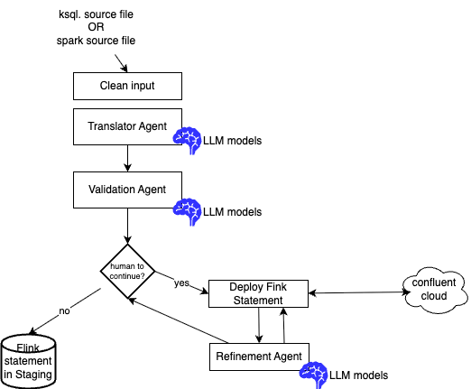
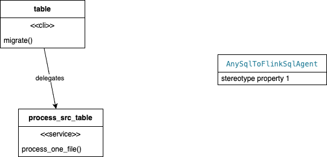

# SQL Translation Code Review

???- info "Version"
    Created Dec - 2024 
    Updated Nov 25 - 2025


The current AI based migration implementation supported by this tool enables migration of:

* dbt/Spark SQL to Flink SQL
* ksqlDB to Flink SQL

The approach uses LLM agents local or remote. This document covers the design approach, development environment setup, and how to execute test to tune the AI based SQL migrations, specially how to extend the AI prompts or workflows to get better results.

The implementation uses the OpenAI SDK, so different LLM models can be used, as soon as they support OpenAI. The `qwen3:30b` or `qwen-coder-30b-a3b-instruct-mlx-4bit` models can be used locally using Osaurus on Mac M3 Pro with 36GB RAM., or Ollama on Linux VM. Other models running remotely and supporting OpenAI APIs may be used too using your own API key. 

## Review the end-user lab

Review the [end user lab for ksql migration](../tutorial/migration_ai_lab.md) to understand the how the data engineer can use the tool for migration.


???- info "Example of Output"
    ```sh
    process SQL file ../src-dbt-project/models/facts/fct_examination_data.sql
    Create folder fct_exam_data in ../flink-project/staging/facts/p1

    --- Start translator AI Agent ---
    --- Done translator Agent: 
    INSERT INTO fct_examination_data
    ...
    --- Start clean_sql AI Agent ---
    --- Done Clean SQL Agent: 
    --- Start ddl_generation AI Agent ---
    --- Done DDL generator Agent:
    CREATE TABLE IF NOT EXISTS fct_examination_data (
        `exam_id` STRING,
        `perf_id` STRING,
    ...
    ```

For a given table, the tool creates one folder with the table name, a Makefile to help manage the Flink statements with Confluent CLI, a `sql-scripts` folder for the Flink DDL and DML statements. 

Example of created folders:

```sh
facts
    └── fct_examination_data
        ├── Makefile
        ├── sql-scripts
        │   ├── ddl.fct_examination_data.sql
        │   └── dml.fct_examination_data.sql
        └── tests
```

As part of the process, developers need to validate the generated DDL and update the PRIMARY key to reflect the expected key. This information is hidden in many files in dbt, and key extraction is not yet automated by the migration tools.

**Attention**, the DML is not executable until all dependent input tables are created.
  

* The ksqldb files to test, the migration from, are in [src/shift_left/tests/data/ksql-project/sources](https://github.com/jbcodeforce/shift_left_utils/tree/main/src/shift_left/tests/data/ksql-project/sources)


* Status of the working migration: See **test_ksql_migration.py::TestKsqlMigrations** code.

| Source | Status | Test Case |
| --- | --- | --- |
| splitting_tutorial | 4 DDLs ✅ 4 DMLs ✅ | test_ksql_splitting_tutorial |
| merge_tutorial | 3 DDLs ✅ 2 DMLs ✅ | test_ksql_merge_tutorial | 

## Current Agentic Approach

The current agentic workflow includes:

1. **Translate** the given SQL content to Flink SQL
1. **Validate** the syntax and semantics
1. **Generate** DDL derived from DML
1. **Get human validation** to continue or not the automation
1. **Deploy** and test with validation agents [optional]

The system uses validation agents that execute syntactic validation and automatic deployment, with feedback loops injecting error messages back to translator agents when validation fails.

## Architecture Overview

The multi-agent system with human-in-the-loop validation may use Confluent Cloud's Flink REST API to deploy a generated Flink statement. The following diagram represents the different agents working together:

<figure markdown='span'>

</figure>


Both agents support two validation modes:

1. **Mandatory Validation**: Always performed, checks syntax and best practices
2. **Live Validation**: Optional, validates against live Confluent Cloud for Apache Flink

The validation process includes:

- Syntax checking
- Semantic validation
- Iterative refinement (up to 3 attempts)
- Human-in-the-loop confirmation for live validation

When validation fails, agents use specialized refinement prompts to:

- Analyze the specific error message
- Consider validation history
- Generate corrected SQL that addresses the identified issues
- Provide explanations of changes made

This creates a self-correcting translation pipeline that improves accuracy through iterative feedback.

### Agent Roles

As agent is a combination of LLM reference, prompts, and tool definitions, there will be different implementation of those agents if we do ksqlDB to Flink SQL or from Spark to Flink.

#### KsqlDB to Flink agents

Supporting class of the workflow is [ksqlDB code agent](https://github.com/jbcodeforce/shift_left_utils/blob/main/src/shift_left/src/shift_left/ai/ksql_code_agent.py).

Each agent uses specialized system prompts stored in external files:

| Agent | Scope | Prompt File |
| --- | --- | --- |
| **Translator** | Raw KSQL to Flink SQL translation | `ai/prompts/ksql_fsql/translator.txt` |
| **Table Detection** | Identify multiple CREATE statements | `ai/prompts/ksql_fsql/table_detection.txt` |
| **Validation** | Validate Flink SQL constructs | `ai/prompts/ksql_fsql/mandatory_validation.txt` |
| **Refinement** | Fix deployment errors | `ai/prompts/ksql_fsql/refinement.txt` |

#### Code 

The `src/shift_left/ai` directory contains a suite of Large Language Model (LLM) agents designed to translate SQL from various dialects to Apache Flink SQL, with validation and iterative refinement capabilities.

#### Spark to Flink agents

Supporting class of the workflow is [Spark sql code agent](https://github.com/jbcodeforce/shift_left_utils/blob/main/src/shift_left/src/shift_left/ai/spark_sql_code_agent.py).

Same approach for spark SQL with the prompts being in the `ai/prompts/spark_fsql` folder.
Each agent uses specialized system prompts stored in external files:

| Agent | Scope | Prompt File |
| --- | --- | --- |
| **Translator** | Spark SQL to Flink SQL translation | `ai/prompts/spark_fsql/translator.txt` |
| **Table Detection** | Identify multiple CREATE statements | `ai/prompts/spark_fsql/table_detection.txt` |
| **Validation** | Validate Flink SQL constructs | `ai/prompts/spark_fsql/mandatory_validation.txt` |
| **Refinement** | Fix deployment errors | `ai/prompts/spark_fsql/refinement.txt` |

### Class diagram

The translation system follows a modular, agent-based architecture with three main components:

```
TranslatorToFlinkSqlAgent (Base Class)
├── SparkToFlinkSqlAgent (Spark SQL → Flink SQL)
└── KsqlToFlinkSqlAgent (KSQL → Flink SQL)
```





#### TranslatorToFlinkSqlAgent (`translator_to_flink_sql.py`)

**Purpose**: Base abstract class that defines the common interface and shared functionality for all SQL translation agents.

**Key Features**:

- **LLM Configuration**: Supports multiple models (Qwen, Mistral, Cogito) with configurable endpoints
- **Validation Pipeline**: Integrates with Confluent Cloud for Apache Flink for live SQL validation
- **Factory Pattern**: Provides `get_or_build_sql_translator_agent()` for dynamic agent instantiation
- **Error Handling**: Base framework for iterative refinement when validation fails


#### SparkToFlinkSqlAgent (`spark_sql_code_agent.py`)

**Purpose**: Specialized agent for translating Spark SQL to Flink SQL with enhanced error categorization and refinement.

**Translation Workflow**:

```
Spark SQL Input
    ↓
Translation Agent (Spark → Flink DML)
    ↓
DDL Generation Agent (DML → DDL)
    ↓
Pre-validation (Syntax Check)
    ↓
Confluent Cloud Validation
    ↓
Iterative Refinement (if errors)
    ↓
Final Flink SQL (DDL + DML)
```

**Key Features**:

- **Structured Responses**: Uses Pydantic models for consistent LLM output parsing
- **Error Categorization**: Classifies errors into specific types (syntax, function incompatibility, type mismatch, etc.)
- **Multi-step Validation**: Pre-validation + live validation with up to 3 refinement iterations
- **DDL Auto-generation**: Automatically creates table definitions from query logic
- **Validation History**: Tracks all validation attempts for debugging

**Specialized Models**:
```python
class SparkSqlFlinkDml(BaseModel):
    flink_dml_output: str

class SparkSqlFlinkDdl(BaseModel):
    flink_ddl_output: str
    key_name: str

class SqlRefinement(BaseModel):
    refined_ddl: str
    refined_dml: str
    explanation: str
    changes_made: List[str]
```

#### KsqlToFlinkSqlAgent (`ksql_code_agent.py`)

**Purpose**: Specialized agent for translating KSQL (Kafka SQL) to Flink SQL with multi-table support and comprehensive preprocessing.

**Translation Workflow**:
```
KSQL Input
    ↓
1. Input Cleaning (Remove DROP statements, comments)
    ↓
2. Table Detection (Identify multiple CREATE statements)
    ↓
3. Individual Translation (Process each statement separately)
    ↓
4. Mandatory Validation (Syntax + best practices)
    ↓
5. Optional Live Validation (Confluent Cloud)
    ↓
Final Flink SQL Collections (DDL[] + DML[])
```

**Key Features**:

- **Multi-table Processing**: Automatically detects and processes multiple CREATE TABLE/STREAM statements
- **Input Preprocessing**: Removes problematic statements and comments that confuse LLMs
- **Batch Translation**: Handles complex KSQL scripts with multiple related statements
- **Mandatory Validation**: Always performs syntax and best practices validation
- **File Snapshots**: Saves intermediate results for debugging and tracking

**Specialized Models**:
```python
class KsqlFlinkSql(BaseModel):
    ksql_input: str
    flink_ddl_output: Optional[str]
    flink_dml_output: Optional[str]

class KsqlTableDetection(BaseModel):
    has_multiple_tables: bool
    table_statements: List[str]
    description: str
```


## A test bed

The current project includes in the `tests/data/` folder some examples of Spark and ksql scripts.

```sh
tests/data/ksql-project
├── common.mk
├── flink-references
├── sources
│   ├── aggregation.ksql
│   ├── ddl-basic-table.ksql
│   ├── ddl-bigger-file.ksql
│   ├── ddl-filtering.ksql
│   ├── ddl-g.ksql
│   ├── ddl-geo.ksql
│   ├── ddl-kpi-config-table.ksql
│   ├── ddl-map_substr.ksql
│   ├── ddl-measure_alert.ksql
│   ├── dml-aggregate.ksql
│   ├── filtering.ksql
│   ├── geospacial.ksql
│   ├── merge_tutorial.ksql
│   ├── movements.ksql
│   ├── splitter.ksql
│   ├── splitting_tutorial.ksql
│   └── w2_processing.ksql
```

`flink-references` includes some migrated solutions used as reference for validating migrations.

## Prerequisites and Setup for Developers

[See the environment setup for developers section.](../contributing.md/#environment-set-up-for-developers)

* If using `uv` as python package manager (developers of the shift left tool), install it [using the documentation](https://docs.astral.sh/uv/getting-started/installation/).

## Using Cursor.ai

If oyu have access to Cursor with  `cloud-4.5-sonnet` model, a prompt like:
```sh
using @src/shift_left/src/shift_left/ai/prompts/ksql_fsql/translator.txt migrate the @src/shift_left/tests/data/ksql-project/sources/w2_processing.ksql  file
```

Will create a markdown file with the original ksql statements and the flink SQL matching statements at a higher speed than running qwen Ollama locally.
