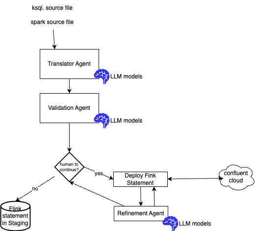

# SQL Translation Methodology

The current implementation supported by this tool is to be able to migrate

* dbt/Spark SQLs to Flink SQL statements
* ksqlDB to Flink SQL

The approch use LLM agents. This document covers the methodology, setup, and usage of the `shift_left` tool for automated SQL migrations.

The core idea, is to leverage LLM to understand the source SQL semantics and translate it to Flink SQL. 

Different LLM models can be used, the `qwen2.5-coder` model can be use locally using Ollama on Mac M3 pro with 36GB ram, but more recently the `qwen3-coder` is giving better results, but as it needs 512GB of ram so it can be accessed remotly. Same for the new KimiAI K2 model.

## Migration Context

As described in the [introduction](../index.md), at the high level, data engineers need to take a source project, define a new Flink project, perform migrations, run Flink statement deployments, manage pipeline and write and execute tests:

<figure markdown='span'>

<capture>Shift Left project system context</capture>
</figure>

For automatic migration, LLM alone might not be sufficient to address complex translations in an automated process. Agents help by specializing in specific steps with feedback loops and retries.

???- info "Complexity of language translation"
      For any programming language translation, we need to start with a corpus of code source. It can be done programmatically from the source language, then for each generated code, implement the semantically equivalent Flink SQL counterparts.

      The goal of the corpus creation is to identify common ksqlDB or Spark SQL constructs (joins, aggregations, window functions, UDFs, etc.), then manually translate a smaller, diverse set of queries to establish translation rules. Then using these rules, we can generate permutations and variations of queries. It is crucial to test the generated Flink SQL against a test dataset to ensure semantic equivalence.

      Build a query pair to represent the source to target set as corpus. For each query pair, include the relevant table schemas. This is vital for the LLM to understand data types, column names, and relationships. It is not recommended to have different prompts for different part of a SQL, as the LLM strength comes from the entire context. But still there will be problem for sql scripts that have a lot of line of code, as a 200+ lines script will reach thousand of tokens.

      To improve result accuracy, it is possible to use Supervised Fine-tuning techniques:

      * Fine-tune the chosen LLM on the generated code. The goal is for the LLM to learn the translation patterns and nuances between ksqlDB or Spark SQL and Flink SQL.
      * Prompt Engineering: Experiment with different prompt structures during fine-tuning and inference. A good prompt will guide the LLM effectively. The current implementation leverage this type of prompts: e.g., "Translate the following Spark SQL query to Flink SQL, considering the provided schema. Ensure semantic equivalence and valid Flink syntax."
      * To assess the evaluation it is recommended to add a step to the agentic workflow to validate the syntax of the generated Flink SQL. A better validation, is to assess semantic equivalence by assessing if the Flink SQL query produces the same results as the or ksqlDB, Spark SQL query on a given dataset.

      For validation it may be relevant to have a knowledge base of common translation error. When the Validation Agent reports an error, the Refinement Agent attempts to correct the Flink SQL. It might feed the error message back to the LLM with instructions to fix it. The knowledge Base should be populated with human-curated rules for common translation pitfalls.

      It may be important to explain why translation was done a certain way to better tune prompts. For complex queries or failures, a human review ("human in the loop") and correction mechanism will be essential, with the system learning from these corrections.

### Limitations

LLMs won't magically translate custom UDFs. This will likely require manual intervention or a separate mapping mechanism. The system should identify and flag untranslatable UDFs.

Flink excels at stateful stream processing. Spark SQL's batch orientation means translating stateful Spark operations (if they exist) to their Flink streaming counterparts would be highly complex and likely require significant human oversight or custom rules.

### Spark SQL to Flink SQL

While Spark SQL is primarily designed for batch processing, even if it also supports streaming via micro-batching. Most basic SQL syntax (SELECT, FROM, WHERE, JOIN) is similar between Spark and Flink.

Flink SQL has more advanced windowing capabilities. For example:

```sql
-- Spark SQL (using DataFrame API)
val windowedDF = df.withWatermark("timestamp", "1 minute") .groupBy(window(col("timestamp"), "5 minutes")) .count()

-- Flink SQL
SELECT COUNT(*) FROM users
GROUP BY TUMBLE(timestamp, INTERVAL '5' MINUTE);
```

* Example of command to migrate a Spark SQL
  ```sh
  shift_left table migrate customer_journey $SRC_FOLDER/src_customer_journey.sql $STAGING --source-type spark
  ```
  
### ksqlDB to Flink SQL

ksqldb has some SQL constructs but this is not a ANSI SQL engine. It is highly integrated with Kafka and uses keyword to define such integration. The migration and prompts need to support migration examples outside of the classical select and create table.

```sh
shift_left table migrate w2_processing $SRC_FOLDER/w2processing.ksql $STAGING --source-type ksql
```

## Current Approach

The current Agentic workflow includes:

1. **Translate** the given SQL content
1. **Validate** the syntax and semantics
1. **Generate** DDL derived from DML
1. **Get human validation** to continue or not the automation
1. **Deploy** and test with validation agents [optional]

The system uses validation agents that execute syntactic validation and automatic deployment, with feedback loops injecting error messages back to translator agents when validation fails.

## Architecture Overview

The multi-agent system with human-in-the-loop validation may use Confluent Cloud for Flink REST API to deploy a generated Flink statement:

<figure markdown='span'>

</figure>

### Agent Roles

| Agent | Scope | Prompt File |
| --- | --- | --- |
| **Translator** | Raw KSQL to Flink SQL translation | `core/utils/prompts/ksql_fsql/translator.txt` |
| **Table Detection** | Identify multiple CREATE statements | `core/utils/prompts/ksql_fsql/table_detection.txt` |
| **Validation** | Validate Flink SQL constructs | `core/utils/prompts/ksql_fsql/mandatory_validation.txt` |
| **Refinement** | Fix deployment errors | `core/utils/prompts/ksql_fsql/refinement.txt` |

Same approach for spark SQL with the prompts being in the `core/utils/prompts/spark_fsql` folder.

## Prerequisites and Setup

### Environment Setup

1. Clone the [shift_left_utils git repository](https://github.com/jbcodeforce/shift_left_utils)
  ```sh
  git clone https://github.com/jbcodeforce/shift_left_utils
  ```

1. Install and [uv](https://github.com/astral-sh/uv) for python package management
    ```sh
    # Install uv if not already installed
    curl -LsSf https://astral.sh/uv/install.sh | sh
    # To update existing version
    uv self update
    ```

1. **Python Environment**: Ensure Python 3.12+ and create a virtual environment
   ```bash
   uv venv --python 3.12.0
   source .venv/bin/activate  # On Windows WSL: .venv\Scripts\activate
   ```

1. **Install Dependencies**: Use `uv` package manager (recommended)
   ```bash
   cd src/shift_left
   # Install project dependencies
   uv sync
   ```

1. **Install shift_left Tool**:
   ```bash
   # under src/shift_left
   uv tool install dist/shift_left-0.1.28-py3-none-any.whl
   # Verify installation
   shift_left --help
   shift_left version
   ```

    you can use `pip`, too if you have an existing python environment:
    ```sh
    pip install src/shift_left/dist/shift_left-0.1.28-py3-none-any.whl
    ```

1. Be sure to be logged in Confluent Cloud, and have defined at least one compute pool.

1. Create an Openrouter.ai api_key: [https://openrouter.ai/](https://openrouter.ai/), the model used is `qwen/qwen3-coder:free` which is free to use.

### Configuration File Setup

* Create a configuration file (e.g., `config-ccloud.yaml`):
  ```sh
  cp src/shift_left/src/shift_left/core/templates/config_tmpl.yaml ./config-ccloud.yaml
  ```
* Update the content of the config-ccloud.yaml to reflect your Confluent Cloud environment. (for the commands used for migration you do not need kafka setting, )
  ```yaml
  # Confluent Cloud Configuration
  confluent_cloud:
    api_key: "YOUR_API_KEY"
    api_secret: "YOUR_API_SECRET"
    organization_id: "YOUR_CLUSTER_ID"
    environment_id: "YOUR_ENVIRONMENT_ID"
    url_scope: public
    region: "YOUR_REGION"
    provider: aws
  flink:
    flink_url: flink....confluent.cloud
    compute_pool_id: "YOUR_COMPUTE_POOL_ID"
    api_key: "YOUR_API_KEY"
    api_secret: "YOUR_API_SECRET"
    catalog_name: "envionment_name"
    database_name: "kafka_cluster_name"
  ```


* Set the following environment variables before using the tool can be done by :
    ```sh
    cp src/shift_left/src/shift_left/core/templates/set_env_temp ./set_env
    ```

    modify the CONFIG_FILE, FLINK_PROJECT, SRC_FOLDER, SL_LLM_* variables

* source it:
    ```sh
    source set_env
    ```

* Validate config-ccloud.yaml

```bash
shift_left project validate-config
```

## Migration Workflow

### 1. Project Initialization

Create a new target project to keep your flink statements and pipelines (e.g. my-flink-app):

```bash
# Initialize project structure
shift_left project init <your-project> </path/to/your/folder>
# example 
shift_left project init my-flink-app $HOME/Code
```

You should get:
```sh
my-flink-app
├── README.md
├── docs
├── pipelines
│   ├── common.mk
│   ├── dimensions
│   ├── facts
│   ├── intermediates
│   ├── sources
│   └── views
├── sources
└── staging
```

### 2. Prepare Source Files

* Copy your KSQL files to the sources directory:

```bash
# Copy KSQL files
cp *.ksql ${SRC_FOLDER}/
```

### 3. Migration Execution

#### Basic Table Migration

```bash
# Migrate a simple table
shift_left table migrate basic_user_table $SRC_FOLDER/user-table.ksql $STAGING --source-type ksql 
```

The command generates:
```sh
# ├── staging/basic_user_table/sql-scripts
# │   ├── ddl.basic_user_table.sql     # Flink DDL
# │   ├── dml.basic_user_table.sql     # Flink DML (if any
```

### 4. Validation and Deployment

```bash
# Deploy to Confluent Cloud for Flink
cd ${STAGING}/basic_user_table

# Deploy DDL statements
make create_flink_ddl

# Deploy DML statements  
make create_flink_dml
```

### 5. Prepare for pipeline management

Flink statements have dependencies, so it is important to use shift_left to manage those dependencies:

* Run after new table are created
  ```sh
  shift_left table build-inventory
  ```

* Build all the metadata
  ```sh
  shift_left pipeline build-all-metadata 
  ```


* Verify an execution plan
  ```sh
  shift_left pipeline build-execution-plan --table-name <>
  ```


### 6. Next

* Organize the Flink statement into a pipeline folder may be using sources, intermediates, dimensions and facts classification. Think about data product. So a candidate hierarchy may look like
  ```sh
  my-flink-app

  ├── pipelines
  │   ├── common.mk
  │   ├── dimensions
  │   │   ├── data_product_a
  │   ├── facts
  │   │   ├── data_product_a
  │   ├── intermediates
  │   │   ├── data_product_a
  │   ├── sources
  │   │   ├── data_product_a
  │   │       ├── src_stream
  │   │       │   ├── Makefile
  │   │       │   ├── pipeline_definition.json
  │   │       │   ├── sql-scripts
  │   │       │   │   ├── ddl.src_stream.sql
  │   │       │   │   └── dml.src_stream.sql
  │   │       │   ├── tests
  │   ├── views
          └── data_product_a
  
  ```

* Add unit tests per table (at least for the complex DML ones) ([see test harness](../test_harness.md))
* Add source data into the first tables of the pipeline 
* Verify the created records within the sink tables.
