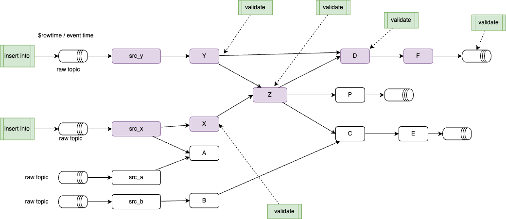

# Testing Flink Statement in isolation

???- info "Version"
    Created March 21 - 2025 
    Updated Sept 24 -2025

The goals of this chapter is to present the requirements, design and how to use the shift_left test harness commands for Flink statement validation in the context of Confluent Cloud Flink. The tool is packaged as a command in the `shift-left` CLI.

```sh
shift_left table --help

# three features are available:
init-unit-tests   Initialize the unit test folder and template files for a given table. It will parse the SQL statements to create the insert statements for the unit tests. It is using the table inventory to find the table folder for the given table name.
run-unit-tests    Run all the unit tests or a specified test case by sending data to `_ut` topics and validating the results
delete-unit-tests      Delete the Flink statements and kafka topics used for unit tests for a given table.
```

[See usage paragraph](#unit-test-usage-and-recipes)

## Context

We should differentiate two types of testing: Flink statement developer's tests, like **unit testing** of one flink statement, and Flink statement **integration tests** which group multiple Flink statements and process data end-to-end.

The objectives of a test harness for developers and system testers, is to validate the quality of a new Flink SQL statement deployed on Confluent Cloud for Flink and therefore address the following needs:

1. be able to deploy a unique flink statement under test (the ones we want to focus on are DMLs, or CTAS)
1. be able to generate test data from the table definition and DML script content - with the developers being able to tune generated test data for each test cases.
1. produce synthetic test data for the n source tables using SQL insert statements or via csv files.

    <figure markdown="span">
    
    </figure>

1. validate test result by looking at records in the output table(s) of the Flink statement under test and applying conditions on data to claim the test failed or succeed. As an example:
  ```sql
  with result_table as (
    select * from fct_orders
    where id = 'order_id_1' and account_name = 'account of bob'
  ) 
  SELECT CASE WHEN count(*)=1 THEN 'PASS' ELSE 'FAIL' END from result_table;
  ```

1. the flow of defining input data and validation scripts is a test case. The following Yaml definition, define one test with input and output SQL references:
  ```yaml
  - name: test_p5_dim_event_element_1
    inputs:
    - table_name: tenant_dim
      file_name: ./tests/insert_tenant_dim_1.sql
      file_type: sql
    ...
    outputs:
    - table_name: p5_dim_event_element
      file_name: ./tests/validate_p5_dim_event_element_1.sql
      file_type: sql
  ```

1. Support multiple testcase definitions as a test suite. Test suite execution may be automated for non-regression testing to ensure continuous quality.
1. Once tests are completed, tear down tables and data.
  ```sh
  shift_left table delete-unit-tests <table-name>
  ```
1. Do not impact other tables that may be used to do integration tests within the same Kafka Cluster. For that there is a postfix string add to the name of the tables. This postfix is defined in the config.yaml file as:
  ```yaml
  app:
    post_fix_unit_test: _ut
  ```
  This post_fix can be anything, but try to use very short string.

The following diagram illustrates the global infrastructure deployment context:

<figure markdown="span">
{ width=750 }
<figcaption>Test Harness environment and scope</figcaption>
</figure>


* One the left, the developer's computer is used to run the test harness tool and send Flink statements to Confluent Cloud environment/ compute pool using the REST API. The Flink API key and secrets are used. 
* The Flink statement under test is the same as the one going to production, except the tool may change the name of the source tables to use the specified postfix. The postfix is defined in the config.yaml file as `app.post_fix_unit_test` parameter.
* The green cylenders represent Kafka Topics which are mapped to Flink source and sink tables. They are defined specifically by the tool.
* As any tables created view Flink on Confluent Cloud have schema defined in schema registry, then schema context is used to avoid conflict within the same cluster. 

The following diagram illustrates the target unit testing environment:

<figure markdown="span">
{ width=750 }
<figcaption>Deployed Flink statements for unit testing</figcaption>
</figure>


## Unit-test Usage and Recipes

* Select a table to test the logic from. This test tool is relevant for DML with complex logic. In this example `c360_dim_users` has a join between two tables: `src_c360_users`, `c360_dim_groups`:
  ```sql
  INSERT INTO c360_dim_users
    with valid_users as (
      SELECT * FROM src_c360_users
      WHERE user_id IS NOT NULL and group_id IS NOT NULL and tenant_id IS NOT NULL
    )
      SELECT
      -- columns hidden
      FROM valid_users u
      LEFT JOIN c360_dim_groups g
      ON  u.tenant_id = g.tenant_id and u.group_id = g.group_id
  ```

* Verify the ddl and dml files for the selected table are defined under `sql-scripts`, verify the table inventory exists and is up-to-date, if not run `shift_left table build-inventory $PIPELINES`
* Initialize the test code by running the following command: Do not create a lot of test cases upfront, you can add more tests later.
  ```sh
  shift_left table init-unit-tests <table_name> --nb-test-cases 1 
  # example with the user_role (using the naming convention)
  shift_left table init-unit-tests c360_dim_users --nb-test-cases 1
  ```

  To make it simple, it is recommended to define only one test case.

* For each input table, of the dml under test, there will be ddl and dml script files created with the numbered postfix to match the unit test, it supports. For example for the test case with id = 1 the name of the sql is:  `insert_c360_dim_groups_1.sql`) for inserting records to the table `c360_dim_groups`.  For each of those input tables, a foundation ddl is created to create the table with "_ut" postfix, this is used for test isolation: `ddl_c360_dim_groups.sql`, `ddl_src_c360_users.sql`
  ```sh
  dim_users
  ├── Makefile
  ├── sql-scripts
  │   ├── ddl.c360_dim_user.sql
  │   └── dml.c360_dim_user.sql
  ├── tests
  │   ├── README.md
  │   ├── ddl_c360_dim_groups.sql
  │   ├── ddl_src_c360_users.sql
  │   ├── insert_c360_dim_groups_1.sql
  │   ├── insert_c360_dim_groups_1.yaml
  │   ├── insert_src_c360_users_1.sql
  │   ├── insert_src_c360_users_1.yaml
  │   ├── test_definitions.yaml
  │   ├── validate_c360_dim_users_1.sql
  │   └── validate_c360_dim_users_2.sql
  ```

*Remarks: the yaml files are not yet used, it is a future extension*

The test cases are created as you can see in the `test_definitions.yaml`
  ```yaml
    foundations:
    - table_name: c360_dim_groups
      ddl_for_test: ./tests/ddl_c360_dim_groups.sql
    - table_name: src_c360_users
      ddl_for_test: ./tests/ddl_src_c360_users.sql
    test_suite:
    - name: test_c360_dim_users_1
      inputs:
      - table_name: c360_dim_groups
        file_name: ./tests/insert_c360_dim_groups_1.sql
        file_type: sql
      - table_name: src_c360_users
        file_name: ./tests/insert_src_c360_users_1.sql
        file_type: sql
      outputs:
      - table_name: c360_dim_users
        file_name: ./tests/validate_c360_dim_users_1.sql
        file_type: sql
  ```

The two test cases use different approaches to define the data: SQL and CSV files. This is a more flexible solution, so the tool can inject data, as csv rows. The csv data may come from an extract of the kafka topic records.

* Data engineers **update the content** of the insert statements and **the validation statements** to reflect business requirements. Once done, try unit testing with the command:
  ```sh
  shift_left table  run-unit-tests <table_name> --test-case-name test_<table_name>_1 
  ```

A test execution may take some time as it performs the following steps:

1. Read the test definition.
1. Execute the ddl for the input tables with '_ut' postfix or using the postfix as defined in the config.yaml parameter named: `app.post_fix_unit_test`
1. Insert records in input tables.
1. Create a new output table with the specified postfix.
1. Deploy the DML to test
1. Deploy the validation SQL for each test case.
1. Build test report


This execution is re-entrant, which means it will NOT recreate the DDLs if the topics are already present, and will skip to the next step. 

Here is an example of outputs: 3 DDLs run successfuly, and the dml under tests is now running ready to generate results.
```
------------------------------------------------------------
1. Create foundation tables for unit tests for c360_dim_users
------------------------------------------------------------
May execute foundation statement for c360_dim_groups /Users/jerome/Documents/Code/shift_left_utils/src/shift_left/tests/data/flink-project/pipelines/dimensions/c360/dim_users/./tests/ddl_c360_dim_groups.sql on lfcp-xvrvmz
Execute statement dev-ddl-c360-dim-groups-jb  on: lfcp-xvrvmz
Executed statement for table: c360_dim_groups_jb status: COMPLETED

May execute foundation statement for src_c360_users /Users/jerome/Documents/Code/shift_left_utils/src/shift_left/tests/data/flink-project/pipelines/dimensions/c360/dim_users/./tests/ddl_src_c360_users.sql on lfcp-xvrvmz
Execute statement dev-ddl-src-c360-users-jb  on: lfcp-xvrvmz
Executed statement for table: src_c360_users_jb status: COMPLETED

Execute statement dev-ddl-c360-dim-users-jb  on: lfcp-xvrvmz
Executed statement for table: c360_dim_users_jb status: COMPLETED

Wait dev-dml-c360-dim-users-jb deployment, increase wait response timer to 20 seconds
Execute statement dev-dml-c360-dim-users-jb  on: lfcp-xvrvmz
Executed statement for table: c360_dim_users_jb status: RUNNING
```

The second part is for the insert statements which should COMPLETE
```
----------------------------------------
2. Deploy insert into statements for unit test test_c360_dim_users_1
----------------------------------------
Run insert test data for c360_dim_groups_jb
Wait dev-ins-1-c360-dim-groups-jb deployment, increase wait response timer to 20 seconds
Execute statement dev-ins-1-c360-dim-groups-jb  on: lfcp-xvrvmz
Executed statement for table: c360_dim_groups_jb status: COMPLETED

Run insert test data for src_c360_users_jb
Execute statement dev-ins-1-src-c360-users-jb  on: lfcp-xvrvmz
Executed statement for table: src_c360_users_jb status: COMPLETED
```


The tool is creating a `*-test-suite-result.json` file under the CLI session folder. 


* Run your validation script:
  ```sh
  shift_left table run-validation-tests  <table_name> --test-case-name <test_case_1> 
  ```

* Clean the tests artifacts created on Confluent Cloud with the command:
  ```sh
  shift_left table delete-unit-tests <table_name>
  ```

### Running with more data

The second test case created by the `shift_left table init-unit-tests ` command uses a csv file to demonstrate how the tool can manage more data. It is possible to extract data from an existing topics, as csv file. The tool, as of now, is transforming the rows in the csv file as SQL insert values. 

In the future it could direcly write to a Kafka topics that are the input tables for the dml under test.

Data engineers may use the csv format to create a lot of records. Now the challenge will be to define the validation SQL script, but this is another story.

### Unit Test Harness FAQ

???- question "What does 'foundation tables for unit tests' mean?"
    Each input tables for a given DML to tests are foundation tables, as the DDL of the current DML. So create foundation tables means running all the DDLs. These are run only one time. As an example this is the part of the test_definition that will be run:
    ```yaml
    foundations:
    - table_name: c360_dim_groups
      ddl_for_test: ./tests/ddl_c360_dim_groups.sql
    - table_name: src_c360_users
      ddl_for_test: ./tests/ddl_src_c360_users.sql
    ```
    + the DDL of the `c360_dim_users` table as the name change.

???- question "Where are the logs? (the session folder)"
    When shift left is started, there is logs folder created under your `$HOME/.shift_left/logs` folder, and the name is specified at the beginning of the trace: `10-09-25-16-59-31-IZH7`
    ```
    --------------------------------------------------------------------------------
    | SHIFT_LEFT - CONFIG_FILE used: ./tests/config-ccloud.yaml - Session started at 2025-10-09 16:59:31 - LOGS folder is : /Users/jerome/.shift_left/logs/10-09-25-16-59-31-IZH7 |
    --------------------------------------------------------------------------------
    ```
    The logs is there with the name of the file = to `shift_left_cli.log`. Other file may be present, like the `*-test-suite-result.json`

???- question "Should I change the name of the tables in the unit test scripts?"
    NO. The table names of the generated SQL are using _ut. This has to be persisted in the git repository. The table names are changed automatically when running the tests, and the tool uses the config.yaml `app.post_fix_unit_test` to overwrite, at deployment time, those names.

???- question "How to re-run my validation SQL?"
    Validation SQL script may take some time to tune and make it works. This is why the command: `shift_left table run-validation-tests  <table_name> --test-case-name <test_case_1> ` is re-entrant and will reexecute the SQL. It will delete Flink previous validation statement.

???- question "When I discover the input data is not coherent, what can I do?"
    Better to delete all the test artifacts with the command
    ```sh
    shift_left table delete-unit-tests <table_name>
    ```
    and then re-run the unit test.

???- question "Is it possible to have two validation scripts for the same input?"
    Yes, and it is even recommended to simplify the validation SQLs as they become big. The test_definition supports this well as you can just specify the same input sqls and use another validation reference. It will be in another test case element.
    ```yaml
      test_suite:
      - name: test_c360_dim_users_1
        inputs:
        - table_name: c360_dim_groups
          file_name: ./tests/insert_c360_dim_groups_1.sql
          file_type: sql
        - table_name: src_c360_users
          file_name: ./tests/insert_src_c360_users_1.sql
          file_type: sql
        outputs:
        - table_name: c360_dim_users
          file_name: ./tests/validate_c360_dim_users_1.sql
          file_type: sql
      - name: test_c360_dim_users_2
        inputs:
        - table_name: c360_dim_groups
          file_name: ./tests/insert_c360_dim_groups_1.sql
          file_type: sql
        - table_name: src_c360_users
          file_name: ./tests/insert_src_c360_users_1.sql
          file_type: sql
        outputs:
        - table_name: c360_dim_users
          file_name: ./tests/validate_c360_dim_users_2.sql
          file_type: sql
    ```

## Integration tests

### Context 

The logic of integration tests is to validate end-to-end processing for a given pipeline and assess the time to process records from sources to facts or sink tables. Integration tests are designed to test end-to-end data flow across multiple tables and pipelines within a project. This is inherently a project-level concern and not a pipelines concern.

The approach is to keep those integration tests at the same level as the `pipelines` folder of the project, but organize the tests by data product. As an example for the data product, `c360`, and the analytical data build from the `fact_users`, the hierarchy will look like:

```sh
pipelines
tests
  └── c360
      └── fact_users
```

The content of the folder will include all the insert statements for the raw topics of the pipeline and the validation SQLs for intermediates and facts. 

The synthetic data are injected at the raw topics with unique identifier and time stamp so it will be easier to develop the validation script and compute the end-to-end latency:

The following figure illustrates those principles:



The data to build is for the sink `F`, so integration tests will validate all the purple Flink statements which are ancestors to `F`. The integration tests insert data for the two input raw topics used to build the `src_x` ans `src_y`.

Intermediate validations may be added to assess the state of the intermediate Flink statement output, but the most important one is the SQL validation of the output of `F`. 

The tool supports to create insert SQLs and the last validation script. But there are challenges to address. It was assessed that we could use Kafka header to add to metadata attribute: a unique id and a timestamp. The classical way to do so, is to alter the raw tables with:

```sql
ALTER TABLE raw_groups add headers MAP<STRING, STRING> METADATA;
```

Then each input statement to the raw topic includes a map construct to define the correlation id and the timestamp:

```sql
INSERT INTO raw_users (user_id, user_name, user_email, group_id, tenant_id, created_date, is_active, headers) VALUES
-- User 1: Initial record
('user_001', 'Alice Johnson', 'alice.johnson@example.com', 'admin', 'tenant_id_001', '2023-01-15', true, map('cor_id', 'cor_01', 'timestamp', now()));
```

but this approach means we need to modify all the intermediate Flink statements to pass those metadata to their output table and the declare the headers in the DDL of the output table(s). 

```sql
insert to output_table
select
  -- ... columns to match output_table
  headers
from final_table;
```

Also at each intermediate statement there will be the following challenges to address:

* On any join, which correlation id to use, or does a concatenation approach being used?
* Which timestamp to use from the two tables joined? min or max?
  ```sql
  select
    -- ..
    max(a.headers.timestamp, b.header.timestamp)
  from table_a a
  left join table_b b on a.condition = b.condition
  ```


* Finally how to ensure that, at each table, records are created to the output table(s): it is possible that input record may be filtered out, and not output record is created, meaning the latency is becoming infinite.

So the solution is to adapt and use existing fields in the input to set a `cor_id` and a `timestamp`. 

Instead if generating a timestamp. when the raw_topic is the outcome of Debezium CDC, there is a the `ts_ms` field that can be used as timestamp, but it also needs to be propagated down the sink.

### Initialize the integration test 

The command to create a scaffolding:

```sh
shift_left project init-integration-tests F
```

### Running the integration tests:

```sh
shift_left project run-integration-tests F
```

### Tearsdown:

```sh
shift_left project delete-integration-tests F
```

With these capabilities, we can also assess the time to process records from source to sink tables.

### Feature tracking

- [x] init tests folder, with data product and sink table folder
- [ ] For test isolation in shared environment and cluster, the name of the table will have a postfix defined in config.yaml and defaulted with `_it`
- [ ] get all alter table for the raw tables
- [ ] get all the insert synthetic data for raw_table
- [ ] build a validation SQL query to validate the message arrive and compute a delta, insert this to a it_test_topic
- [ ] Support Kafka consumer created for output sink table

## Unit Test Harness Code Explanation

The classes to support unit tests processing are:

{ width=900 }
