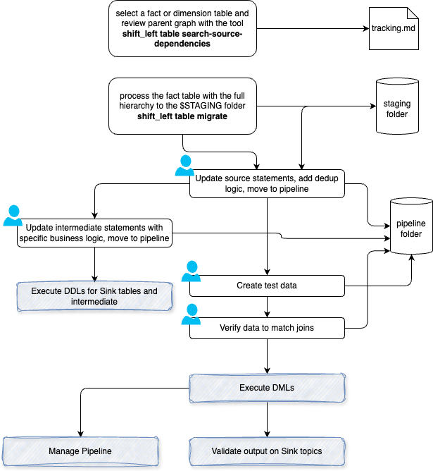

# Flink Project Development Process

???- info "Version"
    Created February 2025 - 

This chapter details a direct migration path from batch ETL jobs processing fact tables to source tables, into Flink SQL pipelines. Prior project setup, as outlined in the [provided note](./setup.md), is required.

Source project can be standard SQL project, Data Build Tool project, or even ksql project. The source project folder is referenced with the $SRC_FOLDER environment variable. 

The migration method begins with a fact table. At a high level, the development flow is illustrated in the following diagram:

1. Start with a Fact or Dimension table. Process the fact table through the entire hierarchy up to the sources, and save the outcomes to an intermediate staging folder, as manual work will be required. The command to do so is [shift_left table migrate](./command.md/#table-migrate)
2. From the generated code, update the Fink statements for the source tables. Complete the deduplication logic in the generated DML to reflect the dbt logic applied for deduplication. The new table should use an upsert append log with a specific primary key. Since the source topic may not have the same primary key, it is crucial to perform primary key refactoring. If you do not have access to the original source topic, a DDL will be created in the tests folder for unit testing. The DDL content, primarily column definitions, can be inferred from the `show create table` command. Move the resulting folder to pipeline/sources.
3. Remove unnecessary intermediate steps, specifically those involving deduplication logic, as this has already been addressed in the source DML statements. Update any other intermediate statements with specific business logic and move the resulting statements to the pipeline/intermediates folder.
4. Execute any DDLs for the sink tables and intermediate tables.
5. If the source topics do not contain records, use the tool to create test data only at the source table level. Ensure consistency in the data for the various join conditions.
6. Execute the remaining DMLs.
7. Validate the data in the output topics designated as sink tables.--- This revision improves clarity and structure while maintaining the original meaning.
8. Start to manage pipelines, see [dedicated session in recipes chapter](./recipes.md/#pipeline-deployment)

[>> next see recipe](./recipes.md) or [shift_left command references](./command.md)