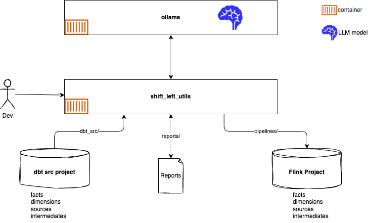
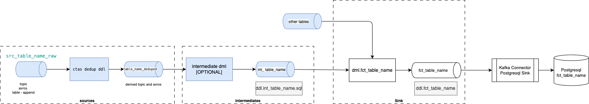

# Shift Left tools and practices

???- info "Versions"
    * Created 12/2024
    * Updated 02/23: new pipeline helper functions to support sink to source pipeline metadata creation or source to sink.
    * Update 06/08: New features, and explanation in recipes for better manage Large Flink project.
    * Update 07/24: v0.1.28: blue/green doc see [CHANGELOG file.](https://github.com/jbcodeforce/shift_left_utils/blob/main/CHANGELOG.md)

Recognizing the increasing need for real-time data processing, driven by demands for immediate insights and responsive applications (ultimately benefiting the end customer), this initiative tackles the challenging task of migrating traditional batch pipelines to modern, stream-based architectures using Apache Flink. 

The approach, supported that the tools in this repository, centers around the data engineer, and Site Reliability Engineers as the "users". By providing intelligent tooling, leveraging the power of Large Language Models and AI Agents, we aim to significantly reduce time associated with this complex refactoring. The utilities within this repository, focusing on SQL translation and Flink project organization aligned with Kimball's dimensional modeling principles, to directly address the pain points of migrating and managing real-time data pipelines. 

The list of important features supported:

* [x] Migrate SQL / dbt sql scripts to Apache Flink SQL, using LLM compatible with OpenAI SDK. It supports understanding the static relationship between source SQL tables
* [x] Define code structure to manage Flink statements with DDL, DML, Makefile (wrapper on top of Confluent Cli).
* [x] Build table inventory for a project with metadata to help automate CI/CD work or supporting the shift_left tool itself
* [x] Create metadata about a pipeline for a given Flink Statement: those metadata includes, name, type of Flink statement (stateless, stateful), what are the direct ancestors of the flink statement, what are the descendants, users of the current Flink statement.
* [x] Assessing statement complexity in term of number of different type of joins: number_of_regular_joins, number_of_left_joins, number_of_right_joins, number_of_inner_joins, number_of_outer_joins
* [x] Build an execution plan for each pipeline to understand what needs to be started and redeployed to avoid brute force deployment. Execution plan is a topological sorted graph which helps to start Flink statements that are needed before other statements
* [x] Deploy execution plan, with constraints on forcing restart of ancestors (or not), update descendants or not.
* [x] Support grouping Flink statements per directory (reflecting the medallion structure of the project: sources, intermediates, dimensions, facts and views), or as a product (data as a product) as an orthogonal view of the medallion view), or as a list of table / Flink statements or a unique table/Flink statement.
* [x] Create Confluent Cloud Flink compute pool via REST API when needed during the execution plan assessment. This helps to get less SRE involvement and dynamic assignement of compute pool to flink.
* [x] Select compute pool from existing running Flink statement to reuse resources.
* [x] Support reports of running statements using the execution plan semantic
* [x] Verify naming convention is respected and other best practices as topic configuration, schema parameters.
* [x] Support aggregating report on statements, like running Flink explain and reporting deployment errors for all statements within a Folder or for a product.
* [x] Support adding custom table worker to do SQL content update during deployment: this is needed to support multi-tenancy into the same Kafka Cluster and Schema Registry, or apply some table changes names. Some default transformations are available:
* [x] Unit tests creation from DML with test definition metadata to be able to run unit tests with mock data on Confluent Cloud, by using REST API to deploy statement.
* [x] Report on cross-product tables as sensitive tables: Some tables are becoming common and shared between data product, adding risk to change them over time, this function helps assessing the risk.
* [x] Getting the list of modified files from a specific date to assess the difference of SQL semantic between the running statement and the one on disk. Uses `git log`.

## Introduction

Shift Left means taking bach-processing jobs and try to refactor them to real-time processing using product such as Apache Flink. In batch processing a lot of projects use SQL and dbt (Data build tool) to define the logic of the data pipeline. In real-time processing, Apache Kafka is a de-facto middleware to persist immutable records, and for SQL, Python and Java based real-time processing, Apache Flink is also the preferred platform.

To organize batch processing and data pipelines to Datawarehouse, some compagnies are adopting the [Kimball guidelines](https://www.kimballgroup.com/data-warehouse-business-intelligence-resources/kimball-techniques/dimensional-modeling-techniques/) and best practices.

Working on this kind of refactoring projects is taking  time and is challenging. Large Language Model and AI Agentic solution should help data engineers to shift their data pipelines to the real-time processing by offering flexible SQL translation tools.

Also organizing Flink project using the Kimball guidelines is possible and even recommended. 

This repository is a tentative to develop and share some of the tools and practices needed for running such shift-leet projects.

As of now the utilities are oriented to use Confluent Cloud for Kafka and for Flink, but running local Flink and Kafka should be easy to support.

To avoid calling remote LLM, the current repository uses Ollama, running locally, or potentially in a remote server on-premises or inside a private network.

Two important concepts of this practice:

* **Dimensions** provide the “who, what, where, when, why, and how” context surrounding a business process event. Dimension tables contain the descriptive attributes used by BI applications for filtering and grouping the facts. 
* **Facts** are the measurements that result from a business process event and are almost always numeric. The design of a fact table is entirely based on a physical activity, and not by the reports to produce from those facts. A fact table always contains foreign keys for each of its associated dimensions, as well as optional degenerate dimension keys and date/time stamps

### The star schema

The star schema, was defined at the end of the 80s, as a multi-dimensional data model to organize data in Date warehouse, to maintain history and by reducing the data duplication. A star schema is used to denormalize business data into dimensions and facts. The fact table connects to multiple other dimension tables along "dimensions" like time, or product.


## Context

The target environment will be Apache Flink running within the Confluent Cloud as a managed service or in th future running in standalone cluster. The source of the batch processing is defined within a dbt (Data build tool) project or within a SQL project and the refactored SQL are produced under the `pipelines` folder.

At the system context level, for the tools of this repository, we can see the following high level components:

<figure markdown='span'>

<capture>Shift Left project system context</capture>
</figure>

1. The source project to migrate: could be dbt or SQL
1. The new Flink project repository, where the project structure is built with a specific tool
1. An automatic migration tool, using Agentic App, used by developers to migrate one pipeline at a time. A pipeline is from a fact or dimension table up to the sources. The landing zone is a `staging folder` in the repository.
1. Tested and finalized pipelines are saved under the `pipelines folder`.
1. Test harness helps to validate complex Flink statement by isolation, using mockup data and test topics.
1. Pipeline dependencies is a tool to get understanding of the sink to source pipeline and from the source to sink too. There is another tool that help assess which tables use a given table.
1. Finally pipeline deployment help to automate, and pace the deployment of a given pipeline.

## Shift_left tool

The following diagram illustrates the development environment which, mainly, uses two docker containers, or when not using docker, the ollama cli and a python virtual environment with needed modules.

<figure markdown='span'>

<capture>shift_left tool context</capture>
</figure>

The `shift_left` cli groups a set of Python tools, Python 3.13.1 and the needed libraries to integrate with Ollama, and Confluent Cloud via REST APIs . The [ollama image](https://hub.docker.com/r/ollama/ollama) is used to run **qwen2.5-coder:32b** LLM model locally on the developer's computer.

Follow the [setup instructions to get started with the migration project](./setup.md).

If the developer laptop does not have enough capacity, there is an option to run Ollama on an EC2 machine with GPUs.

## A migration path

Any batch pipelines that create tables or files in a Lakehouse platform can be refactored using Apache Flink pipelines, as illustrated in the following figure:

<figure markdown='span'>

<capture>Shifting left the data pipeline processing</capture>
</figure>

In the diagram above, the architecture employs a sink configured as a PostgreSQL database, which will support business intelligence dashboards. It can also be a set of Iceberg tables persisted in an object storage. The Flink tables are mapped to Kafka topics, and Kafka connectors are used to transfer data from these topics to the PostgreSQL database. On the left side of the diagram source topics content is coming from Change Data Capture.

From the perspective of a Confluent Cloud Flink pipeline, the last topic serves as the sink.

To facilitate the refactoring, the approach begins with the sink table and works backward to identify the sources. Once the sources are determined, the process may involve implementing a set of deduplication statements and intermediate steps to apply some business logic and data transformations.

The dbt project contains all the SQL statements necessary to do a classical bronze to gold landing zone transformation. The goal of the shift_left migration tools is to process these files and replicate the same organizational structure for the Flink SQL statements, which includes sources, intermediates, dimensions, and facts, but adapting the SQL structure due to the power fo Apache Flinkc. 

The target Flink project structure will look like in the following example:

```sh
pipelines
├── dimensions
│   └── {data_product_name}
│       └── {dimension_name}
│           ├── Makefile
│           ├── sql-scripts
│           │   ├── ddl.{dim_name}.sql
│           │   └── dml.{dim_trainee}.sql
│           └── tests
├── facts
│   └── {data_product_name}
│       └─── {fact_name}
│           ├── Makefile
│           ├── sql-scripts
│           │   ├── ddl.{fact_name}.sql
│           │   └── dml.{fact_name}.sql
│           └── tests
├── intermediates
│   └── {data_product_name}
│       └─── {fact_name}
│          ├── Makefile
│          ├── sql-scripts
│          │   ├── ddl.{intermediate_name}.sql
│          │   └── dml.{intermediate_name}.sql
│          └── tests
├── sources
│   └── {data_product_name}
│       ├── {src_name}
│           ├── Makefile
│           ├── dedups
│           │   └── dml.{src_name}.sql
│           └── tests
│               └── ddl.{src_name}.sql

```

### An illustrative example

The `src/shift_left/tests/data` folder includes a dbt project used to demonstrate the power of LLM for automatic migration. The dbt is an example of ELT batch processing including a set of SQL scripts organized by sources, intermediates and facts scripts. 

1. The source file to migrate is [data/dbt-project/facts/p7/fct_user_role.sql](https://github.com/jbcodeforce/shift_left_utils/blob/main/src/shift_left/tests/data/dbt-project/facts/p7/fct_user_role.sql). This file includes references to dbt table names, macros, and then templated SQL statements.
1. When starting a new project, Data engineers, may create the target Flink project, using the Kimball architecture, with the following command:
    ```sh
    shift_left project init demo-flink-project ~/Code
    ```

1. Modify the config.yaml file to reflect the Confluent Cloud environment. [See dedicated note on the config.yaml](./setup.md/#set-up-configyaml-file), but for migration the only important parameters are:
    ```yaml
    confluent_cloud:
    flink:
    app:
    ```

1. Modify the set of mandatory environment variables for the Confluent Cloud environment in the `.env` file under the project, then:
    ```sql
    source ~/Code/demo-flink-project/.env
    ```

1. Understand the dependencies of the table to migrate:
    ```sql
    shift_left table search-source-dependencies $SRC_FOLDER/facts/p7/fct_user_role.sql
    ```
    
1. Then for each table to migrate, run the command:
    ```sql
    shift_left table migrate user_role  $SRC_FOLDER/facts/p7/fct_user_role.sql $STAGING --recursive
    ```

This command can take some time as it involves multiple calls to LLM.

## Source Topic management

In some ETL or ELT pipelines, Kafka topics may be the source of the pipeline. A classical example is when a change data capture mechanism is deployed and get records from existing SQL database to Kafka Topics. One topic per table. The architecture looks like in the following diagram:


When migrating to real-time processing, using Confluent Cloud and Flink compute pool, the source topics may be reused and the Flink Statement will do mostly the same processing as the ELT. Confluent Cloud for Flink creates tables from topic and get the schema from the schema registry.

The name of the table matches the name of the topic and the table schema maps to the topic-value schema. 

Adopt the naming convention from the change data capture, like Debezium for the topic. Any naming convention based on the environment like dev, staging, or production, will impact any DML statements. In Confluent Cloud the environment groups one to many Kafka clusters and multiple Flink compute pools. The topic name can be the same between Kafka cluster so the same DML statement can be used in different conpute pool.

## Navigate the documentation

As a developer of this project read:

[:material-source-branch: How to contribute article](./contributing.md){ .md-button }
[:material-map-marker-star-outline: Code structure and development practices](./coding/index.md){ .md-button }

As a Data engineer read:

[:material-database-marker: The recipe for data engineers and the corresponding referenced practices](./recipes.md#data-engineer-centric-use-cases){ .md-button }

As Site Reliable Engineer read:

[:material-sitemap: The recipe for SRE and the corresponding referenced practices](./recipes.md#deployment-centric-use-cases-for-sres){ .md-button }