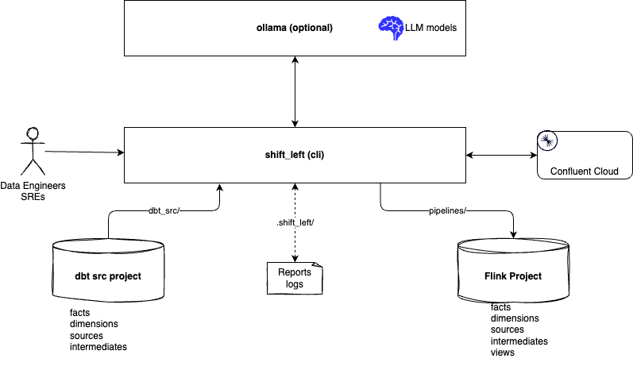

# Shift Left tools and practices

???- info "Versions"
    Created 12/2024
    Updated 02/23: new pipeline helper functions to support sink to source pipeline metadata creation or source to sink.

## Introduction

Shift Left means taking bach-processing jobs and try to refactor them to real-time processing using product such as Apache Flink. In batch processing a lot of projects use SQL and dbt (Data build tool) to define the logic of the data pipeline. In real-time processing, Apache Kafka is a de-facto middleware to persist immutable records, and for SQL, Python and Java based real-time processing, Apache Flink is also the preferred platform.

To organize batch processing and data pipelines to Datawarehouse, some compagnies are adopting the [Kimball guidelines](https://www.kimballgroup.com/data-warehouse-business-intelligence-resources/kimball-techniques/dimensional-modeling-techniques/) and best practices.

Working on this kind of refactoring projects is taking  time and is challenging. Large Language Model and AI Agentic solution should help data engineers to shift their data pipelines to the real-time processing by offering flexible SQL translation tools.

Also organizing Flink project using the Kimball guidelines is possible and even recommended. 

This repository is a tentative to develop and share some of the tools and practices needed for running such shift-leet projects.

As of now the utilities are oriented to use Confluent Cloud for Kafka and for Flink, but running local Flink and Kafka should be easy to support.

To avoid calling remote LLM, the current repository uses Ollama, running locally, or potentially in a remote server on-premises or inside a private network.

Two important concepts of this practice:

* **Dimensions** provide the “who, what, where, when, why, and how” context surrounding a business process event. Dimension tables contain the descriptive attributes used by BI applications for filtering and grouping the facts. 
* **Facts** are the measurements that result from a business process event and are almost always numeric. The design of a fact table is entirely based on a physical activity, and not by the reports to produce from those facts. A fact table always contains foreign keys for each of its associated dimensions, as well as optional degenerate dimension keys and date/time stamps

## Context

The target environment will be Apache Flink running within the Confluent Cloud as a managed service or in th future running in standalone cluster. The source of the batch processing is defined within a dbt (Data build tool) project or within a SQL project and the refactored SQL are produced under the `pipelines` folder.

At the system context level, for the tools of this repository, we can see the following high level components:


1. The source project to migrate: could be dbt or SQL
1. The new Flink project repository, where the project structure is built with a specific tool
1. An automatic migration tool, using Agentic App, used by developers to migrate one pipeline at a time. A pipeline is from a fact or dimension table up to the sources. The landing zone is a `staging folder` in the repository.
1. Tested and finalized pipelines are saved under the `pipelines folder`.
1. Test harness helps to validate complex Flink statement by isolation, using mockup data and test topics.
1. Pipeline dependencies is a tool to get understanding of the sink to source pipeline and from the source to sink too. There is another tool that help assess which tables use a given table.
1. Finally pipeline deployment help to automate, and pace the deployment of a given pipeline.

## Shift_left tooling


The following diagram illustrates the development environment which, mainly, uses two docker container containers, or when not using docker, the ollama cli and a python virtual environment with needed modules.



The shift left utils docker image groups a set of Python tools, Python 3.13.1 and the needed libraries to integrate with Ollama, like using LLM client API with Langgraph. The [ollama image](https://hub.docker.com/r/ollama/ollama) is used to run **qwen2.5-coder:32b** LLM model locally on the developer's computer.

Follow the [setup instructions to get started with the migration project](./setup.md).

If the developer laptop does not have enough capacity, there is an option to run Ollama on an EC2 server.

## A migration path

Any batch pipelines that create tables or files in a Lakehouse platform can be refactored using a Flink pipeline, as illustrated in the following figure:


The diagram above illustrates the target architecture for each pipeline after migration. This architecture employs a sink configured as a PostgreSQL database, which will support business intelligence dashboards. The Flink tables are mapped to Kafka topics, and Kafka connectors are utilized to transfer data from these topics to the PostgreSQL database.

From the perspective of a Confluent Cloud Flink pipeline, the last topic serves as the sink.

To facilitate the refactoring, the approach begins with the sink table and works backward to identify the sources. Once the sources are determined, the process may involve implementing a set of deduplication statements and intermediate steps to apply business logic or data transformations.

The dbt project contains all the SQL statements necessary for migration, located in the models folder. The goal of the tools is to process these files and replicate the same organizational structure for Flink SQL statements, which includes sources, intermediates, staging, dimensions, and facts. Additionally, the tools aim to automate parts of the migration process.


The target structure will look like in the following example:

```sh
pipelines
├── dimensions
│   └── {application_name}
│       └── {dimension_name}
│           ├── Makefile
│           ├── sql-scripts
│           │   ├── ddl.{dim_name}.sql
│           │   └── dml.{dim_trainee}.sql
│           └── tests
├── facts
│   └── {application_name}
│       └─── {fact_name}
│           ├── Makefile
│           ├── sql-scripts
│           │   ├── ddl.{fact_name}.sql
│           │   └── dml.{fact_name}.sql
│           └── tests
├── intermediates
│   └── {application_name}
│       └─── {fact_name}
│          ├── Makefile
│          ├── sql-scripts
│          │   ├── ddl.{intermediate_name}.sql
│          │   └── dml.{intermediate_name}.sql
│          └── tests
├── sources
│   └── {application_name}
│       ├── {src_name}
│           ├── Makefile
│           ├── dedups
│           │   └── dml.{src_name}.sql
│           └── tests
│               └── ddl.{src_name}.sql

```

## Source Topic management

In some ETL or ELT pipelines, Kafka topics may be the source of the pipeline. A classical example is when a change data capture mechanism is deployed and get records from existing SQL database to Kafka Topics. One topic per table. The architecture looks like in the following diagram:


When migrating to real-time processing, using Confluent Cloud and Flink compute pool, the source topics may be reused and the Flink Statement will do mostly the same processing as the ELT. Confluent Cloud for Flink creates tables from topic and get the schema from the schema registry.

The name of the table matches the name of the topic and the table schema maps to the topic-value schema. 

Adopt the naming convention from the change data capture, like Debezium for the topic. Any naming convention based on the environment like dev, staging, or production, will impact any DML statements. In Confluent Cloud the environment groups one to many Kafka clusters and multiple Flink compute pools. The topic name can be the same between Kafka cluster so the same DML statement can be used in different conpute pool.