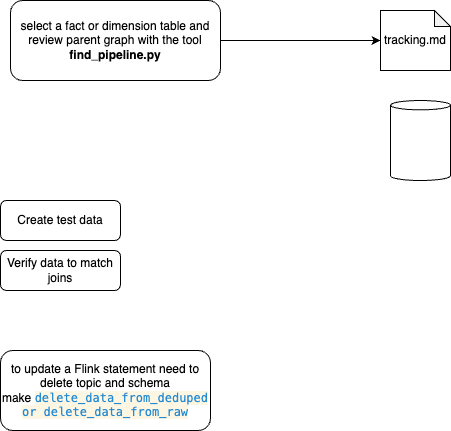

# Migration process

This chapter covers a straightforward migration process from ETL fact tables up to source tables to FLINK SQL pipelines. Ensure you have completed the project setup using one of the two options explained [in this note](./setup.md).

All the dbt source tables are defined in the #SRC_FOLDER folder. 

The migration method begins with a fact table. At a high level, the development flow is illustrated in the following diagram:



1. Start with a Fact or Dimension table. Process the fact table through the entire hierarchy up to the sources, and save the outcomes to an intermediate staging folder, as manual work will be required.
2. From the generated code, update the Fink statements for the source tables. Complete the deduplication logic in the generated DML (CTAS structure) to reflect the dbt logic applied for deduplication. The new table should use an upsert append log with a specific primary key. Since the source topic may not have the same primary key, it is crucial to perform primary key refactoring in the CTAS statement. If you do not have access to the original source topic, a DDL will be created in the tests folder for isolated testing. The DDL content, primarily column definitions, can be completed by referencing the source table in tools like DataBricks or Snowflake. Move the resulting folder to pipeline/sources.
3. Remove unnecessary intermediate steps, specifically those involving deduplication logic, as this has already been addressed in the source DML statement. Update any other intermediate statements with specific business logic and move the resulting statements to the pipeline/intermediates folder.
4. Execute any DDLs for the sink tables and intermediate tables.
5. If the source topics do not contain records, use the tool to create test data only at the source table level. Ensure consistency in the data for the various join conditions.
6. Execute the remaining DMLs.
7. Validate the data in the output topics designated as sink tables.--- This revision improves clarity and structure while maintaining the original meaning.

## 1 - Discover the current pipeline

Starting with a single fact table, the following command will identify the dependency hierarchy and include elements to track the migration project:

```sh
python find_pipeline.py -f $SRC_FOLDER/facts/fact_education_document.sql 
```

* The output may look like in the followring report:

```sh
-- Process file: $SRC_FOLDER/facts/fact_education_document.sql
Process the table: fact_education_document
Dependencies found:
  - depends on : int_education_completed
  - depends on : int_non_abandond_training
  - depends on : int_unassigned_curriculum
  - depends on : int_courses
  - depends on : int_docs_wo_training_data


  ....

 NOT_TESTED | OK ('int_training_completed_release', '$SRC_FOLDER/intermediates/training_document/int_training_completed.sql')
 NOT_TESTED | OK ('src_web_business_unit_entity_type', '$SRC_FOLDER/sources/src_web_business_unit_data.sql')
 ...
 NOT_TESTED | OK ('int_training_course_deduped', '$SRC_FOLDER/intermediates/dedups/int_training_course_deduped.sql')
 NOT_TESTED | OK ('int_courses_wo_trainingdata', '$SRC_FOLDER/intermediates/training_document/int_courses_wo_training_data.sql')
 NOT_TESTED | OK ('src_training_curriculum', '$SRC_FOLDER/sources/src_training_curriculum.sql')
```


## 2 - Process a hierarchy from one single sink sql file

The `process_src_tables.py` is really a set of integrated functions to process a lot of dbt files and help to migrate them more efficiently. It uses the LLM LangGraph workflow as defined in `flink_sql_code_agent_lg.py` python script.

The program arguments are:

| arg | Definitions |
| --- | --- |
| **-f  or --folder_path** | name of the folder or the file name including the tables to migrate. This could be a unique .sql file or a folder including multiple sql files. Mandatory |
| **-o  or --pipeline_folder_path** | name of the folder, output of the sql statement creation. Mandatory |
| **-t or --table_name** | [optional] name of the table to process - the tool searches for the file in the source project and then processes the sql file. This approach is used when developer use table name instead fo file name. |
| **-ld** |  default= False, For the given file or folder, list for each table their table dependancies |
| **-pd** | default= False, For the given file, process also its dependencies so a full graph is created. |

**Attention** `-pd` is for taking a table and process all its parents, up to all sources: it can be long and creates a lot of files to process. 

The following example will create a DML based on the same logic as the one in the dbt sql script, and will add corresponding DDL to create the sink table:

```sh
python process_src_tables.py -f $SRC_FOLDER/facts/fct_training_doc.sql -o $STAGING
```

The tool also lists the dependencies in term of parent tables, up to the source files, as the tool reuses the same functions of the `find_pipeline.py` script.


For a given table, the tool creates one folder with the table name, a Makefile to help managing the Flink Statements with Confluent cli, a `sql-scripts` folder for the Flink ddl and dml statements. A `tests` folder to add `data.json` (using another tool) to do some basic testing.

Example of created folders:

```sh
facts
    └── fct_user_role
        ├── Makefile
        ├── sql-scripts
        │   ├── ddl.fct_user_role.sql
        │   └── dml.fct_user_role.sql
        └── tests
```

As part of the process, developers need to validate the generated DDL and update the PRIMARY key to reflect the expected key. This information is hidden in lot of files in the dbt, and the key extraction is not yet automated by the migration tools, yet.

Normally the DML is not executable until all dependent tables are created.

### Deploying the DMLs or DDLs

The SQLs for sink or intermediate table are saved in sql-scripts folder and a makefile is also generated to simplify the deployment of the Flink SQL Statements. There are two generic targets: `create_flink_ddl` and `create_flink_dml`. 

You need to be logged to confluent cloud using `confluent login` command before being able to run make.

* To create the target table  using your environment Flink compute pool:

```sh
make create_flink_ddl
```

This action will create the Kafka topic and will create the schema definition for the key and the value in the Schema Registry.

* If the table is also controlled by a DML, for example for joins, or deduplication, a DML may be deployed using:

```sh
make create_flink_dml
```

* Sometime, we may need to delete the created topics and schemas, for that the makefile target is:

```sh
make delete_data
```

Each Flink Statement is named, so it may be relevant to delete a created statement with:

```sh
make delete_flink_statements
```

The `process_src_tables.py` creates or updates two tracking files under $REPORT_FOLDER folder:

1. `tables_done.txt`  which lists the files processed so far by the different runs. It also manually updated to track the testing.
1. `tables_to_process.txt`: as new dependencies tables are found, they are added to this file so we can track the things to be done

`table_done.txt` can be manually updated to add project management information like if the DDL (True or False), DML (True or False) were successfuly completed and running on CCloud, the source target file (URI_SRC) and the new Flink SQL matching file (URI_TGT).

```sh
table_name, Type of dbt, DDL, DML, URI_SRC, URI_TGT
fct_user_role,fact,T,T,facts/qx/fct_user_role.sql,pipelines/facts/qx/fct_user_role
```

???- info "Code explanation"
  The template for the Makefile in the case of Sink table is `utils/templates/makefile_ddl_dml_tmpl.jinja` and for source with deduplication logic the Makefile template is `utils/templates/makefile_src_dedup_tmpl.jinja`.


## 3 - Process one table using the -pd flag

The `process_src_tables.py` has a flag to process the parents from the current fact or dimension table. This will create intermediate tables up to source tables.

It is very helpful but developers need to take care of the semantic of the intermediate tables. It is important to work with domain experts to select the best path for implementation. 


???+ warning
    This is when it becomes a little bit tricky, as analysis should lead to refactoring.  Intermediate tables, name starting with `int_`, include some transformation and filtering logic or but also some deduplication.  It was decided to do the deduplication as early as possible. close to the raw data. So when migrating source table, the tool prepare a dml to do the dedup, which means partitioning on the `__db` field and the primary key of the table. It is also leveraging the Flink table changelog format as `upsert` to keet the last record for a given key.

The refactored tables are keeping the same table name and are saved under the -o specified $STAGING folder. So it may be relevant to move the ddl and dml for the intermediates and source tables to the pipeline path manually after completing the analysis with domain experts.

Be sure to do update tracking document.

## 4 - Process one table at a time

When taking a fact or dimention table, which is considered as a sink of the pipeline, the `process_src_tables.py` gives the list of dependent tables. The following output is for an example:

```sh
Process the table: fct_training_document
Dependencies found:
  - depends on : int_training_completed_release
  - depends on : int_non_abandond_training
  - depends on : int_unassigned_curriculum
  - depends on : int_courses_wo_trainingdata
  - depends on : int_docs_wo_trainingdata
```

From there it is possible to use the same tool (with option **-t**) to continue walking to the parent hierarchy one step at a time: developers can launch the same tool to process the tables, one by one, given their name, the tool will search in the source dbt file for the table reference:

```sh
python process_src_tables.py  -t int_training_completed_release  -o $STAGING
```

Process the table: int_training_completed_release
Dependencies found:
  - depends on : src_tdc_sys_user

```
intermediates
└── qx
    └── int_training_completed_releases
        ├── Makefile
        ├── sql-scripts
        │   ├── ddl.int_tdc_sys_user_deduped.sql
        │   └── dml.int_tdc_sys_user_deduped.sql
        └── tests
```

The source table is coming from a topic and the `src_tdc_sys_user.sql` as the following source structure:

```sql
with 
tdc_sys_user as (select * from {{ source('mc_qx','tdc_sys_user') }})

,final as (

    select 
        * 
    from tdc_sys_user
    {{limit_tenants()}}
    {{limit_ts_ms()}}

)

select * from final
```

The tool has identified the source of `int_tdc_sys_user_deduped` is `src_tdc_sys_user` and this sql file uses `tdc_sys_user` as the source table. This source table structure is defined in Databrick, so using Databricks console, developers can update the generated DDL to complete the column definitions. 

The DDL is used for testing, but if you are already connected to a Kafka Cluster where the source topics are already available, then it is prefered to do not use the sources.

The conditions in previous example, use the `limit_tenants` and `limit_ts_ms` which may not be relevant when running in Flink as this logic is used to filter out records in the batch processing as the order of records is not guarantee. In Kafka topic the records are in append mode so ordered over time and each records with the same key will be in the same Kafka partition. 

Doing the following command creates the source ddl and dml statements to do the dedups for this source table. The logic of the tool is to look at the table name pattern so `src_` is a source table. We could find a better heuristic in the future.

```sh
python process_src_tables.py -t src_tdc_sys_user -o staging
```

To complete the dedup logic it is import to understand the dbt dedup macro and the intermediate sql to see if there is something important to add and definitively to get the good column names used for partitioning.
