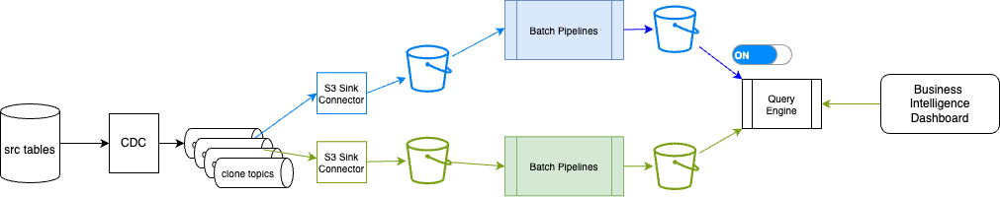

# Testing Flink Solution

As a generic test plan for Flink project, we propose to address the following test activities:

1. Unit tests
1. Integration tests with production data
1. Performance testing

## Three main test activities

### 1. Unit Testing

* **SQL Query Testing**: For each DML flink statement defined in the project pipelines folder, Data Engineer may define test suites with test data to validate the logic of the SQL statement. The [test harness tooling](./test_harness.md) is used for that, as it authorized to test individual Flink SQL query in isolation, by creating temporary input and output tables for running test suites.

    * When window operators are used, special timing concerns need to be addressed
    * Unit test should be able to verify watermark handling and event time processing

* For **User Define Function**: The test need to support unit test of the function code, but also validate input/output data, error handling and edge cases.

### 2. Integration Testing

As Confluent Cloud for Flink is natively integrated with Kafka, the goal of integration testings is to isolate tests from the source/ replicated tables,  down to sink to data lakehouse.

* Test end-to-end data flow from source to sink
* Verify message serialization/deserialization
* Validate schema evolution handling

* State Management is relevant for CP Flink or Open-source Flink. For Confluent cloud the state management is transparent for the users. The classical items are:

    * Test state backend operations
    * Verify checkpointing and savepoint functionality
    * Test state recovery scenarios

### 3. Performance Testing

The goal is to assess how long it takes to deploy a complete pipeline, with focus on when data products are available for end consumption. As an example we will take a classical shift_left processing architecture with a timing reprensentation:

<figure markdown="span">

</figure>

* Throughput Testing

    * Measure maximum processing rate (events/second)
    * Test with different message sizes
    * Evaluate parallel processing capabilities
    * Monitor CPU and memory usage

* Latency Testing

    * Measure end-to-end processing latency
    * Test with different window sizes
    * Evaluate backpressure handling
    * Monitor network latency

* Scalability Testing

    * Test horizontal scaling (adding/removing task managers)
    * Evaluate job manager performance
    * Test with increasing data volumes
    * Monitor resource utilization

### 4. Blue/Green Deployment Testing

The classical blue-green deployment for ETL jobs change everything and once the batch is done, the consumer of the data product, switch to new content. The following figure illustrates the approach at a high level:

<figure markdown="span">

</figure>

While in real-time processing the concept of blue-green deployment should be very limited and in the context of a pipeline, as presented in [the pipeline management chapter](./pipeline_mgr.md)

<figure markdown="span">

</figure>

* Deployment Strategy

    * Test parallel deployment of new version
    * Verify zero-downtime deployment
    * Test rollback procedures
    * Validate state migration between versions

### 5. Pipeline Management Testing

* Monitoring and Alerting

    * Test metric collection and reporting
    * Verify alert thresholds
    * Test failure detection and notification
    * Validate logging mechanisms

* Operational Testing

    * Test job cancellation and restart
    * Verify savepoint creation and restoration
    * Test job scaling operations
    * Validate backup and recovery procedures

### 6. Confluent Cloud Specific Testing

* Cloud Integration

    * Test connectivity to Confluent Cloud
    * Verify authentication and authorization
    * Test network security and encryption
    * Validate cloud resource management

* Cost Optimization

    * Monitor resource utilization
    * Test auto-scaling configurations
    * Evaluate cost-effective configurations
    * Test resource cleanup procedures

### 7. Security Testing

* Authentication and Authorization

    * Test access control mechanisms
    * Verify encryption in transit and at rest
    * Test security configurations
    * Validate audit logging

### 8. Disaster Recovery Testing

* Failure Scenarios

    * Test node failures
    * Test network partition scenarios
    * Test data center failures
    * Validate recovery procedures

## Test Environment Requirements

* Development Environment

* Staging Environment

    * Dedicated Confluent Cloud environment
    * Production-like configuration
    * Monitoring and logging setup

* Production Environment

    * Production Confluent Cloud setup
    * Production-grade monitoring
    * Backup and recovery systems

## Test Tools and Frameworks

* Testing Tools

    * Flink Test Harness
    * Prometheus for metrics
    * Grafana for visualization

* CI/CD Integration

    * Automated test execution
    * Test result reporting
    * Deployment automation
    * Environment provisioning

### Success Criteria

* Performance Metrics

    * Throughput: > X events/second
    * Latency: < Y milliseconds
    * Resource utilization: < Z%

* Reliability Metrics

    * Uptime: > 99.9%
    * Data consistency: 100%
    * Recovery time: < X minutes

* Operational Metrics

    * Deployment success rate: 100%
    * Rollback success rate: 100%
    * Alert accuracy: > 99%