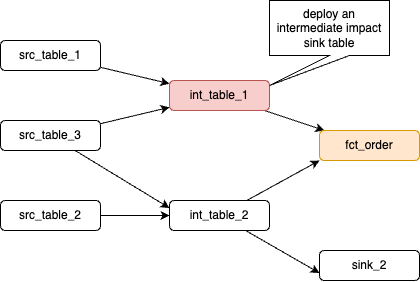
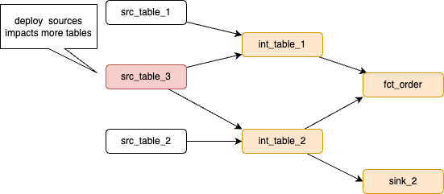

# Pipeline Management

???- info "Version"
    Created Mars 21- 2025 

The goals of this chapter is to present the requirements, design, and validation of the pipeline management tools.

## Context

Flink statements are inherently interdependent, consuming and joining tables produced by other statements, forming a complex pipeline. Careful deployment is crucial. The following diagram illustrates this interconnectedness and outlines a pipeline management strategy.

<figure markdown="span">

 <figcaption>a pipeline of Flink statements</figcaption>
</figure>

*This graph is generated by running a report like: `shift_left pipeline report fct_order --graph`*

## Managing the pipeline

The [recipe chapter](./recipes.md) has how-to descriptions on some the specific commands to use for pipeline management. The following high level concepts are the foundations for this management:

1. The git folder is the source of truth for pipeline definitions. 
1. The table inventory, which lists all the Flink tables, must be run with a simple command like:

    ```
    shift_left table build-inventory $PIPELINES
    ```

    The `inventory.json` is persisted in the $PIPELINES folder and committed in git. It will be extensively used by any pipeline commands.

1. Table pipeline definition json file, includes a single level of information about the pipeline. Those files are built from the sink tables going up to the src. During the Flink development phase, developers can use this tool to build the metadata:

    ```sh
    shift_left pipeline build_metadata $PIPELINES/facts/p1/fct_order/sql_scripts/dml.dct_order.sql $PIPELINES
    ```

    The created file looks like:

    ```json
    {
    "table_name": "fct_order",
    "type": "fact",
    "path": "pipelines/facts/p1/fct_order",
    "ddl_ref": "pipelines/facts/p1/fct_order/sql-scripts/ddl.fct_order.sql",
    "dml_ref": "pipelines/facts/p1/fct_order/sql-scripts/dml.fct_order.sql",
    "compute_pool_id": "",
    "parents": [
        {
            "table_name": "int_table_1",
            "type": "intermediate",
            "dml_ref": "pipelines/intermediates/p1/int_table_1/sql-scripts/dml.int_table_1.sql",
            "ddl_ref": "pipelines/intermediates/p1/int_table_1/sql-scripts/ddl.int_table_1.sql",
            "table_folder_name": "pipelines/intermediates/p1/int_table_1",
            "compute_pool_id": ""
        },
        {
            "table_name": "int_table_2",
            "type": "intermediate",
            "dml_ref": "pipelines/intermediates/p1/int_table_2/sql-scripts/dml.int_table_2.sql",
            "ddl_ref": "pipelines/intermediates/p1/int_table_2/sql-scripts/ddl.int_table_2.sql",
            "table_folder_name": "pipelines/intermediates/p1/int_table_2",
            "compute_pool_id": ""
        }
    ],
    "children": []
    }
    ```

    Developers or SREs may use another command to go over all facts, dimension or views folders, which will be all those definitions:

    ```sh
    shift_left pipeline build-all-metadata $PIPELINES
    ```

    Note that going to a second sink to the same intermediate or source table will modify existing definitions to add a children. The parents and children lists are in fact Set so no duplicate entries if a table is used by multiple pipelines.

1. A hierarchy view of a pipeline can be used for reporting, or by the developer to understand the complex tree, he/she is using when adding a new table:

    ```sh
    shift_left pipeline report fct_order --json
    ```

1. Hierarchy view is used to deploy a selected table and its children. Here is an example of all the tables (fct_order) that will be modified by a stateful statement deployment (int_table_1):

<figure markdown="span">

 <figcaption>Intermediate table deployment</figcaption>
</figure>

While a source processing, that most of the time are doing deduplication, which is stateful will impact more elements:

<figure markdown="span">

 <figcaption>Src table deployment</figcaption>
</figure>


## Requirements

The following list presents the requirements to implement:

* [x] The expected command to deploy should be simple like:

```sh
shift_left pipeline deploy [OPTIONS] TABLE_NAME INVENTORY_PATH

   --compute-pool-id     TEXT  Flink compute pool ID. If not provided, it will create a pool. [default: None]   
   --dml-only            By default the deployment will do DDL and DML, with this flag it will deploy only DML [default: no-dml-only]                
   --force               The children deletion will be done only if they are stateful. This Flag force to drop table and recreate all (ddl, dml) [default: no-force]
```

* [ ] Deploy dml - ddl: Given the table name, executes the dml and ddl to deploy a pipeline. If the compute pool id is present it will use it. If not, it will get the existing pool_id from the table already deployed, if none is defined it will create a new pool and assign the pool_id. A deployment may impact children statement depending of the semantic of the current DDL and the children's one.

* [ ] Support deploying only DML, or both DDL and DML (default)
* [ ] Deploying a DDL, means dropping existing table if exists.
* [ ] Deploying a non existant sink means deploying all its parents if not already deployed, up to the sources. This will be the way to deploy a pipeline. In this case deploy first the sources, ddl and dml, except if already running as it means this table was created by another pipeline.
* [ ] Deploying an existant sink, means drop the table if the force flag is true, and deploy the DML. If forced flag is false, only deploy dml. When DML is stateful deploy DDL and DML (= forced) 

### Questions

The following may be considered:

* does it make sense to have DDL only deployment from a source to sink pipeline?

## Developer's note

The module to support the management of pipeline is `pipeline_mgr.py` and `deployment_mgr.py`.

* Testing a Flink deployment see []()
