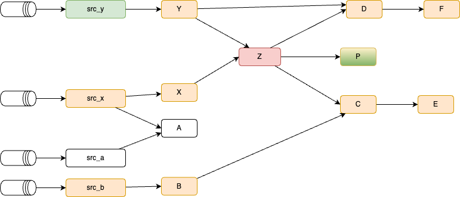

# Pipeline Management

???- info "Version"
    Created Mars 21- 2025 - Update 3/28/25

The goals of this chapter is to present the requirements, design, and validation of the pipeline management tools.

## Context

Flink statements are inherently interdependent, consuming and joining tables produced by other statements, forming a complex pipeline. Careful deployment is crucial. The following diagram illustrates this interconnectedness for a simple example and outlines a pipeline management strategy.

<figure markdown="span">

 <figcaption>a pipeline of Flink statements</figcaption>
</figure>

*This graph is generated by running a report like: `shift_left pipeline report fct_order --graph`*

???- info "Test data"
    The folder [src/shift_left/tests/data](https://github.com/jbcodeforce/shift_left_utils/tree/cli/src/shift_left/tests/data) includes a Flink-project with the DDLs and DMLs to support the graph illustrated above, and it is used in all the test cases.

## Managing the pipeline

The [recipe chapter](./recipes.md) has how-to descriptions for the specific commands to use during development and during the pipeline management by system reliability engineers. The following high level concepts are the foundations for this management:

1. The git folder is the source of truth for pipeline definitions. 
1. The table inventory, which lists all the Flink tables of a project, is used as the foundation to find basic metadata about Flink statements. It must be created with a simple command like:

    ```
    shift_left table build-inventory $PIPELINES
    ```

    The `inventory.json` is persisted in the $PIPELINES folder and committed in git. It will be extensively used by any pipeline commands. It could be updated at each PR by a CI tool.

1. For each table `pipeline_definition json` file, includes a single level of information about the pipeline. Those files are built from the sink tables going up to the sources. During the Flink development phase, developers may use this tool to build the metadata:

    ```sh
    shift_left pipeline build_metadata $PIPELINES/facts/p1/fct_order/sql_scripts/dml.fct_order.sql $PIPELINES
    ```

    The created file may look like:

    ```json
    {
        "table_name": "fct_order",
        "type": "fact",
        "dml_ref": "pipelines/facts/p1/fct_order/sql-scripts/dml.fct_order.sql",
        "ddl_ref": "pipelines/facts/p1/fct_order/sql-scripts/ddl.fct_order.sql",
        "path": "pipelines/facts/p1/fct_order",
        "state_form": "Stateful",
        "parents": [
            {
                "table_name": "int_table_2",
                "type": "intermediate",
                "dml_ref": "pipelines/intermediates/p1/int_table_2/sql-scripts/dml.int_table_2.sql",
                "ddl_ref": "pipelines/intermediates/p1/int_table_2/sql-scripts/ddl.int_table_2.sql",
                "path": "pipelines/intermediates/p1/int_table_2",
                "state_form": "Stateful",
                "parents": [],
                "children": [
                    {
                    "table_name": "fct_order",
                    "type": "fact",
                    "dml_ref": "pipelines/facts/p1/fct_order/sql-scripts/dml.fct_order.sql",
                    "ddl_ref": "pipelines/facts/p1/fct_order/sql-scripts/ddl.fct_order.sql",
                    "path": "pipelines/facts/p1/fct_order",
                    "state_form": "Stateful",
                    "parents": [],
                    "children": []
                    }
                ]
            },
            {
                "table_name": "int_table_1",
                "type": "intermediate",
                "dml_ref": "pipelines/intermediates/p1/int_table_1/sql-scripts/dml.int_table_1.sql",
                "ddl_ref": "pipelines/intermediates/p1/int_table_1/sql-scripts/ddl.int_table_1.sql",
                "path": "pipelines/intermediates/p1/int_table_1",
                "state_form": "Stateful",
                "parents": [],
                "children": [
                    {
                    "table_name": "fct_order",
                    "type": "fact",
                    "dml_ref": "pipelines/facts/p1/fct_order/sql-scripts/dml.fct_order.sql",
                    "ddl_ref": "pipelines/facts/p1/fct_order/sql-scripts/ddl.fct_order.sql",
                    "path": "pipelines/facts/p1/fct_order",
                    "state_form": "Stateful",
                    "parents": [],
                    "children": []
                    }
                ]
            }
        ],
        "children": []
    }
    ```

    Developers or SREs may use others command to go over all facts, dimensions or views folders, to create all the `pipeline_definition.json` from each of the dml of those tables:

    ```sh
    shift_left pipeline build-all-metadata $PIPELINES/facts
    ```

    Note that going while walking up a second pipeline from a new sink, may modify the pipeline_definitions.json of an existing parent table, to update the list of children with the new sink. Same for new intermediate table. The parents and children lists are in fact Sets so there is no duplicate entry if a table is used by multiple pipelines.

1. A hierarchy view of a pipeline can be used for reporting, or by the developer to understand the complex tree:

    ```sh
    shift_left pipeline report fct_order --json
    ```

    The optins are `--json`, `--simple`,  `--yaml` or `--graph` can be used. 

1. Hierarchy view is used to deploy a selected table, its parents and eventually its children. 
1. For deployment they are some heuristic to follow:

    1. when deploying a Flink statement, any parent (tables used for select or joins) not running, need to start them
    1. When the current intermediate table, one with children and parents, is stateful and needs to be dropped then children will be impacted. 
    1. For a current intermediate table, if a child is stateful, then need to restart this child once the current topic / table is created. If the child is stateless then offset management needs to be done. 
    1. The deployment follows a LIFO queue
    1. A table is running if a topic exist. Do we need to consider the DML writing to this table to also be running. It may not be a strong argument.


### Different constraints for pipeline deployment

#### Deploying a fact table

During development, Flink SQL developers use the makefile: see [recipe]() to deploy statement. While preparing for staging or integration tests, it may be relevant to deploy a full pipeline from a sink table. For example SREs want to deploy the sink `fct_order` table. To make the DML running successfuly, as it joins two tables, both tables need to be created. So the tool needs to walk up the hierarchy to deploy parents, up to the source. The white colored topic and Flink statements are currently running, tables and topics have messages. Before deploying the `fct_order dml`, the tool needs to assess what are the current parents table running. If there are missing tables, the tool needs to deploy those, taking into consideration parents of parents. For example, for the `int_table_1` which is not created, the tool needs first to run the DDL `src_table_1` and any `DML for src_table_1`. (in the test the dml of the sources are just inserting records, but in real project, those DMLs may consume from an existing Kafka topic created via CDC), thne run the `int_table_1` DDL and DML, to finally deploy the `fct_order` DDL and DML. 

<figure markdown="span">

 <figcaption>Sink table deployment - with parent deployment</figcaption>
</figure>

The red color highlights what is the goal of the deployment. The white represents what is stable, while the orange elements are impacted by the deployment.  

???- info "Step to demonstrate a sink table deployment"
    * Remove any older logs with `rm ~/.shift_left/logs/*.log*`
    * Be sure `config.yaml` has the good parameters in particular the flink and Confluent cloud access keys,secrets, a default compute_pool_id and the logging level.
    * Defines the PIPELINES and CONFIG_FILE environement variables
    * Ensure the table inventory is up to date, if not run `shift_left table build-inventory $PIPELINES`
    * If for any reason, the pipeline definitions for the given pipeline needs to be recreated, run: `shift_left pipeline build-metadata fct_order $PIPELINES`
    * Verify a report works on the fact table: `shift_left pipeline report fct_order $PIPELINES`.  
    * Deploy the fact table: `shift_left deploy fct_order`
    * Verify in the Confluent Cloud console the Flink statements running and the topics created.

#### Deploying an intermediate table

Intermediate table deployment, will follow the same principle as above if parent in the upward hierarchy are not running, but most important, it may impact children. The behavior of the deployment will be different if the DML are stateful, for the current DML to deploy but also for the children. The red color means those elements will be recreated, and orange means they may be impacted for a re-deployment. For stateful with earliest-offset consumption, will mean the topic needs to be recreated and the downstream children recreated. For stateless, stopping, getting the offset and restarting from the saved offset will work.

<figure markdown="span">

 <figcaption>Intermediate table deployment</figcaption>
</figure>

#### Deploying source table

For source processing, it may impact more children elements. Most of those processing are doing deduplication or transforming to upsert table with different primary keys, which means becoming stateful.

<figure markdown="span">

 <figcaption>Source table deployment</figcaption>
</figure>


#### More complex graph for testing

The following graph represents a more complex network of dependencies to illustrate the following patterns:

* intermediate table Z has multiple parents with their own sources. So deploy Z will mean assessing X, and Y trees
* Running every node may impact restarting any children

<figure markdown="span">

 <figcaption>Topology used for test</figcaption>
</figure>

*topics are not represented between Flink Statements, only the four source topics.*

The navigation to the parents needs to follow a depth first search to get all non running parents, while restarting children should follow a breath first search.

The approach is also to build an execution plan and then execute the plan in the order of the definition.

## Tool Requirements

The following list presents the requirements to implement for the shift_left deploy command:

* [x] The expected command to deploy should be as simple as:

```sh
shift_left pipeline deploy [OPTIONS] TABLE_NAME INVENTORY_PATH

   --compute-pool-id     TEXT  Flink compute pool ID. If not provided, it will create a pool. [default: None]   
   --dml-only            By default the deployment will do DDL and DML, with this flag it will deploy only DML [default: no-dml-only]                
   --force               The children deletion will be done only if they are stateful. This Flag force to drop table and recreate all (ddl, dml) [default: no-force]
```

* [x] Deploy dml - ddl: Given the table name, executes the dml and ddl to deploy a pipeline. If the compute pool id is present it will use it. If not, it will get the existing pool_id from the table already deployed, if none is defined it will create a new pool and assign the pool_id. A deployment may impact children statement depending of the semantic of the current DDL and the children's one.

* [x] Support deploying only DML, or both DDL and DML (default)
* [x] Deploying a DDL, means dropping existing table if exists.
* [x] Deploying a non existing sink means deploying all its parents if not already deployed, up to the sources. This will be the way to deploy a pipeline. In this case deploy first the sources, ddl and dml, except if already running as it means the current table was created by another pipeline. This is recursive.
* [ ] Deploying an existing sink, means drop the table if the force flag is true, and deploy the DML. If forced flag is false, only deploy dml. When DML is stateful deploy DDL and DML (= forced) 
* [ ] For a given table with children, deploy the current table, and for each children redeploy the DML, if the DML is stateful. When stateless, manage the offset and modify the DML to read from the retrieved offset.
* [x] Support deleting a full pipeline: delete tables not used by other pipeline: the number of children is 1 or all the children are not running.

### Questions

The following may be considered:

* does it make sense to have DDL only deployment from a source to sink pipeline?

## Developer's notes

The modules to support the management of pipeline is `pipeline_mgr.py` and `deployment_mgr.py`.

* Testing a Flink deployment see [test - ]


For deployment the approach is to build a graph from the table developer want to deploy. The graph includes the parents and then the children. The graph is built reading static information about the relationship between statement, and then go over each statement and assess if for this table the dml is running. For a parent it does nothing