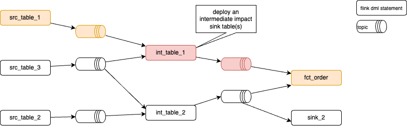

# Pipeline Management

???- info "Version"
    Created Mars 21- 2025 - Update 4/19/25

The goals of this chapter is to present the requirements, design, and validation of the pipeline management tools.

## Context

### Statement Evolution

Modifying streaming workloads over time, without serious side effects, is challenging: a workload’s downstream dependency chains run perpetually and expect continuous output. Any Flink DAG code is immutable, therefore a quick deployment strategy is to do not modify Flink process flow. When a SQL statement is started, it reads the source tables from the beginning (or any specified offset) and the operators, defined in the statement, build their state. Source or sink operators use the latest schema version for key and value at the time of deployment. 

The general strategy for [query evolution](https://docs.confluent.io/cloud/current/flink/concepts/schema-statement-evolution.html#query-evolution) is to replace the existing statement and the corresponding tables it maintains with a new statement and new tables. Let take a simple example of a Flink statement joining two tables and with an output table also used by a join within a second statement:


The streaming processing has processed all blue records and a new version needs to be applied at a time from which new records processed may have an impact.

The typical change to consider are:

* adding a new column in a select statement
* removing a field in a select statement
* adding aggregation dimension or new joins, with full historical records reprocessing,

For each Flink Statement deployment some questions need to be assessed:

* What should be done with the pre-existing output records? 
* Does the update impact the meaning ot the output? (change the dimensionality of an aggregation)
* What happens if the new output format breaks compatibility with the old? 
* How can the old and new data structures be made to work together, and what if they can't?

Which can be summarized, which statement need to backfill for the earliest or not. 

As illustrated in the [query evolution - basic strategy section], the process is to stop Flink statements to change, create a new table _v2, and once lag is recovered, swap consumers from the old topic to the new one.


### Flink Statement interdependancies

Flink statements are inherently interdependent, consuming and joining tables produced by other statements, forming a complex pipeline. Careful deployment is crucial. The following diagram illustrates this interconnectedness for a simple example and outlines a pipeline management strategy.

<figure markdown="span">

 <figcaption>a pipeline of Flink statements</figcaption>
</figure>

*This graph is generated by running a report like: `shift_left pipeline report fct_order --graph`*

???- info "Test data"
    The folder [src/shift_left/tests/data](https://github.com/jbcodeforce/shift_left_utils/tree/cli/src/shift_left/tests/data) includes a Flink-project with the DDLs and DMLs to support the graph illustrated above, and it is used in all the test cases.

## Core concepts for managing Flink Statement pipelines

The [recipe chapter](./recipes.md) has how-to descriptions for the specific commands to use during development and during the pipeline management by system reliability engineers. The following high level concepts are the foundations for this management:

1. The git folder is the source of truth for pipeline definitions. 
1. The table inventory, which lists all the Flink tables of a project, is used as the foundation to find basic metadata about Flink statements. It must be created with a simple command like:

    ```
    shift_left table build-inventory $PIPELINES
    ```

    The `inventory.json` is persisted in the $PIPELINES folder and committed in git. It will be extensively used by any pipeline commands. It could be updated at each PR by a CI tool.

1. For each table `pipeline_definition json` file, includes a single level of information about the pipeline. Those files are built from the sink tables going up to the sources. During the Flink development phase, developers may use this tool to build the metadata:

    ```sh
    shift_left pipeline build_metadata $PIPELINES/facts/p1/fct_order/sql_scripts/dml.fct_order.sql $PIPELINES
    ```

    The created file may look like:

    ```json
    {
        "table_name": "fct_order",
        "type": "fact",
        "dml_ref": "pipelines/facts/p1/fct_order/sql-scripts/dml.fct_order.sql",
        "ddl_ref": "pipelines/facts/p1/fct_order/sql-scripts/ddl.fct_order.sql",
        "path": "pipelines/facts/p1/fct_order",
        "state_form": "Stateful",
        "parents": [
            {
                "table_name": "int_table_2",
                "type": "intermediate",
                "dml_ref": "pipelines/intermediates/p1/int_table_2/sql-scripts/dml.int_table_2.sql",
                "ddl_ref": "pipelines/intermediates/p1/int_table_2/sql-scripts/ddl.int_table_2.sql",
                "path": "pipelines/intermediates/p1/int_table_2",
                "state_form": "Stateful",
                "parents": [],
                "children": [
                    {
                    "table_name": "fct_order",
                    "type": "fact",
                    "dml_ref": "pipelines/facts/p1/fct_order/sql-scripts/dml.fct_order.sql",
                    "ddl_ref": "pipelines/facts/p1/fct_order/sql-scripts/ddl.fct_order.sql",
                    "path": "pipelines/facts/p1/fct_order",
                    "state_form": "Stateful",
                    "parents": [],
                    "children": []
                    }
                ]
            },
            {
                "table_name": "int_table_1",
                "type": "intermediate",
                "dml_ref": "pipelines/intermediates/p1/int_table_1/sql-scripts/dml.int_table_1.sql",
                "ddl_ref": "pipelines/intermediates/p1/int_table_1/sql-scripts/ddl.int_table_1.sql",
                "path": "pipelines/intermediates/p1/int_table_1",
                "state_form": "Stateful",
                "parents": [],
                "children": [
                    {
                    "table_name": "fct_order",
                    "type": "fact",
                    "dml_ref": "pipelines/facts/p1/fct_order/sql-scripts/dml.fct_order.sql",
                    "ddl_ref": "pipelines/facts/p1/fct_order/sql-scripts/ddl.fct_order.sql",
                    "path": "pipelines/facts/p1/fct_order",
                    "state_form": "Stateful",
                    "parents": [],
                    "children": []
                    }
                ]
            }
        ],
        "children": []
    }
    ```

    Developers or SREs may use others command to go over all facts, dimensions or views folders, to create all the `pipeline_definition.json` from each of the dml of those tables:

    ```sh
    shift_left pipeline build-all-metadata $PIPELINES/facts
    ```

    Note that going while walking up a second pipeline from a new sink, may modify the pipeline_definitions.json of an existing parent table, to update the list of children with the new sink. Same for new intermediate table. The parents and children lists are in fact Sets so there is no duplicate entry if a table is used by multiple pipelines.

1. A hierarchy view of a pipeline can be used for reporting, or by the developer to understand the complex tree:

    ```sh
    shift_left pipeline report fct_order --json
    ```

    The optins are `--json`, `--simple`,  `--yaml` or `--graph` can be used. 

1. Hierarchy view is used to deploy a selected table, its parents and eventually its children. 
1. For deployment they are some heuristic to follow:

    1. when deploying a Flink statement, for any parent (tables used for select or joins) currently not running, the tools needs to start them
    1. When the current intermediate table, one with children and parents, is generating events from a stateful processing, the output table needs to be recreated, the consumers who consumed from the earliest needs to be restarted. Eventually this means cascading down the children graph to restart all the impacted children.
    1. For a current intermediate table, if a child is stateful, then the tool needs to restart this child once the current topic / table is created. If the child is stateless then offset management needs to be done: the children is stopped, and restarted from last committed offset. 
    1. The deployment follows a sources to sink deployment to ensure that for a given table all parents are running.


### Multi-cluster support

Flink is deployed at the environment level. An environment may have multiple Kafka clusters. A schema registry is also at the environment level. The tool needs to support conflicting consistency: do not overwrite schema, separate cluster or topics within the same cluster. The following figure illustrates those concepts:


Therefore the following are important requirements to address:

* Tables are created by flink job and may avoid conflicting so a naming convention is needed, sepcially when a unique cluster is used for dev and staging: dev-<table-name>; <stage-tablename> 
* Flink job (dml-*) needs to follow a naming convention to easily find compute pool to statement allocation in the Console.
* Sources topics may have been created by external systems so it may also being created with naming convention, or the same source topics used by the different deployment.
* Schemas in the registry needs to support context and each created table definition uses the `key.avro-registry.schema-context`  = '.flink-stage' or '.flink-dev'  settings.
* Table name needs to follow a naming convention to separate dev and stage.
* When stage is a separate kafka cluster then the catalog and database names are used to define the scope of the created tables.


<style>
table th:first-of-type {
    width: 50%;
}
table th:nth-of-type(1) {
    width: 50%;
}
</style>
| table name | schema context | 
| --- | --- | 
| src_p1_table_1 | .flink-dev | 
| src_p1_table_2 | .flink-dev | 
| src_p1_table_3 | .flink-dev |
| p1_fct_table_1 | .flink-dev |
| src_p1_table_1 | .flink-stage |
| src_p1_table_2 | .flink-stage |
| src_p1_table_3 | .flink-stage |
| p1_fct_table_1 | .flink-stage |

The shift_left `config..yaml` file needs to be specific per deployment target. The table illustrates the parameters specific for a given environment

<style>
table th:first-of-type {
    width: 40%;
}
table th:nth-of-type(2) {
    width: 30%;
}
</style>
| Use case | Goal |Parameter to set|
| --- | --- | --- |
| Deploy to dev env and cluster| Tables are create with prefix | `kafka.cluster_type: dev` and  `flink.catalog_name: dev-env` `flink.database_name: dev-cluster`|
| Deploy to stage same kafka cluster, same env| Tables are create with prefix to separate from dev | `kafka.cluster_type: stage` and  `flink.catalog_name: dev-env` `flink.database_name: dev-cluster`|
| Deploy to stage different kafka cluster same environment | Tables are create with prefix but the database name is different too. | `kafka.cluster_type: stage` and   `flink.catalog_name: dev-env` `flink.database_name: stage-cluster` |

### Different constraints for pipeline deployment

#### Deploying a fact table

During development, Flink SQL developers use the makefile: see [this recipe](./recipes.md/#developer-centric-use-cases) to deploy statement. While preparing for staging or integration tests, it may be relevant to deploy a full pipeline from a sink table. For example SREs want to deploy the sink `fct_order` table. To make the DML running successfuly, as it joins two tables, both tables need to be created. So the tool needs to walk up the hierarchy to deploy parents, up to the source. The white colored topic and Flink statements are currently running, tables and topics have messages. Before deploying the `fct_order dml`, the tool needs to assess what are the current parents table running. If there are missing tables, the tool needs to deploy those, taking into consideration parents of parents. For example, for the `int_table_1` which is not created, the tool needs first to run the DDL `src_table_1` and any `DML for src_table_1`. (in the test the dml of the sources are just inserting records, but in real project, those DMLs may consume from an existing Kafka topic created via CDC), thne run the `int_table_1` DDL and DML, to finally deploy the `fct_order` DDL and DML. 

<figure markdown="span">

 <figcaption>Sink table deployment - with parent deployment</figcaption>
</figure>

The red color highlights what is the goal of the deployment. The white represents what is stable, while the orange elements are impacted by the deployment.  

???- info "Step to demonstrate a sink table deployment"
    * Remove any older logs with `rm ~/.shift_left/logs/*.log*`
    * Be sure `config.yaml` has the good parameters in particular the flink and Confluent cloud access API keys, secrets, a default compute_pool_id and the appropriate logging level.
    * Defines the PIPELINES and CONFIG_FILE environment variables
    * Ensure the table inventory is up to date, if not run `shift_left table build-inventory $PIPELINES`
    * If for any reason, the pipeline definitions for the given pipeline needs to be recreated, run: `shift_left pipeline build-metadata fct_order $PIPELINES`
    * Verify a report works on the fact table: `shift_left pipeline report fct_order $PIPELINES`.  
    * Deploy the fact table: `shift_left deploy fct_order`
    * Verify in the Confluent Cloud console the Flink statements running and the topics created.

#### Deploying an intermediate table

Intermediate table deployment, will follow the same principle as above if parent in the upward hierarchy are not running, but most important, it may impact children. The behavior of the deployment will be different if the DML are stateful, for the current DML to deploy but also for the children. The red color means those elements will be recreated, and orange means they may be impacted for a re-deployment. For stateful with earliest-offset consumption, will mean the topic needs to be recreated and the downstream children recreated. For stateless, stopping, getting the offset and restarting from the saved offset will work.

<figure markdown="span">

 <figcaption>Intermediate table deployment</figcaption>
</figure>

#### Deploying source table

For source processing, it may impact more children elements. Most of those processing are doing deduplication or transforming to upsert table with different primary keys, which means becoming stateful.

<figure markdown="span">

 <figcaption>Source table deployment</figcaption>
</figure>


#### More complex graph for testing

The following graph represents a more complex network of dependencies to illustrate the following patterns:

* intermediate table Z has multiple parents with their own sources. So deploy Z will mean assessing X, and Y trees
* Running every node may impact restarting any children

<figure markdown="span">

 <figcaption>Topology used for test</figcaption>
</figure>

*topics are not represented between Flink Statements, only the four source topics.*

The navigation to the parents needs to follow a depth first search to get all non running parents, while restarting children should follow a breath first search.

The approach is also to build an execution plan and then execute the plan in the order of the definition.

## Tool Requirements

The following list presents the requirements to implement for the shift_left deploy command:

* [x] The expected command to deploy should be as simple as:

```sh
shift_left pipeline deploy [OPTIONS] TABLE_NAME INVENTORY_PATH

   --compute-pool-id     TEXT  Flink compute pool ID. If not provided, it will create a pool. [default: None]   
   --dml-only            By default the deployment will do DDL and DML, with this flag it will deploy only DML [default: no-dml-only]                
   --force               The children deletion will be done only if they are stateful. This Flag force to drop table and recreate all (ddl, dml) [default: no-force]
```

* [x] Deploy dml - ddl: Given the table name, executes the dml and ddl to deploy a pipeline. If the compute pool id is present it will use it. If not, it will get the existing pool_id from the table already deployed, if none is defined it will create a new pool and assign the pool_id. A deployment may impact children statement depending of the semantic of the current DDL and the children's one.

* [x] Support deploying only DML, or both DDL and DML (default)
* [x] Deploying a DDL, means dropping existing table if exists.
* [x] Deploying a non existing sink means deploying all its parents if not already deployed, up to the sources. This will be the way to deploy a pipeline. In this case deploy first the sources, ddl and dml, except if already running as it means the current table was created by another pipeline. This is recursive.
* [ ] Deploying an existing sink, means drop the table if the force flag is true, and deploy the DML. If forced flag is false, only deploy dml. When DML is stateful deploy DDL and DML (= forced) 
* [ ] For a given table with children, deploy the current table, and for each children redeploy the DML, if the DML is stateful. When stateless, manage the offset and modify the DML to read from the retrieved offset.
* [x] Support deleting a full pipeline: delete tables not used by other pipeline: the number of children is 1 or all the children are not running.

## Testing plan

As a generic test plan for Flink project we propose to address the following

### 1. Unit Testing

* SQL Query Testing

    * Test individual Flink SQL queries in isolation
    * Test window functions, aggregations, and joins
    * Verify watermark handling and event time processing

* User Define Function Testing

    * Test custom user-defined functions
    * Validate input/output data types
    * Test error handling and edge cases

### 2. Integration Testing

As Confluent Cloud for Flink is natively integrated with Kafka, the goal of integration testings is to isolate tests from the source/ replicated tables,  down to sink to data lakehouse.

* Test end-to-end data flow from source to sink
* Verify message serialization/deserialization
* Validate schema evolution handling

* State Management is relevant for CP Flink or Open-source Flink. For Confluent cloud the state management is transparent for the users. The classical items are:

    * Test state backend operations
    * Verify checkpointing and savepoint functionality
    * Test state recovery scenarios

### 3. Performance Testing

The goal is to assess how long it takes to deploy a complete pipeline with specific approaches:

* Throughput Testing

    * Measure maximum processing rate (events/second)
    * Test with different message sizes
    * Evaluate parallel processing capabilities
    * Monitor CPU and memory usage

* Latency Testing

    * Measure end-to-end processing latency
    * Test with different window sizes
    * Evaluate backpressure handling
    * Monitor network latency

* Scalability Testing

    * Test horizontal scaling (adding/removing task managers)
    * Evaluate job manager performance
    * Test with increasing data volumes
    * Monitor resource utilization

### 4. Blue/Green Deployment Testing

* Deployment Strategy

    * Test parallel deployment of new version
    * Verify zero-downtime deployment
    * Test rollback procedures
    * Validate state migration between versions


### 5. Pipeline Management Testing

* Monitoring and Alerting

    * Test metric collection and reporting
    * Verify alert thresholds
    * Test failure detection and notification
    * Validate logging mechanisms

* Operational Testing

    * Test job cancellation and restart
    * Verify savepoint creation and restoration
    * Test job scaling operations
    * Validate backup and recovery procedures

### 6. Confluent Cloud Specific Testing

* Cloud Integration

    * Test connectivity to Confluent Cloud
    * Verify authentication and authorization
    * Test network security and encryption
    * Validate cloud resource management

* Cost Optimization

    * Monitor resource utilization
    * Test auto-scaling configurations
    * Evaluate cost-effective configurations
    * Test resource cleanup procedures

### 7. Security Testing

* Authentication and Authorization

    * Test access control mechanisms
    * Verify encryption in transit and at rest
    * Test security configurations
    * Validate audit logging

### 8. Disaster Recovery Testing

* Failure Scenarios

    * Test node failures
    * Test network partition scenarios
    * Test data center failures
    * Validate recovery procedures

### Test Environment Requirements

* Development Environment

* Staging Environment

    * Dedicated Confluent Cloud environment
    * Production-like configuration
    * Monitoring and logging setup

* Production Environment

    * Production Confluent Cloud setup
    * Production-grade monitoring
    * Backup and recovery systems

### Test Tools and Frameworks

* Testing Tools

    * Flink Test Harness
    * Prometheus for metrics
    * Grafana for visualization

* CI/CD Integration

    * Automated test execution
    * Test result reporting
    * Deployment automation
    * Environment provisioning

### Success Criteria

* Performance Metrics

    * Throughput: > X events/second
    * Latency: < Y milliseconds
    * Resource utilization: < Z%

* Reliability Metrics

    * Uptime: > 99.9%
    * Data consistency: 100%
    * Recovery time: < X minutes

* Operational Metrics

    * Deployment success rate: 100%
    * Rollback success rate: 100%
    * Alert accuracy: > 99%