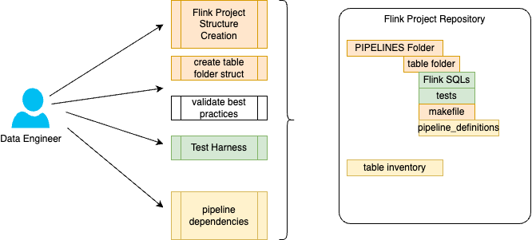
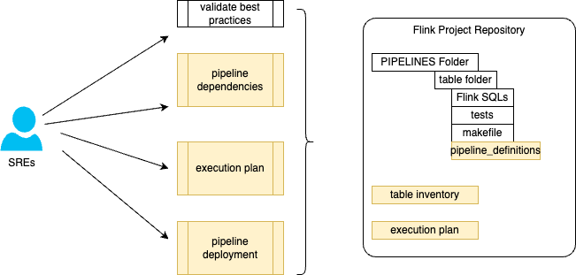
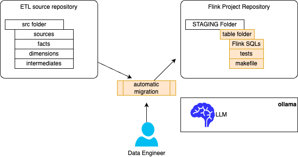
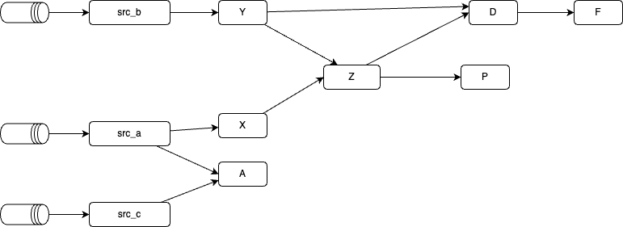
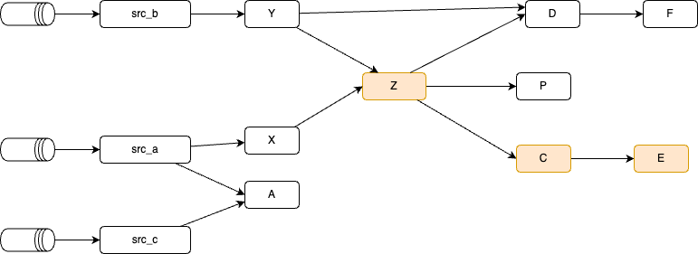

# Recipes Summary

???- info "Version"
    * Created January 2025.
    * Update: 05/28/2025. 

This chapter details the standard activities to manage a Confluent Cloud Flink project with the `shift_left` tool when doing a ETL to real-time migration project. The recipes address new project initiative or a migration project from an existing SQL based ETL solution.

As introduced in the [context chapter](./index.md#context) the CLI groups a set of commands to manage project, tables, and Flink statements as part of pipelines.

<figure markdown="span">

</figure>

The audience for the recipes chapter are the Data Engineers and the SREs.

## Tool context

The `shift_left` CLI may help to support different Data Engineers and SREs activities. For that, the tool will build and use a set of different components. The figures below groups what the different components are for different use cases.

The major development activity constructs managed by the tools are:

* Flink Project, with the structure of the different folders.
* Flink Table with the structure of a **table folder structure**, with sql-scripts, makefile and tests.
* **Flink table inventory** to keep an up to date inventory of table, with the references to the ddl and dml. Tables not in the inventory do not exist.
* **Flink Statement pipeline definition**: metadata about a table and its parents and / or children. Sink tables have only parents, source tables have only children.
* **Flink SQL statement** for DDL and DML.
* For complex DML it may make sense to have dedicated **test definitions**.

### Data engineer centric use cases

Developers/ Data Engineers are responsible to develop the Flink SQL statements and the validation tests. 

<figure markdown="span">

</figure>

The table folder structure, table inventory and pipeline_definitions are generated and managed by tools. No human edit is needed and even discouraged.

See the following **recipes** to support the management of those elements:

[:material-table-of-contents: Create a Flink project](#create-a-flink-project-structure){ .md-button }
[:material-table: Add table folder structure](#add-a-table-structure-to-the-flink-project){ .md-button }

[:material-traffic-light: Validate development best practices](#validate-naming-convention-and-best-practices){ .md-button }
[:material-ab-testing: Use the Test harness](./test_harness.md/#usage--recipe){ .md-button }
[:material-semantic-web: Understanding Flink semantic](#understand-flink-statement-physical-plan){ .md-button }

[Validate running statements](#accessing-running-statements){ .md-button }

[Understand Flink statement dependencies](#understand-the-current-flink-statement-relationship){ .md-button }
[Verify execution plan for each table, product or folder](#assess-a-flink-statement-execution-plan){ .md-button }
[Deploy a pipeline](#pipeline-deployment){ .md-button }

### Deployment centric use cases for SREs

For pipeline deployment, there are very important elements that keep the deployment consistent, most of them are described above, but the execution plan is interesting tool to assess, once a pipeline is defined, how it can be deployed depending if SREs deploy from the source, the sink or an intermediate. (See [pipeline managmeent section](pipeline_mgr.md))

<figure markdown="span">

</figure>

The involved recipes are:

[:material-bookshelf: Build Table inventory](#build-table-inventory){ .md-button }
[:material-sitemap: Build dependency metadata](#build-structured-pipeline-metadata-and-walk-through){ .md-button }
[Understand Flink statement dependencies](#understand-the-current-flink-statement-relationship){ .md-button }

[Review the current execution plan from a Flink statement](#assess-a-flink-statement-execution-plan){ .md-button }
[Deploy a Flink Statement taking into consideration its execution plan](#pipeline-deployment){ .md-button }

### Migration use cases

This use case applies only when the source project is available and based on dbt or SQL. (ksql will be possible in the future)



* [Migrate existing SQL source file to Flink SQL using AI.](#migrate-sql-tables-from-source-to-staging)

## Setup

To use the CLI, be sure to follow the [setup instructions.](./setup.md)

### The config.yaml file

The `config.yaml` file is crucial to set up and is using by the tool via the CONFIG_FILE environment variable. [See instructions](./setup.md/#environment-variables). This file should be setup per Confluent Cloud environment.

???- example "Practices"
    Define one config.yaml per environment (dev, stage, prod) and save them in the `$HOME/.shift_left` folder.

## Project related tasks

### Create a Flink project structure

This activity is done when starting a new Flink project. The lead developer will jump start a project by running this command to create folder and git init.

* Get help for the [shift_left project management](./command.md/#project) CLI

```sh
shift_left project --help
```

* To create a new project:

```sh
shift_left project init <project_name> <project_path> 
# example for a default Kimball project
shift_left project init flink-project ../
# For a project more focused on developing data as a product
shift_left project init flink-project ../ --project-type data-product
```

???- info "Output"
        ```sh
        my-flink-project
        ├── config.yaml
        ├── docs
        ├── logs
        ├── pipelines
        │   ├── common.mk
        │   └── data_product_1
        │       ├── dimensions
        │       ├── facts
        │       │   └── fct_order
        │       │       ├── Makefile
        │       │       ├── sql-scripts
        │       │       │   ├── ddl.fct_order.sql
        │       │       │   └── dml.fct_order.sql
        │       │       ├── tests
        │       │       └── tracking.md
        │       ├── intermediates
        │       └── sources
        └── staging
        ```

### List the topics

Build a txt file with the list of topic for the Kafka Cluster defined in the config.yaml. 

```sh
shift_left project list-topics $PIPELINES
```

Each topic has a json object to describe its metadata.

???- example "topic metadata"
    ```json
       {
        'kind': 'KafkaTopic',
        'metadata': {
            'self': 'https://p....confluent.cloud/kafka/v3/clusters/lkc-..../topics/....audit-trail',
            'resource_name': 'crn:///kafka=lkc-..../topic=....audit-trail....'
        },
        'cluster_id': 'lkc-.....',
        'topic_name': '....audit-trail',
        'is_internal': False,
        'replication_factor': 3,
        'partitions_count': 1,
        'partitions': {'related': 'https://.../partitions'},
        'configs': {'related': 'https://...../configs'},
        'partition_reassignments': {'related': 'https://..../partitions/-/reassignment'},
        'authorized_operations': []
    }
    ```

## Table related tasks

On a day to day basis Data Engineer may need to add a table and the SQL statements to create and insert records to the new table. The table has to land in one of the hierarchy: **facts, dimensions, views, intermediates, sources**.

### Add a table structure to the Flink project

* Get help for the `shift_left` table management CLI

```sh
shift_left table --help
```

* Create a new table folder structure to start writing SQL statements using basic templates: (see the [command description](./command.md/#table-init)). There are two mandatory arguments: the table name and the folder to write the new table structure to. Be sure to following table name naming convention.

```sh
shift_left table init fct_user $PIPELINES/facts --product-name p3
```

???- example "Output example"
    ```
    facts
        └── p3
            └── fct_user
                ├── Makefile
                ├── sql-scripts
                │   ├── ddl.p3_fct_user.sql
                │   └── dml.p3_fct_user.sql
                ├── tests
                └── tracking.md
    ```

* Another example for an intermediate table:

```sh
shift_left table init int_p3_users $PIPELINES/intermediates --product-name p3
```

???- example "Output example"
    ```
    intermediates
        └── p3
            └── int_p3_users
                ├── Makefile
                ├── sql-scripts
                │   ├── ddl.int_p3_users.sql
                │   └── dml.int_p3_users.sql
                ├── tests
                └── tracking.md
    ```


[See also the table naming convention section.](#a-table-name-naming-convention)

### Using Makefile for deployment

During the development of the DDL and DML it may be more efficient to use the confluent CLI to deploy the Flink statements. To make the things easier a Makefile exists in each table folder to support the deployment during development. Each Confluent Cloud cli commands are defined in a common makefile that is used by any Makefile within a 'table' folder. As an example the fact table `fct_order` has a Makefile at the same level of the sql-scripts.

```sh
── fct_order
    ├── Makefile
    ├── sql-scripts
    │   ├── ddl.p1_fct_order.sql
    │   └── dml.p1_fct_order.sql
```

The Makefile import the `common.mk`


???- warning "Change the relative path"
    It may be needed to change the relative path to the common.mk file when the number of sub folders from the $PIPELINES is greater or less that 3 levels from the current folder.

* To setup, [install make on Windows](https://learn.microsoft.com/en-us/windows/wsl/install), or for MacOS: `brew install make`
* Be sure to be on a confluent cli above 4.24. To upgrade: `confluent update`
* Be sure when starting a new session to have login to Confluent cloud and set the good endpoint:

```sh
make init
```

* To create one Flink dynamic table using the target Flink compute pool do:

  ```sh
  make create_flink_ddl
  ```

This action creates the Kafka topic with the name of the table and creates the schema definitions for the key and the value in the Schema Registry of the Confluent Cloud environment. A DDL execution will terminate and the Flink job statement is set to be Completed. The Make tsarget also ask for deleting the DDL Flink statement as we need to keep a unique name for the Flink statement. As a Flink-developer role, you need to be able to delete Flink Statement.

???- info "How it works"
    Each makefile is reusing targets defined in a common.mk file that is under the $PIPELINES folder. This file uses environment variables so each Developer can have their own compute pool, and work in different environment. [See setup env variables section](./setup.md#environment-variables). See the top of the common.mk file for the usage of those environment variables [the template is here](https://github.com/jbcodeforce/shift_left_utils/blob/main/src/shift_left/src/shift_left/core/templates/common.mk). 

* Verify the completion of the job using cli:

  ```sh
  make describe_flink_ddl
  ```

* For DML deplouyment use: (This job will run forever until stopped or deleted)

  ```sh
  make create_flink_dml
  ```

* Verify the running job using cli:

  ```sh
  make describe_flink_dml
  ```

* Sometime, developer may need to delete the created topics and schemas, for that the makefile target is:

  ```sh
  make drop_table_<table_name>
  ```

* Each Flink Statement is named, so it may be relevant to delete a created statement with the command:

  ```sh
  make delete_flink_statements
  ```


### Discover the current source dependencies

When doing a migration project it may be interesting to understand the current SQL statement relationship with the tables it uses.

It is assumed the source project, is constructed with the Kimball approach. Existing Data Platforms have such capabilities, but we found interesting to get a simple tool that goes within the source SQL content file and build a dependencies graph. The current SQL parser is good to parse dbt SQL file, as Flink SQL.

Starting with a single fact table, the following command will identify the dependency hierarchy and include elements to track the migration project:

```sh
shift_left table search-source-dependencies $SRC_FOLDER/facts/fact_education_document.sql $SRC_FOLDER
```

* The output may look like in the followring report:

```sh
-- Process file: $SRC_FOLDER/facts/fact_education_document.sql
Table: fact_education_document in the SQL ../facts/fact_education_document.sql  depends on:
  - int_education_completed  in SQL ../intermediates/int_education_completed.sql
  - int_non_abandond_training  in SQL ../intermediates/int_non_abandond_training.sql
  - int_unassigned_curriculum  in SQL ../intermediates/int_unassigned_curriculum.sql
  - int_courses   in SQL ../intermediates/int_courses.sql
  - int_docs_wo_training_data  in SQL ../intermediates/docs/int_docs_wo_training_data.sql
```


### Validate naming convention and best practices

It is possible to assess a set of basic rules against all files in the $PIPELINES folder

```sh
shift_left table validate-table-names $PIPELINES
```

Some standard reported violations:

| Error message | Action | Comments |
| --- | --- | ---|
| CREATE TABLE statement | CREATE TABLE IF NOT EXISTS statement| Missing 'IF NOT EXISTS' |
| WRONG FILE NAME | `<ddl|dml>.<int|src>_<product>_<table_name>.sql` | Refer DDL,DML file naming [standards](#ddl-and-dml-file-naming-convention) |
| WRONG TABLE NAME | `<src|int>_<product>_<table_name>` | Refer Table naming [standards](#a-table-name-naming-convention)|
| WRONG `changelog.mode` | `changelog.mode` should be `upsert` for source, intermediate. `retract` for sink | None |
| WRONG `kafka.cleanup-policy` | `kafka.cleanup-policy` should be `delete` for source, intermediate. `compact` for sink | Note `delete` is default |
| `key.avro-registry.schema-context` NOT FOUND | `.flink-dev` or `.flink-stage` | Needed for 2 clusters 1 Schema Registry setup ... dev & stage |
| `value.avro-registry.schema-context` NOT FOUND | `.flink-dev` or `.flink-stage` | Needed for 2 clusters 1 Schema Registry setup ... dev & stage |
| MISSING pipeline definition | pipeline_definition.json is missing | Refer to GIT repo directory structure [standards](#create-a-flink-project-structure)|
| INVALID pipeline ddl_ref | `ddl_ref` path in `pipeline_definition.json` doesnt exist |  Run the `shift_left` utils tool to resolve |
| INVALID pipeline dml_ref | `dml_ref` path in `pipeline_definition.json` doesnt exist |  Run the `shift_left` utils tool to resolve |
| INVALID pipeline table_name | `table_name` in `pipeline_definition.json` is invalid  | Due to a bug in the past the tool may write `No-Table`. Investigate and resolve |

#### A table name naming convention

The folder name may be used as a table name in a lot of commands. The following naming convention is defined:

* **Sources:**  Template: `src_<product>_<table_name>`   Examples: `src_p1_records, src_p2_users` 
* **Intermediates:**  Template: `int_<product>_<table_name>` Examples: `int_p1_action, int_p2_inventory_event`
* **Facts or dimensions:** Template: `<product>_<fct|dim><table_name>` Examples: `p1_dim_user_role,  p2_fct_event_link`
* **Materialized Views:** Template: `<product>_mv_<table_name>`  Examples: `p2_mv_cancel_event, p2_mv_config_users`

#### DDL and DML File naming convention

* **Sources:**

    * Template: `<ddl|dml>.src_<product>_<table_name>.sql`
    * Examples: `dml.src_p1_table_1.sql`

* **Intermediates:**

    * Template: `<ddl|dml>.int_<product>_<table_name>.sql`
    * Examples: `dml.p1_int_table_1.sql`

* **Facts, Dimensions & Views:**

    * Template: `<ddl|dml>.<product>_<fct|dim|mv>_<table_name>.sql`
    * Examples: `ddl.p1_fct_table_1.sql, dml.p1_fct_table_1.sql, ddl.p1_mv_table_1.sql`

### Understand the current Flink Statement relationship

When the DML is created with the FROM, JOINS,... it is possible to use the tool to get the hierarchy of parents and build the pipeline_definition.json file for a table. It is strongly recommended to use sink tables, like `dimensions, facts or views` dml statements.

1. It is important that table inventory is up to date. See [this section](#build-table-inventory)

1. Run the command to update the current pipeline definition metadata and update the parents ones, recursively.

```sh
shift_left pipeline build-metadata $PIPELINES/dimensions/p1/dim_event/sql-scripts/dml.p1_dim_event.sql
```

This will build the `pipeline_definition.json`.

???- example "a simple metadata file"
    ```json
    {
    "table_name": "fct_order",
    "type": "fact",
    "dml_ref": "pipelines/facts/p1/fct_order/sql-scripts/dml.fct_order.sql",
    "ddl_ref": "pipelines/facts/p1/fct_order/sql-scripts/ddl.fct_order.sql",
    "path": "pipelines/facts/p1/fct_order",
    "state_form": "Stateful",
    "parents": [
        {
            "table_name": "int_table_2",
            "type": "intermediate",
            "dml_ref": "pipelines/intermediates/p1/int_table_2/sql-scripts/dml.int_table_2.sql",
            "ddl_ref": "pipelines/intermediates/p1/int_table_2/sql-scripts/ddl.int_table_2.sql",
            "path": "pipelines/intermediates/p1/int_table_2",
            "state_form": "Stateful",
            "parents": [],
            "children": [
                {
                "table_name": "fct_order",
                "type": "fact",
                "dml_ref": "pipelines/facts/p1/fct_order/sql-scripts/dml.fct_order.sql",
                "ddl_ref": "pipelines/facts/p1/fct_order/sql-scripts/ddl.fct_order.sql",
                "path": "pipelines/facts/p1/fct_order",
                "state_form": "Stateful",
                "parents": [],
                "children": []
                }
            ]
        },
        {
            "table_name": "int_table_1",
            "type": "intermediate",
            "dml_ref": "pipelines/intermediates/p1/int_table_1/sql-scripts/dml.int_table_1.sql",
            "ddl_ref": "pipelines/intermediates/p1/int_table_1/sql-scripts/ddl.int_table_1.sql",
            "path": "pipelines/intermediates/p1/int_table_1",
            "state_form": "Stateful",
            "parents": [],
            "children": [
                {
                "table_name": "fct_order",
                "type": "fact",
                "dml_ref": "pipelines/facts/p1/fct_order/sql-scripts/dml.fct_order.sql",
                "ddl_ref": "pipelines/facts/p1/fct_order/sql-scripts/ddl.fct_order.sql",
                "path": "pipelines/facts/p1/fct_order",
                "state_form": "Stateful",
                "parents": [],
                "children": []
                }
            ]
        }
    ],
    "children": []
    }
    ```

### Understand Flink Statement Physical Plan

The [Flink statement physical plan](https://docs.confluent.io/cloud/current/flink/reference/statements/explain.html#understanding-the-output) shows how Flink executes your query and it is available via the console wit the "EXPLAIN" keyword. When a project includes a lot of Flink statements it makes sense to automate the discovery of potential issues, as part of a quality assurance process. Shift left tools propose two reports: 1/ at the table level, as a Data engineer will get from the console, and 2/ at the data product level to get a full assessment of all the Flink statements classified within a product.

* Execute `explain` on one table, using a specific compute pool id, and persist the report under the $HOME/.shift_left folder. If the compute-pool-id is not specified it will use the default one in the config.yaml:
    ```sh
    shift_left table explain --table-name <tablename> --compute-pool-id <compute-pool-id>
    ```

* Execute for all the tables within a product, forcing keeping the reports for each table.
    ```sh
    shift_left table explain --product-name <productname> --compute-pool-id <compute-pool-id> --persist-report
    ```

### Update tables content recursively

There are some cases when we need to apply a set of updates to a lot of Flink Statement files in one run. The update can be coded into a python file which includes classes that implement an interface. The following updates are already supported.

| Update name | Type of changes  | Class name |
| --- | --- | --- |
| CompressionType |  Add the `'kafka.producer.compression.type' = 'snappy'` in the WITH section of the DDL |  `shift_left.core.utils.table_worker.Change_CompressionType `|
| ChangeModeToUpsert| Set the `'changelog.mode' = 'upsert'` configuration | `shift_left.core.utils.table_worker.ChangeChangeModeToUpsert` |
| ChangePK_FK_to_SID | apply replace("_pk_fk", "_sid") to dml | `shift_left.core.utils.table_worker.ChangePK_FK_to_SID` |
| Concat_to_Concat_WS | change the type of concat to use | `shift_left.core.utils.table_worker.Change_Concat_to_Concat_WS` |
| ReplaceEnvInSqlContent | Replace the name of the raw topic with the environement prefix| `shift_left.core.utils.table_worker.ReplaceEnvInSqlContent` |


Example of a command to modify all the DDL files in the $PIPELINES folder hierarchy:

```sh
shift_left table update-tables $PIPELINES  --ddl --class-to-use shift_left.core.utils.table_worker.Change_CompressionType
```

???- info "Extending the TableWorker"
    The class is in shift_left.core.utils.table_worker.py module. Each new class needs to extend the TabeWorker interface

    ```python
    class TableWorker():
    """
    Worker to update the content of a sql content, applying some specific logic
    """
    def update_sql_content(sql_content: str) -> Tuple[bool, str]:
        return (False, sql_content)


    class YourOwnUpdate(TableWorker):

     def update_sql_content(sql_content: str) -> Tuple[bool, str]:
        # your code here
        return updated, new_content
    ```

### Specific task to update all Makefiles

During the life of a project it may be relevant to add specific Make target, change naming convention,... therefore there is a need to be able to change all the Makefile within a `pipelines` folder. The command is simple and will take the updated template as source and apply specific tuning per table folder:

```sh
shift_left table update-all-makefiles $PIPELINES
```

As of now the template is in the source folder: `shift_left_utils/src/shift_left/src/shift_left/core/templates/makefile_ddl_dml_tmpl.jinja`.

### Migrate SQL tables from source to staging

As presented in the [introduction](./index.md/#shift_left-tooling), the migration involves a Local LLM running with Ollama, so developers need this environment to be able to run the following commands.

* Process one table

```sql
shift_left table migrate $SRC_FOLDER/facts/aqem/aqem.fct_event.sql $STAGING
```

* Process the table and the parents up to the sources. So it will migrate recursively all the tables. This could take time if the dependencies graph is big.

```sql
shift_left table migrate $SRC_FOLDER/facts/aqem/aqem.fct_event.sql $STAGING --recursive
```


???- info "Example of Output"
    ```sh
    process SQL file ../src-dbt-project/models/facts/fct_examination_data.sql
    Create folder fct_exam_data in ../flink-project/staging/facts/p1

    --- Start translator AI Agent ---
    --- Done translator Agent: 
    INSERT INTO fct_examination_data
    ...
    --- Start clean_sql AI Agent ---
    --- Done Clean SQL Agent: 
    --- Start ddl_generation AI Agent ---
    --- Done DDL generator Agent:
    CREATE TABLE IF NOT EXISTS fct_examination_data (
        `exam_id` STRING,
        `perf_id` STRING,
    ...
    ```


For a given table, the tool creates one folder with the table name, a Makefile to help managing the Flink Statements with Confluent cli, a `sql-scripts` folder for the Flink ddl and dml statements. A `tests` folder to add `test_definitions.yaml` (using another tool) to do some basic testing.

Example of created folders:

```sh
facts
    └── fct_examination_data
        ├── Makefile
        ├── sql-scripts
        │   ├── ddl.fct_examination_data.sql
        │   └── dml.fct_examination_data.sql
        └── tests
```

As part of the process, developers need to validate the generated DDL and update the PRIMARY key to reflect the expected key. This information is hidden in lot of files in the dbt, and the key extraction is not yet automated by the migration tools, yet.

Normally the DML is not executable until all dependent tables are created.

## Build table inventory

The inventory is built by crowling the Flink project `pipelines` folder and by looking at each dml to get the table name. The inventory is a hashmap with the key being the table name and the value is a `FlinkTableReference` defined as:

```python
class FlinkTableReference(BaseModel):
    table_name: Final[str] 
    ddl_ref: Optional[str]
    dml_ref: Optional[str]
    table_folder_name: str
```

* To build an inventory file do the following command:

```sh
shift_left table build-inventory $PIPELINES
```

???- example "Example of inventory created"

        ```json
        "src_table_2": {
            "table_name": "src_table_2",
            "dml_ref": "../examples/flink_project/pipelines/sources/p1/src_table_2/sql-scripts/dml.src_table_2.sql",
            "table_folder_name": "../examples/flink_project/pipelines/sources/p1/src_table_2"
        },
        "src_table_3": {
            "table_name": "src_table_3",
            "dml_ref": "../examples/flink_project/pipelines/sources/p1/src_table_3/sql-scripts/dml.src_table_3.sql",
            "table_folder_name": "../examples/flink_project/pipelines/sources/p1/src_table_3"
        },
        "src_table_1": {
            "table_name": "src_table_1",
            "dml_ref": "../examples/flink_project/pipelines/sources/src_table_1/sql-scripts/dml.src_table_1.sql",
            "table_folder_name": "../examples/flink_project/pipelines/sources/src_table_1"
        },
        "int_table_2": {
            "table_name": "int_table_2",
            "dml_ref": "../examples/flink_project/pipelines/intermediates/p1/int_table_2/sql-scripts/dml.int_table_2.sql",
            "table_folder_name": "../examples/flink_project/pipelines/intermediates/p1/int_table_2"
        },
        "int_table_1": {
            "table_name": "int_table_1",
            "dml_ref": "../examples/flink_project/pipelines/intermediates/p1/int_table_1/sql-scripts/dml.int_table_1.sql",
            "table_folder_name": "../examples/flink_project/pipelines/intermediates/p1/int_table_1"
        },
        "fct_order": {
            "table_name": "fct_order",
            "dml_ref": "../examples/flink_project/pipelines/facts/p1/fct_order/sql-scripts/dml.fct_order.sql",
            "table_folder_name": "../examples/flink_project/pipelines/facts/p1/fct_order"
        }
        ```

The `inventory.json` file is saved under the $PIPELINES folder and it is used intensively by the `shift_left` cli.

???- warning "Update the inventory"
    Each time a new table is added or renamed, it is recommended to run this command. It can even be integrated in a CI pipeline.

## Work with pipelines

The table inventory, as created in previous recipe, is important to get the pipeline metadata created. The approach is to define metadata for each table to keep relevant information for the DDL and DML files, the parents and children relationships. The recursive information is limited to 2 levels to avoid infinite loops.

A source table will not have parent, while a sink table will not have children. Intermediate tables have both.

For deeper analysis of the challenges of deploying Flink statements, we recommend reading [Confluent Cloud Flink product documentation - Query evolution chapter](https://docs.confluent.io/cloud/current/flink/concepts/schema-statement-evolution.html#query-evolution) and the [pipeline manager chapter.](./pipeline_mgr.md)

### Build structured pipeline metadata and walk through

A pipeline is discovered by walking from the sink to the sources via intermediate statements. Each pipeline is a list of existing dimension and fact tables, and for each table the tool creates the `pipeline_definition.json`.

The project folder structure for a table looks like in the following convention:

`<facts | intermediates | dimensions | sources>/<product_name>/<table_name>`

The `pipeline_definition.json` is persisted under the `<table_name>` folder. 

The tool needs to get an up-to-date inventory, see [previous section to build it](#build-table-inventory).

* Build all the `pipeline_definition.json` from a given sink by specifying the **DML** file path:

```sh
shift_left pipeline build-metadata $PIPELINES/facts/p1/fct_order/sql-scripts/dml.fct_order.sql
# you can add a folder, as CLI argument, to get the path to the inventory. By default it uses the environment variable.
shift_left pipeline build-metadata $PIPELINES/facts/p1/fct_order/sql-scripts/dml.fct_order.sql $PIPELINES
```

The tool goes over the SQL content and gets table names from the JOIN, and the FROM predicates. It will remove any CTE and any extracted string that are not table names. The regular expression may have some misses, so the tool searches within the table inventory, anyway.

The following figure illustrates what will happen for each parent of the referenced table. The first figure illustrates existing Flink statement hierarchy, which means, existing tables have a pipeline_definition.json file in their repective folder, created from previous run. 

<figure markdown="span">

</figure>

As a developer add the sink table **E**, the tool is re-executed so that the **E** and **C** pipeline definitions are newly created, while the **Z**, which already exists, has its pipeline_definition children list updated, by adding the child **C**.

<figure markdown="span">

</figure>

The tool will keep existing files and merge content.

???- example "The different pipeline_definition.json impacted"
    The sink table **E** will have a new metadata file:

    ```json
    {
    "table_name": "E",
    "type": "fact",
    "parents": [
        {
            "table_name": "C",
            "type": "intermediate",
            "path": "pipelines/intermediates/p1/C",
    }
    ```

    Table **C** will also have a new one:

    ```json
    {
    "table_name": "C",
    "type": "intermediate",
    "parents": [
        {
            "table_name": "Z",
            "type": "intermediate",
            "path": "pipelines/intermediates/p/Z",
        }],
    "children": [ { "table_name": "E", ...} ]
    }
    ```

    While **Z** get a new child:

    ```json
    {
    "table_name": "Z",
    "type": "intermediate",
    "parents": [{ "table_name": "X", ...},
            { "table_name": "Y", ...},
        ],
    "children": [ { "table_name": "D", ...},
                    { "table_name": "P", ...},
                     { "table_name": "C", ...}
                ]
    }
    ```


### Delete pipeline_definition.json files for a given folder

Delete all the `pipeline_definition.json` files from a given folder. The command walk down the folder tree to find table folder.

```sh
shift_left pipeline delete-all-metadata $PIPELINES
```

Only the facts tables:

```sh
shift_left pipeline delete-all-metadata $PIPELINES/facts
```

### Define pipeline definitions for all the tables within a folder hierarchy

It may be relevant to update all the metadata definitions within a given folder. Start by deleting all and then recreate:

* For facts or dimensions

```sh
shift_left pipeline delete-all-metadata $PIPELINES/facts
#
shift_left pipeline build-all-metadata $PIPELINES/facts
```

* For all pipelines

```sh
shift_left pipeline delete-all-metadata $PIPELINES
#
shift_left pipeline build-all-metadata $PIPELINES
# same as env variable will be used
shift_left pipeline build-all-metadata
```

### Build pipeline static reports 

A static report is built by looking at the SQL content of the DML Flink statement and build list of parents of each table. The build-all-metadata may update t he meta-data file children part as other table consumes current table. As an example if `Table A` has zero children, but 6 parents the first version of its `pipeline_definition.json` will include only its 6 parents. When building `Table B` dependencies, as it uses `Table A`, then the `Table A` children will have the Table B as child:

```yaml
{
   "table_name": "table_a",
   "product_name": "p1",
   ....
    "children": [
            {
               "table_name": "table_b",
               "product_name": "p1",
               "type": "intermediate",
               "dml_ref": "pipelines/intermediates/p1/table_b/sql-scripts/dml.int_p1_table_b.sql",
               "ddl_ref": "pipelines/intermediates/p1/table_b/sql-scripts/ddl.int_p1_table_b.sql",
               "path": "pipelines/intermediates/aqem/table_b",
               "state_form": "Stateful",
               "parents": [],
               "children": []
            }
         ]
```

To avoid having too much data the parents and children lists of those added child are empty.

Once those metadata files are created a lot of things can be done, and specially understand the static relationship between statements.

* Get a report from one sink table to n sources: 

```sh
shift_left pipeline report fct_table
# explicitly specifying the pipeline folder. (this is to demonstrate that it can run in STAGING folder too)
shift_left pipeline report fct_table $PIPELINES
```

* Get a report from one source to n sinks:

```sh
shift_left pipeline report src_table
```

The same approach works for intermediate tables. The tool supports different output:

* A very minimalist graph view

```sh
shift_left pipeline report fct_table --graph
```

* json extract


```sh
shift_left pipeline report fct_table --json
```

* yaml


```sh
shift_left pipeline report fct_table --yaml
```

### Assess a Flink Statement execution plan

The execution plan is a topological sorted Flink statement hierarchy enriched with current state of the running DMLs, with a plan to start non running parents, and update or restart the children depending of the upgrade mode: stateless or stateful.

* Here is a basic command for an intermediate table:
    ```sh
    shift_left pipeline build-execution-plan --table-name int_table_2 
    ```

* The options that are relevant to control the execution plan:
    ```sh
    --compute-pool-id 
    --may-start-descendants
    --force-ancestors
    --cross-product-deployment
    ```

* This command will take into account the following parameters in the config.yaml:
    ```yaml
    flink.flink_url
    flink.api_key
    flink.api_secret
    flink.compute_pool_id
    flink.catalog_name
    flink.database_name
    ```

* The execution plan can be extended to a product, so a user may see all the dependencies for a given product:
    ```sh
    shift_left pipeline build-execution-plan --product-name p2
    ```

* It may be interesting to get the execution plan for a given layer, like all the facts or intermediates, so the granulatity is at the directory level, so it can be intermediate, facts... or even combination of level/product like:
    ```sh
    shift_left pipeline build-execution-plan --dir $PIPELINES/intermediates/p2
    ```

???- example "The outcome of an execution plan"
    The information reported is taking into account the table hierarchy and the state of the Statement currently running:

    ```
    To deploy fct_order the following statements need to be executed in the order

    --- Parents impacted ---
	
    ```

???+ info "For any help of pipeline commands"

    ```sh
    shift_left pipeline --help
    ```

### Accessing running statements

The execution plan helps to get valuable information and reports can be built from there:

* Get the current Flink statement running in the environment specified in the config.yaml under: `confluent_cloud.environment_id` for a given table

```sh
# Get help
shift_left pipeline report-running-statements  --help
# Running Flink Statements
shift_left pipeline report-running-statements --table-name fct_order
```

The list will include all the ancestors of the current table with the statement name, comput pool id and statement running status.

* The report can be used to get all the statements for a given product. This will generate two files under the $HOME/.shift_left folder: csv and json files.

```sh
shift_left pipeline report-running-statements --product-name p1
```

* Finally the report can be run from the content of a folder, which basically addresses the use case to look at intermediates or facts for a given product or cross products:

```sh
shift_left pipeline report-running-statements --dir $PIPELINES/facts/p1
```

### Pipeline Deployment

There are multiple choices to deploy a Flink Statement:

1. During the Flink statement development activity, `confluent cli` may be used but `shift_left table init` command created an higher level of abstraction, using a Makefile within the table folder. This makefile directly use the `confluent cli`.
    ```sh
    make create_flink_ddl
    make create_flink_dml
    make drop_table_<table_name>
    ```

1. Use the shift_left CLI to do a controlled deployment of a table. The tool uses the pipeline metadata to walk down the static relationship between Flink statements to build an execution plan and then deploy it. Data engineers should run the [`pipeline build-execution-plan`](#assess-a-flink-statement-execution-plan) to assess the deep relationship between statements and understand the state of running Flink jobs.

1. Deploy statements:

    *  Deploy for one table without updating ancestors. It will start ancestors not just started. The deployment will take the full pipeline from the source to sink giving a sink table name.
    ```sh
    shift_left pipeline deploy --from-table p1_fct_order
    ```

    * Deploy for one table and restart its ancestors
    ```sh
    shift_left pipeline deploy --from-table p1_fct_order --force-ancestors
    ```
    * Deploy one table and its children
    ```sh
    shift_left pipeline deploy  --from-table p1_fct_order --may-start-descendants
    ```
    *  Which can be combined to start everything within the scope of a pipeline
    ```sh
    pipeline deploy --from-table p1_fct_order  --force-ancestors --may-start-descendants
    ```
    *  Which can be combined to start everything within the scope of a pipeline, defaulting to the given compute-pool-id if not found:
    ```sh
    pipeline deploy --from-table p1_fct_order  --force-ancestors --may-start-descendants --compute-pool-id lfcp-2...
    ```
    * Deploy a set of tables within the same layer:
    ```sh
    pipeline deploy --dir $PIPELINES/sources/p2 --force-ancestors --may-start-descendants
    ```
    * Deploy a set of tables for a given product:
    ```sh
    pipeline deploy --product-name p2 --force-ancestors --may-start-descendants
    ```


## Troubleshooting the CLI

When starting the CLI, it creates a logs folder under the $HOME/.shift_left/logs folder. The level of logging is specified in the `config.yaml` file in the app section:

```yaml
app:
  logging: INFO
```


