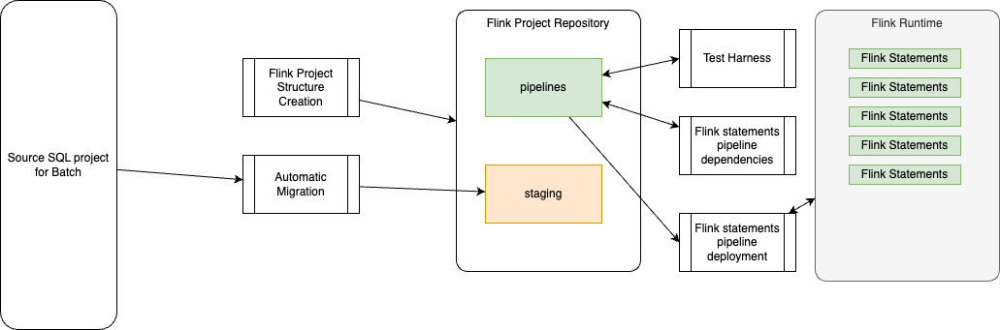

# Recipes Summary

This section provides a brief overview of the migration tools and their application to specific use cases. Ensure the following environment variables are set: in a `.env` file. For example, in a project where the source repository is cloned to your-src-dbt-folder and the target Flink project is flink-project, use these setting:

```sh
export SRC_FOLDER=../../your-src-dbt-folder/models
export STAGING=../../flink-project/staging
export PIPELINES=../../flink-project/pipelines
export CONFIG_FILE=../../flink-project/config.yaml
```

Refer to the high-level component view for project organization details:



## Project related tasks

### Create a Flink project structure

* Get help for the shift_left project management CLI

```sh
shift_left project --help
```


* To create a new project:

```sh
shift_left project init <project_name> <project_path> --project-type 
# example for a default Kimball project
shift_left project init flink-project ../
# For a project more focused on developing data product
shift_left project init flink-project ../ --project-type data-product
```

???- info "Output"
        ```sh
        my-flink-project
        ├── config.yaml
        ├── docs
        ├── logs
        ├── pipelines
        │   ├── common.mk
        │   └── data_product_1
        │       ├── dimensions
        │       ├── facts
        │       │   └── fct_order
        │       │       ├── Makefile
        │       │       ├── sql-scripts
        │       │       │   ├── ddl.fct_order.sql
        │       │       │   └── dml.fct_order.sql
        │       │       ├── tests
        │       │       └── tracking.md
        │       ├── intermediates
        │       └── sources
        └── staging
        ```

### Add a table structure to the Flink project

* Get help for the shift_left table management CLI

```sh
shift_left table --help
```

* The goal of this tool is to create a folder structure to start migrating SQL manually:

```sh
shift_left table init fct_user $PIPELINES/facts/p1
```

???- info "Output"

        ```
        └── p1
            └── fct_user
                ├── Makefile
                ├── sql-scripts
                │   ├── ddl.fct_user.sql
                │   └── dml.fct_user.sql
                ├── tests
                └── tracking.md
        ```


## Migrate SQL tables from source to staging

As introduced before the migration involves a Local LLM running with Ollama, so you need this environment to be able to run this command.

```sql
shift_left table migrate $SRC_FOLDER/facts/aqem/aqem.fct_event.sql $STAGING --recursive
```


## Build an inventory of Flink SQL DDL and DML statements

The inventory is built by crowling the `pipelines` folder and looking at each dml to get the table name. The inventory is a hashmap with the key being the table name and the value is a TableReference defined as:

```python
class FlinkTableReference(BaseModel):
    table_name: Final[str] 
    ddl_ref: Optional[str]
    dml_ref: Optional[str]
    table_folder_name: str
```

* To build an inventory file do the following command:

```sh
shift_left table build-inventory $PIPELINES
```

???- info "Example of inventory created"

        ```json
        "src_table_2": {
            "table_name": "src_table_2",
            "dml_ref": "../examples/flink_project/pipelines/sources/p1/src_table_2/sql-scripts/dml.src_table_2.sql",
            "table_folder_name": "../examples/flink_project/pipelines/sources/p1/src_table_2"
        },
        "src_table_3": {
            "table_name": "src_table_3",
            "dml_ref": "../examples/flink_project/pipelines/sources/p1/src_table_3/sql-scripts/dml.src_table_3.sql",
            "table_folder_name": "../examples/flink_project/pipelines/sources/p1/src_table_3"
        },
        "src_table_1": {
            "table_name": "src_table_1",
            "dml_ref": "../examples/flink_project/pipelines/sources/src_table_1/sql-scripts/dml.src_table_1.sql",
            "table_folder_name": "../examples/flink_project/pipelines/sources/src_table_1"
        },
        "int_table_2": {
            "table_name": "int_table_2",
            "dml_ref": "../examples/flink_project/pipelines/intermediates/p1/int_table_2/sql-scripts/dml.int_table_2.sql",
            "table_folder_name": "../examples/flink_project/pipelines/intermediates/p1/int_table_2"
        },
        "int_table_1": {
            "table_name": "int_table_1",
            "dml_ref": "../examples/flink_project/pipelines/intermediates/p1/int_table_1/sql-scripts/dml.int_table_1.sql",
            "table_folder_name": "../examples/flink_project/pipelines/intermediates/p1/int_table_1"
        },
        "fct_order": {
            "table_name": "fct_order",
            "dml_ref": "../examples/flink_project/pipelines/facts/p1/fct_order/sql-scripts/dml.fct_order.sql",
            "table_folder_name": "../examples/flink_project/pipelines/facts/p1/fct_order"
        }
        ```


## Work with pipelines

The table inventory, as created in previous recipe, is important to get the pipeline metadata created. The approach is to define metadata for each table in term of DDL and DML + parents and children.

The model look like:

```python
class FlinkStatementHierarchy(BaseModel):
    table_name: str
    type: str
    path: str
    ddl_ref: str
    dml_ref: str
    parents: Optional[Set[FlinkTableReference]]
    children: Optional[Set[FlinkTableReference]]
```

A source table will not have parent, while a sink table will not have children. Intermediate tables have both.

???+ info "For any help of pipeline commands"

    ```sh
    shift_left pipeline --help
    ```

### Build structured pipeline metadata and walk through

A pipeline is discovered by walking from the sink to the sources via intermediate statements. Each pipeline is a list of existing dimension and fact tables, and for each table the tool creates the `pipeline_definition.json` reflecting the data structure presented in previous section.

The structured folder for a table looks like:

`<facts | intermediates | dimensions | sources>/<product_name>/<table_name>`

The `pipeline_definition.json` is persisted under the <table_name> folder.

The tool needs to get an up-to-date inventory, see [previous section to build it](#build-an-inventory-of-flink-sql-ddl-and-dml-statements).

* Build all the `pipeline_definition.json` from a given sink:

```sh
shift_left pipeline build-metadata $PIPELINES/facts/p1/fct_order/sql-scripts/dml.fct_order.sql
# you can add a folder to get the path to the inventory
shift_left pipeline build-metadata $PIPELINES/facts/p1/fct_order/sql-scripts/dml.fct_order.sql $PIPELINES
```

### Delete pipeline_defition.json file for a given folder

Delete all the `pipeline_definition.json` files from a given folder. It goes down recursively.

```sh
shift_left pipeline delete-metadata $PIPELINES
```

### Build pipeline reports 

* Get a report from one sink to n sources:

```sh
shift_left pipeline report fct_table
# with the inventory.json folder
shift_left pipeline report fct_table $PIPELINES
```

* Get a report from one source to n sinks:

```sh
shift_left pipeline report src_table
```

### Pipeline Deployment

There are multiple choices to deploy a Flink Statement:

1. During development phase where `confluent cli` is used with an higher level of abstractions delivered by a Makefile within the table folder.
1. Use the CLI to do a controlled deployment of a table. The tool uses the pipeline metadata to walk down the pipeline to change each table with a new version.
1. The CLI has a mode to delete all tables of a pipelines and redeploy each them with a control manner to avoid overloading the Flink JobManager


The deployment will take the full pipeline from the source to sink giving a sink table name.

#### Using Confluent CLI / makefile

Each confluent cli are defined in a common makefile, and each sql to be deploy has also a make file with a set of targets:

* To create the Flink dynamic table using the target Flink compute pool do:

  ```sh
  make create_flink_ddl
  ```

This action creates the Kafka topic with the name of the table and create the schema definitions for the key and the value in the Schema Registry of the Confluent Cloud environment. A DDL execution will terminate and the Flink job statement is set to be Completed.

* Verify the completion of the job using cli:

  ```sh
  make describe_flink_ddl
  ```

* If the table is also controlled by a DML, for example for joins, or deduplication, a DML may be deployed using:

  ```sh
  make create_flink_dml
  ```

* Verify the running job using cli:

  ```sh
  make describe_flink_dml
  ```

* Sometime, developer may need to delete the created topics and schemas, for that the makefile target is:

  ```sh
  make drop_table_<table_name>
  ```

* Each Flink Statement is named, so it may be relevant to delete a created statement with the command:

  ```sh
  make delete_flink_statements
  ```
