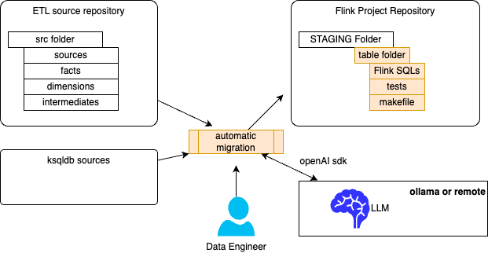

# Recipes Summary

???- info "Version"
    * Created January 2025.
    * Update: 04/10/2025. 

This chapter details the standard activities to manage a Confluent Cloud Flink project with the `shift_left` tool when doing a ETL to real-time migration project. The recipes address new project initiative or a migration project from an existing SQL based ETL solution.

As introduced in the [context chapter](./index.md#context) the CLI groups a set of commands to manage project, tables, and Flink statements as part of pipelines.


The audience for the recipes chapter are the Data Engineers and the SREs.

## Tool context

The shift_left CLI may help to support different Data Engineers and SREs activities. For that, the tool will build and use a set of different components. The figures below groups what the different components are for different use cases.

The major constructs managed by the tools are:

* Project, with the structure of the different folders
* Table with the structure of a **table folder structure**, with sql-scripts, makefile and tests
* **Table inventory** to keep an up to date inventory of table, with the references to the ddl and dml. Tables not in the inventory do not exist.
* **Pipeline definition**: metadata about a table and its parents and / or children. Sink tables have only parents, source tables have only children.
* **Flink SQL statements** for DDL and DML
* For complex DML it may make sense to have dedicated **test definitions**

### Developer centric use cases

Developers are responsible to develop the Flink SQL statements and potentially the tests. 


The table folder structure, table inventory and pipeline_definitions are generated and managed by tools. No human edit is needed and event discouraged.

See the following recipes to support the management of those elements:

* [Create a Flink project](#create-a-flink-project-structure)
* [Create table folder structure](#add-a-table-structure-to-the-flink-project)
* [Validate best practices](#validate-naming-convention-and-best-practices)
* [Test harness](./test_harness.md)
* [Understand Flink statement dependencies](#understand-the-current-flink-statement-relationship)

### Deployment centric use cases

For pipeline deployment, there are very important elements that keep the deployment consistent, most of them are described above, but the execution plan is interesting tool to assess, once a pipeline is defined, how it can be deployed depending if SREs deploy from the source, the sink or an intermediate. (See [pipeline managmeent section](pipeline_mgr.md))


The involved recipes are:

* [Table inventory](#build-an-inventory-of-all-the-flink-sql-ddl-and-dml-statements-with-table-name-as-key)
* [Build dependency metadata](#build-structured-pipeline-metadata-and-walk-through)
* [Understand Flink statement dependencies](#understand-the-current-flink-statement-relationship)
* [Review the current execution plan from a Flink statement](#assess-a-flink-statement-execution-plan)
* [Deploy a Flink Statement taking into consideration its execution plan](#pipeline-deployment)

### Migration use cases

This use case applies only when the source project is available and based on dbt or SQL. (ksql will be possible in the future)



* [Migrate existing SQL source file to Flink SQL using AI.](#migrate-sql-tables-from-source-to-staging)

## Setup

To use the CLI be sure to follow the [setup instructions.](./setup.md)

Ensure the following environment variables are set: in a `.env` file. For example, in a project where the source repository is cloned to your-src-dbt-folder and the target Flink project is flink-project, use these setting:

```sh
export FLINK_PROJECT=$HOME/Code/flink-project
export STAGING=$FLINK_PROJECT/staging
export PIPELINES=$FLINK_PROJECT/pipelines
export SRC_FOLDER=$HOME/Code/datawarehouse/models
export CCLOUD_CONTEXT=login.....
export CPOOL_ID=lfcp-xxxxxx
export TOPIC_LIST_FILE=$FLINK_PROJECT/src_topic_list.txt 
export CONFIG_FILE=$FLINK_PROJECT/config.yaml
export DB_NAME=kafka_env_name
export CCLOUD_ENV_ID=env-xxxxxx
```

### The config.yaml file

The `config.yaml` file is important to set up and reference with the CONFIG_FILE environment variable. [See instructions](./setup.md/#environment-setup)

## Project related tasks

### Create a Flink project structure

This activity is done when starting a new Flink project. The lead developer will jump start a project by running this command to create folder and git init.

* Get help for the [shift_left project management](./command.md/#project) CLI

```sh
shift_left project --help
```

* To create a new project:

```sh
shift_left project init <project_name> <project_path> 
# example for a default Kimball project
shift_left project init flink-project ../
# For a project more focused on developing data as a product
shift_left project init flink-project ../ --project-type data-product
```

???- info "Output"
        ```sh
        my-flink-project
        ├── config.yaml
        ├── docs
        ├── logs
        ├── pipelines
        │   ├── common.mk
        │   └── data_product_1
        │       ├── dimensions
        │       ├── facts
        │       │   └── fct_order
        │       │       ├── Makefile
        │       │       ├── sql-scripts
        │       │       │   ├── ddl.fct_order.sql
        │       │       │   └── dml.fct_order.sql
        │       │       ├── tests
        │       │       └── tracking.md
        │       ├── intermediates
        │       └── sources
        └── staging
        ```

### List the topics

Build a txt file with the list of topic for the Kafka Cluster defined in the config.yaml. 

```sh
shift_left project list-topics $PIPELINES
```

Each topic has a json object to describe its metadata.

???- example "topic metadata"
    ```json
       {
        'kind': 'KafkaTopic',
        'metadata': {
            'self': 'https://p....confluent.cloud/kafka/v3/clusters/lkc-..../topics/....audit-trail',
            'resource_name': 'crn:///kafka=lkc-..../topic=....audit-trail....'
        },
        'cluster_id': 'lkc-.....',
        'topic_name': '....audit-trail',
        'is_internal': False,
        'replication_factor': 3,
        'partitions_count': 1,
        'partitions': {'related': 'https://.../partitions'},
        'configs': {'related': 'https://...../configs'},
        'partition_reassignments': {'related': 'https://..../partitions/-/reassignment'},
        'authorized_operations': []
    }
    ```

## Table related tasks

On a day to day basis Data Engineer may need to add a table and the SQL statements to create and insert records to the new table. The table has to land in one of the hierarchy: **facts, dimensions, views, intermediates, sources**.

### Add a table structure to the Flink project

* Get help for the shift_left table management CLI

```sh
shift_left table --help
```

* Create a new table folder structure to start writing SQL statements using basic templates: (see the [command description](./command.md/#table-init)). There are two mandatory arguments: the table name and the folder to write the new table structure to. Be sure to following table name naming convention.

```sh
shift_left table init fct_user $PIPELINES/facts/p1
```

???- example "Output example"
    ```
    facts
        └── p1
            └── fct_user
                ├── Makefile
                ├── sql-scripts
                │   ├── ddl.fct_user.sql
                │   └── dml.fct_user.sql
                ├── tests
                └── tracking.md
    ```

???- info "A table name naming convention"
    The folder name may be used as a table name in a lot of commands. The following naming convention is defined:
    
    * Sources:  Template: `src_<product>_<table_name>`   Examples: `src_p1_records, src_p2_users` 
    * Intermediates:  Template: `int_<product>_<table_name>` Examples: `int_p1_action, int_p2_inventory_event`
    * Facts or dimensions: Template: `<product>_<fct|dim><table_name>` Examples: `p1_dim_user_role,  p2_fct_event_link`
    * Materialized Views: Template: `<product>_mv_<table_name>`  Examples: `p2_mv_cancel_event, p2_mv_config_users`

### Discover the current source dependencies

When doing a migration project it may be interesting to understand the current SQL statement relationship with the tables it uses.

It is assumed the source project, is constructed with the Kimball approach. Existing Data Platforms have such capabilities, but we found interesting to get a simple tool that goes within the source SQL content file and build a dependencies graph. The current SQL parser is good to parse dbt SQL file, as Flink SQL.

Starting with a single fact table, the following command will identify the dependency hierarchy and include elements to track the migration project:

```sh
shift_left table search-source-dependencies $SRC_FOLDER/facts/fact_education_document.sql $SRC_FOLDER
```

* The output may look like in the followring report:

```sh
-- Process file: $SRC_FOLDER/facts/fact_education_document.sql
Table: fact_education_document in the SQL ../facts/fact_education_document.sql  depends on:
  - int_education_completed  in SQL ../intermediates/int_education_completed.sql
  - int_non_abandond_training  in SQL ../intermediates/int_non_abandond_training.sql
  - int_unassigned_curriculum  in SQL ../intermediates/int_unassigned_curriculum.sql
  - int_courses   in SQL ../intermediates/int_courses.sql
  - int_docs_wo_training_data  in SQL ../intermediates/docs/int_docs_wo_training_data.sql
```


### Validate naming convention and best practices

It is possible to assess a set of basic rules against all files in the $PIPELINES folder

```sh
shift_left table validate-table-names $PIPELINES
```

Some standard reported violations:

| Error message | Action | Comments |
| --- | --- | ---|
| CREATE TABLE statement | CREATE TABLE IF NOT EXISTS statement| Missing 'IF NOT EXISTS' |
| WRONG FILE NAME | <ddl|dml>.<int|src>_<product>_<table_name>.sql | Refer for DDL, DML file naming [standards](./index.md/#shift_left_tooling) | 
| MISSING pipeline definition | pipeline_definition.json is missing | Refer to GIT repo directory sturcture [standards]()|

### Understand the current Flink Statement relationship

When the DML is created with the FROM, JOINS,... it is possible to use the tool to get the hierarchy of parents and build the pipeline_definition.json file for a table. It is strongly recommended to use sink tables, like `dimensions, facts or views` dml statements.

1. It is important that table inventory is up to date. See [this section](#build-an-inventory-of-all-the-flink-sql-ddl-and-dml-statements-with-table-name-as-key)
1. Run the command to update the current pipeline definition metadata and update the parents ones, recursively.

```sh
shift_left pipeline build-metadata $PIPELINES/dimensions/p1/dim_event/sql-scripts/dml.p1_dim_event.sql
```

This will build the `pipeline_definition.json`.

???- example "a simple metadata file"
    ```json
    {
    "table_name": "fct_order",
    "type": "fact",
    "dml_ref": "pipelines/facts/p1/fct_order/sql-scripts/dml.fct_order.sql",
    "ddl_ref": "pipelines/facts/p1/fct_order/sql-scripts/ddl.fct_order.sql",
    "path": "pipelines/facts/p1/fct_order",
    "state_form": "Stateful",
    "parents": [
        {
            "table_name": "int_table_2",
            "type": "intermediate",
            "dml_ref": "pipelines/intermediates/p1/int_table_2/sql-scripts/dml.int_table_2.sql",
            "ddl_ref": "pipelines/intermediates/p1/int_table_2/sql-scripts/ddl.int_table_2.sql",
            "path": "pipelines/intermediates/p1/int_table_2",
            "state_form": "Stateful",
            "parents": [],
            "children": [
                {
                "table_name": "fct_order",
                "type": "fact",
                "dml_ref": "pipelines/facts/p1/fct_order/sql-scripts/dml.fct_order.sql",
                "ddl_ref": "pipelines/facts/p1/fct_order/sql-scripts/ddl.fct_order.sql",
                "path": "pipelines/facts/p1/fct_order",
                "state_form": "Stateful",
                "parents": [],
                "children": []
                }
            ]
        },
        {
            "table_name": "int_table_1",
            "type": "intermediate",
            "dml_ref": "pipelines/intermediates/p1/int_table_1/sql-scripts/dml.int_table_1.sql",
            "ddl_ref": "pipelines/intermediates/p1/int_table_1/sql-scripts/ddl.int_table_1.sql",
            "path": "pipelines/intermediates/p1/int_table_1",
            "state_form": "Stateful",
            "parents": [],
            "children": [
                {
                "table_name": "fct_order",
                "type": "fact",
                "dml_ref": "pipelines/facts/p1/fct_order/sql-scripts/dml.fct_order.sql",
                "ddl_ref": "pipelines/facts/p1/fct_order/sql-scripts/ddl.fct_order.sql",
                "path": "pipelines/facts/p1/fct_order",
                "state_form": "Stateful",
                "parents": [],
                "children": []
                }
            ]
        }
    ],
    "children": []
    }
    ```

### Update tables content recursively

There are some cases when we need to apply a set of updates to a lot of Flink Statement files in one run. The update can be coded into a python file which includes classes that implement an interface. The following updates are already supported.

| Update name | Type of changes  | Class name |
| --- | --- | --- |
| CompressionType |  Add the `'kafka.producer.compression.type' = 'snappy'` in the WITH section of the DDL |  `shift_left.core.utils.table_worker.Change_CompressionType `|
| LocalTimeZone |  add or change the `'sql.local-time-zone' = 'UTC-0'` in the DDL | `shift_left.core.utils.table_worker.ChangeLocalTimeZone` |
| ChangeModeToUpsert| Set the `'changelog.mode' = 'upsert'` configuration | `shift_left.core.utils.table_worker.ChangeChangeModeToUpsert` |
| ChangePK_FK_to_SID | apply replace("_pk_fk", "_sid") to dml | `shift_left.core.utils.table_worker.ChangePK_FK_to_SID` |
| Concat_to_Concat_WS | change the type of concat to use | `shift_left.core.utils.table_worker.Change_Concat_to_Concat_WS` |
| ReplaceEnvInSqlContent | Replace the name of the raw topic with the environement prefix| `shift_left.core.utils.table_worker.ReplaceEnvInSqlContent` |


Example of a command to modify all the DDL files in the $PIPELINES folder hierarchy:

```sh
shift_left table update-tables $PIPELINES  --ddl --class-to-use shift_left.core.utils.table_worker.Change_CompressionType
```

???- info "Extending the TableWorker"
    The class is in shift_left.core.utils.table_worker.py module. Each new class needs to extend the TabeWorker interface

    ```python
    class TableWorker():
    """
    Worker to update the content of a sql content, applying some specific logic
    """
    def update_sql_content(sql_content: str) -> Tuple[bool, str]:
        return (False, sql_content)


    class YourOwnUpdate(TableWorker):

     def update_sql_content(sql_content: str) -> Tuple[bool, str]:
        # your code here
        return updated, new_content
    ```

### Migrate SQL tables from source to staging

As presented in the [introduction](./index.md/#shift_left-tooling), the migration involves a Local LLM running with Ollama, so developers need this environment to be able to run the following commands.

* Process one table

```sql
shift_left table migrate $SRC_FOLDER/facts/aqem/aqem.fct_event.sql $STAGING
```

* Process the table and the parents up to the sources. So it will migrate recursively all the tables. This could take time if the dependencies graph is big.

```sql
shift_left table migrate $SRC_FOLDER/facts/aqem/aqem.fct_event.sql $STAGING --recursive
```


???- info "Example of Output"
    ```sh
    process SQL file ../src-dbt-project/models/facts/fct_examination_data.sql
    Create folder fct_exam_data in ../flink-project/staging/facts/p1

    --- Start translator AI Agent ---
    --- Done translator Agent: 
    INSERT INTO fct_examination_data
    ...
    --- Start clean_sql AI Agent ---
    --- Done Clean SQL Agent: 
    --- Start ddl_generation AI Agent ---
    --- Done DDL generator Agent:
    CREATE TABLE IF NOT EXISTS fct_examination_data (
        `exam_id` STRING,
        `perf_id` STRING,
    ...
    ```


For a given table, the tool creates one folder with the table name, a Makefile to help managing the Flink Statements with Confluent cli, a `sql-scripts` folder for the Flink ddl and dml statements. A `tests` folder to add `test_definitions.yaml` (using another tool) to do some basic testing.

Example of created folders:

```sh
facts
    └── fct_examination_data
        ├── Makefile
        ├── sql-scripts
        │   ├── ddl.fct_examination_data.sql
        │   └── dml.fct_examination_data.sql
        └── tests
```

As part of the process, developers need to validate the generated DDL and update the PRIMARY key to reflect the expected key. This information is hidden in lot of files in the dbt, and the key extraction is not yet automated by the migration tools, yet.

Normally the DML is not executable until all dependent tables are created.

## Build an inventory of all the Flink SQL DDL and DML statements with table name as key

The inventory is built by crowling the Flink project `pipelines` folder and by looking at each dml to get the table name. The inventory is a hashmap with the key being the table name and the value is a `FlinkTableReference` defined as:

```python
class FlinkTableReference(BaseModel):
    table_name: Final[str] 
    ddl_ref: Optional[str]
    dml_ref: Optional[str]
    table_folder_name: str
```

* To build an inventory file do the following command:

```sh
shift_left table build-inventory $PIPELINES
```

???- example "Example of inventory created"

        ```json
        "src_table_2": {
            "table_name": "src_table_2",
            "dml_ref": "../examples/flink_project/pipelines/sources/p1/src_table_2/sql-scripts/dml.src_table_2.sql",
            "table_folder_name": "../examples/flink_project/pipelines/sources/p1/src_table_2"
        },
        "src_table_3": {
            "table_name": "src_table_3",
            "dml_ref": "../examples/flink_project/pipelines/sources/p1/src_table_3/sql-scripts/dml.src_table_3.sql",
            "table_folder_name": "../examples/flink_project/pipelines/sources/p1/src_table_3"
        },
        "src_table_1": {
            "table_name": "src_table_1",
            "dml_ref": "../examples/flink_project/pipelines/sources/src_table_1/sql-scripts/dml.src_table_1.sql",
            "table_folder_name": "../examples/flink_project/pipelines/sources/src_table_1"
        },
        "int_table_2": {
            "table_name": "int_table_2",
            "dml_ref": "../examples/flink_project/pipelines/intermediates/p1/int_table_2/sql-scripts/dml.int_table_2.sql",
            "table_folder_name": "../examples/flink_project/pipelines/intermediates/p1/int_table_2"
        },
        "int_table_1": {
            "table_name": "int_table_1",
            "dml_ref": "../examples/flink_project/pipelines/intermediates/p1/int_table_1/sql-scripts/dml.int_table_1.sql",
            "table_folder_name": "../examples/flink_project/pipelines/intermediates/p1/int_table_1"
        },
        "fct_order": {
            "table_name": "fct_order",
            "dml_ref": "../examples/flink_project/pipelines/facts/p1/fct_order/sql-scripts/dml.fct_order.sql",
            "table_folder_name": "../examples/flink_project/pipelines/facts/p1/fct_order"
        }
        ```

The `inventory.json` file is saved under the $PIPELINES folder and it is used intensively by the shift_left cli.

???- warning "Update the inventory"
    Each time a new table is added or renamed, it is recommended to run this command. It can even be integrated in a CI pipeline.

## Work with pipelines

The table inventory, as created in previous recipe, is important to get the pipeline metadata created. The approach is to define metadata for each table to keep relevant information for the DDL and DML files, the parents and children relationships. The recursive information is limited to 2 levels to avoid infinite loops.

A source table will not have parent, while a sink table will not have children. Intermediate tables have both.

For deeper analysis of the challenges of deploying Flink statements, we recommend reading [Confluent Cloud Flink product documentation - Query evolution chapter](https://docs.confluent.io/cloud/current/flink/concepts/schema-statement-evolution.html#query-evolution) and the [pipeline manager chapter.](./pipeline_mgr.md)

### Build structured pipeline metadata and walk through

A pipeline is discovered by walking from the sink to the sources via intermediate statements. Each pipeline is a list of existing dimension and fact tables, and for each table the tool creates the `pipeline_definition.json`.

The project folder structure for a table looks like in the following convention:

`<facts | intermediates | dimensions | sources>/<product_name>/<table_name>`

The `pipeline_definition.json` is persisted under the `<table_name>` folder. 

The tool needs to get an up-to-date inventory, see [previous section to build it](#build-an-inventory-of-flink-sql-ddl-and-dml-statements).

* Build all the `pipeline_definition.json` from a given sink by specifying the **DML** file path:

```sh
shift_left pipeline build-metadata $PIPELINES/facts/p1/fct_order/sql-scripts/dml.fct_order.sql
# you can add a folder, as CLI argument, to get the path to the inventory. By default it uses the environment variable.
shift_left pipeline build-metadata $PIPELINES/facts/p1/fct_order/sql-scripts/dml.fct_order.sql $PIPELINES
```

The tool goes over the SQL content and get table names from the JOINs, and the FROM. It will remove CTE and any extracted string that are not table names. The regular expression may have some misses, so the tool searches within the table inventory, anyway.

The following figure illustrates what will happen for each parent of the referenced table. The first figure illustrates existing Flink statement hierarchy, which means, existing tables have a pipeline_definition.json file in their repective folder, created from previous run. 


As a developer the sink table **E** is added and the tool is executed. The **E** and **C** pipeline definitions are new so created, while the **Z** already exists, so the tool update its pipeline_definition children list , by adding the child **C**.


The tool will keep existing file and merge content.

???- example "The different pipeline_definition.json impacted"
    The sink table **E** will have a new metadata file:

    ```json
    {
    "table_name": "E",
    "type": "fact",
    "parents": [
        {
            "table_name": "C",
            "type": "intermediate",
            "path": "pipelines/intermediates/p1/C",
    }
    ```

    Table **C** will also have a new one:

    ```json
    {
    "table_name": "C",
    "type": "intermediate",
    "parents": [
        {
            "table_name": "Z",
            "type": "intermediate",
            "path": "pipelines/intermediates/p/Z",
        }],
    "children": [ { "table_name": "E", ...} ]
    }
    ```

    While **Z** get a new child:

    ```json
    {
    "table_name": "Z",
    "type": "intermediate",
    "parents": [{ "table_name": "X", ...},
            { "table_name": "Y", ...},
        ],
    "children": [ { "table_name": "D", ...},
                    { "table_name": "P", ...},
                     { "table_name": "C", ...}
                ]
    }
    ```


### Delete pipeline_definition.json files for a given folder

Delete all the `pipeline_definition.json` files from a given folder. The command walk down the folder tree to find table folder.

```sh
shift_left pipeline delete-metadata $PIPELINES
```

Only the facts tables:

```sh
shift_left pipeline delete-metadata $PIPELINES/facts
```

### Define pipeline definitions for all the tables within a folder hierarchy

It may be relevant to update all the metadata definitions within a given folder. Start by deleting all and then recreate:

* For facts or dimensions

```sh
shift_left pipeline delete-metadata $PIPELINES/facts
#
shift_left pipeline build-all-metadata $PIPELINES/facts
```

* For all pipelines

```sh
shift_left pipeline delete-metadata $PIPELINES
#
shift_left pipeline build-all-metadata $PIPELINES
# same as env variable will be used
shift_left pipeline build-all-metadata
```

### Build pipeline reports 

* Get a report from one sink table to n sources: 

```sh
shift_left pipeline report fct_table
# explicitly specifying the pipeline folder. (this is to demonstrate that it can run in STAGING folder too)
shift_left pipeline report fct_table $PIPELINES
```

* Get a report from one source to n sinks:

```sh
shift_left pipeline report src_table
```

The same approach works for intermediate tables.


### Assess a Flink Statement execution plan

The execution plan is a hierarchical Flink statement hierarchy enriched with current state of the running DMLs on the platform and with a plan to start non running parents, and update or restart the children depending of the upgrade mode: stateless or stateful.

Here is a basic command for an intermediate table:

```sh
shift_left pipeline build-execution-plan-from-table int_table_2 --compute-pool-id  lfcp-123456 --dml-only --force
```

It will take into account the following parameters in the config.yaml:

```yaml

```

???- example "The outcome of an execution plan"
    The information reported is taking into account the table hierarchy and the state of the Statement currently running:

    ```
    To deploy fct_order the following statements need to be executed in the order

    --- Parents impacted ---
	src_2 is : RUNNING on cpool_id: lfcp-12345 may run-as-parent: True or restart-as-child: False
	src_1 is : RUNNING on cpool_id: lfcp-12345 may run-as-parent: True or restart-as-child: False
    src_3 is : RUNNING on cpool_id: lfcp-12345 may run-as-parent: True or restart-as-child: False
    ```

???+ info "For any help of pipeline commands"

    ```sh
    shift_left pipeline --help
    ```


### Pipeline Deployment

There are multiple choices to deploy a Flink Statement:

1. During development phase where `confluent cli` is used with an higher level of abstractions delivered by a Makefile within the table folder.
1. Use the CLI to do a controlled deployment of a table. The tool uses the pipeline metadata to walk down the pipeline to change each table with a new version.
1. The CLI has a mode to delete all tables of a pipelines and redeploy each them with a control manner to avoid overloading the Flink JobManager


The deployment will take the full pipeline from the source to sink giving a sink table name.


#### Using the deploy pipeline command

The pipeline management, requirements and approach are details in the [pipeline management chapter.](./pipeline_mgr.md) The following are commands to use for common use cases:

* Deploy a sink table (Fact, Dimension or View)

## Troubleshooting the CLI

When starting the CLI, it creates a logs folder under the $HOME/.shift_left/logs folder. The level of logging is specified in the `config.yaml` file in the app section:

```yaml
app:
  logging: INFO
```


