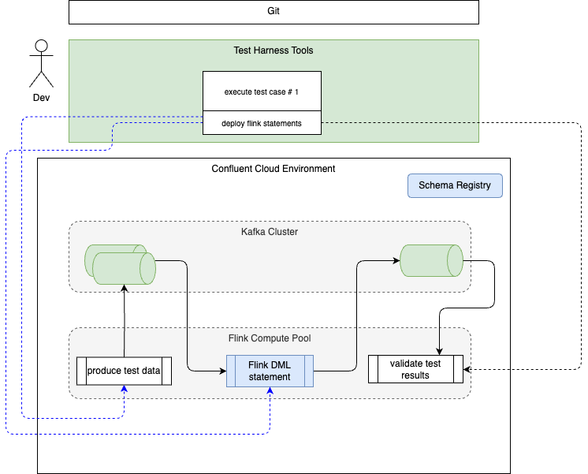

# Testing Flink Statement in isolation

???- info "Version"
    Created Mars 21- 2025 

The goals of this chapter is to present the requirements and design of this test tool, which is included as a command in the `shift-left` CLI.

## Context


We should differentiate two types of testing: Flink statement developer testing, like unit / component tests, and integration tests with other tables and with real data streams.

The objectives of a test harness for developer and system testers, is to validate the quality of a new Flink SQL statement deployed on Confluent Cloud and therefore address the following needs:

1. be able to deploy a flink statement (the ones we want to focus on are DMLs, or CTAS)
1. be able to generate test data from schema registry or table definition - and with developer being able to tune test data for each test cases.
1. produce test data to n source topics, consumes from the expected output topic and validates expected results. All this flow being one test case. This may be automated for non-regression testing to ensure continuous quality.
1. support multiple testcase definitions as a test suite
1. tear down topics and data.
1. Do not impact other topics that may be use to do integration tests within the same Kafka Cluster.

The following diagram illustrates the global infrastructure deployment context:


The following diagram illustrates the target unit testing environment:




## Requirements

* [x] The command is integrated in the shilf-left CLI as:

```sh
table init-unit-test [OPTIONS] TABLE_NAME
or
table run-test-suite [OPTIONS] TABLE_NAME

Arguments:

TABLE_NAME: Name of the table to unit tests. [required]
Options:

--test-case-name TEXT: Name of the individual unit test to run. By default it will run all the tests [required]
--compute-pool-id TEXT: Flink compute pool ID. If not provided, it will create a pool. [env var: CPOOL_ID; required]
```

* [x] Be able to define test suite. The yaml is defined as below and created automatically by the `shift_left table init-unit-tests` command.

```yaml

foundations:
    - table_name: int_table_1
      ddl_for_test: tests/ddl_int_table_1.sql
    - table_name: int_table_2
      ddl_for_test: tests/ddl_int_table_2.sql
test_suite:
- name: test_case_1
    inputs:
    - table_name: int_table_1
    sql_file_name: tests/insert_int_table_1_1.sql
    - table_name: int_table_2
    sql_file_name: tests/insert_int_table_2_1.sql
    outputs:
    - table_name: fct_order
    sql_file_name: tests/validate_fct_order_1.sql
- name: test_case_2
    inputs:
    - table_name: int_table_1
      sql_file_name: tests/insert_int_table_1_2.sql
    - table_name: int_table_2
      sql_file_name: tests/insert_int_table_2_2.sql
    outputs:
    - table_name: fct_order
    sql_file_name: tests/validate_fct_order_2.sql
```

* [x] Organize tests under the tests folder of the table: (Created automatically with `shift_left table init-unit-tests`)

```sh
└── fct_order
    ├── Makefile
    ├── pipeline_definition.json
    ├── sql-scripts
    │   ├── ddl.fct_order.sql
    │   └── dml.fct_order.sql
    └── tests
        ├── ddl_int_table_1.sql
        ├── ddl_int_table_2.sql
        ├── insert_int_table_1_1.sql
        ├── insert_int_table_1_2.sql
        ├── insert_int_table_2_1.sql
        ├── insert_int_table_2_2.sql
        ├── test_definitions.yaml
        ├── validate_fct_order_1.sql
        └── validate_fct_order_2.sql
```

* [x] Create the above structure and template from the DML sql content at init phase. The command should be:

  ```sh
  table init-unit-tests table_name
  ```

  This command needs the inventory and loads table references and metadata and then creates content from the DML SQL content.
  
* [x] For each test cases defined do the following on a selected compute pool id

    * Execute the foundation sql statements to create the temporary tables for injecting test data (e.g. `tests/ddl_int_table_1.sql`, `tests/ddl_int_table_2.sql`). The name of the tables are changed to add `_ut` at the end to avoid colision with existing topics.
    * Deploy the target flink deployment to test, by loading the sql content from the file (e.g. `sql-scripts/dml.fct_order.sql`) but modifying the table names dynamically (e.g.  `int_table_1` becoming `int_table_1_ut`). 
    * Execute the inputs SQL statements to inject the data to the different source tables.
    * Execute the validation SQL statement to validate the expected results

* [x] When test suite is done teardown the temporary tables.

## Usage/Demonstration

* Select a table to test the logic. This test tool is relevant for DML with complex logic. In this example user_role has a join between three tables.

```sql
INSERT INTO int_p3_user_role
WITH
    users as (
        select user_id,
               tenant_id,
               role_id,
               status
        from src_p3_users 
        left join src_p3_tenants on src_p3_users.tenant_id = src_p3_tenants.id
    ),
    roles as (
        select role_id
               role_name,
               u.tenant_id,
               u.user_id,
               u.status
        from src_p3_roles
        left join users u on src_p3_roles.role_id = u.role_id
    )
SELECT * FROM roles;
```

* Verify the ddl and dml of the table are created under `sql-scripts`, verify the table inventory exists and is up to date, then run the following command:

```sh
shift_left table init-unit-tests <table_name>
# example with the name of the table following a certain naming convention
shift_left table init-unit-tests int_p3_user_role
```

* In the table folder under the pipelines, verify the created files under the `tests` folder. For each table, inputs to the dml under test, there will be a ddl script file created with the numbered suffix to match the unit test it supports.  In the example below the dml_user_role.sql has 2 input tables: src_identity_metadata and tenant_dimension. For each of those input tables a foundation ddl is created to create the table with "_ut" for test isolation: `ddl_src_identity_metadata.sql` and `ddl_tenant_dimension.sql`

```sh
user_role
├── Makefile
├── sql-scripts
│   ├── ddl.int_p3_user_role.sql
│   └── dml.int_p3_user_role.sql
├── tests
│   ├── ddl_src_p3_roles.sql
│   ├── ddl_src_p3_tenants.sql
│   ├── ddl_src_p3_users.sql
│   ├── insert_src_p3_roles_1.sql
│   ├── insert_src_p3_roles_2.csv
│   ├── insert_src_p3_tenants_1.sql
│   ├── insert_src_p3_tenants_2.csv
│   ├── insert_src_p3_users_1.sql
│   ├── insert_src_p3_users_2.csv
│   ├── test_definitions.yaml
│   ├── validate_int_p3_user_role_1.sql
│   └── validate_int_p3_user_role_2.sq
```

Then 2 test cases are created as you can see in the 

```yaml
test_suite:
- name: test_int_p3_user_role_1
  inputs:
  - table_name: src_p3_roles
    file_name: ./tests/insert_src_p3_roles_1.sql
    file_type: sql
  - table_name: src_p3_users
    file_name: ./tests/insert_src_p3_users_1.sql
    file_type: sql
  - table_name: src_p3_tenants
    file_name: ./tests/insert_src_p3_tenants_1.sql
    file_type: sql
  outputs:
  - table_name: int_p3_user_role
    file_name: ./tests/validate_int_p3_user_role_1.sql
    file_type: sql
- name: test_int_p3_user_role_2
  inputs:
  - table_name: src_p3_roles
    file_name: ./tests/insert_src_p3_roles_2.csv
    file_type: csv
  - table_name: src_p3_users
    file_name: ./tests/insert_src_p3_users_2.csv
    file_type: csv
  - table_name: src_p3_tenants
    file_name: ./tests/insert_src_p3_tenants_2.csv
    file_type: csv
  outputs:
  - table_name: int_p3_user_role
    file_name: ./tests/validate_int_p3_user_role_2.sql
    file_type: sql
```

* Data engineers update the content of the insert statements and validation statements. Once done try unit testing with the command

```sh
shift_left table  run-test-suite <table_name> --test-case-name test_<table_name>_1 
```

A test execution can take some time as it will:

1. Read the test definition.
1. Execute the ddl for the input tables with '_ut' suffix to keep specific test data.
1. Insert records in input tables.
1. Create a new output table with '_ut' suffix.
1. Deploy the DML to test
1. Deploy the validate SQL for each test case.
1. Build test report

* Clean the tests with the command:

```
shift_left table delete-tests <table_name>
```


