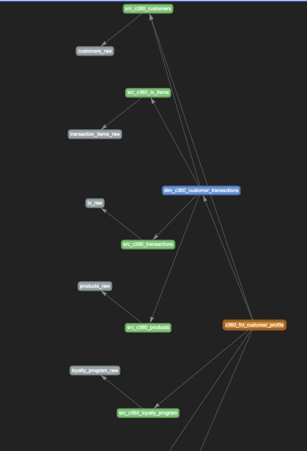
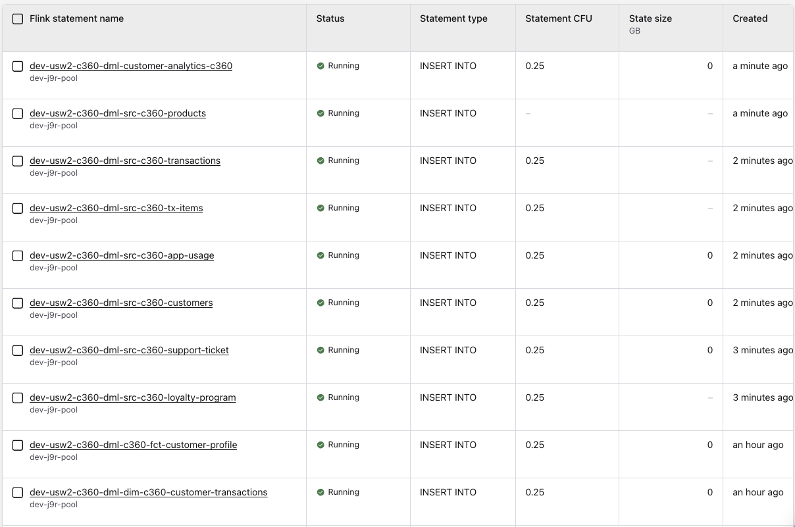

# Lab: Day to Day Data Engineer's Work

???+ info "Version"
	Created in 09/2025.
	Updated 06/2026

This lab presents the Data Engineers' activities to perform during the development of Confluent Flink Solution using tools like `shift_left`, Confluent Console, confluent cli or even the Confluent MCP server.

## Prerequisites

* During this lab, you will work on an existing Flink project, therefore clone the following repository if not already done:
	```sh
	git clone https://github.com/jbcodeforce/flink_project_demos.git
	cd flink_project_demos/customer_360/c360_flink_processing
	```

* Set your configuration file and environment variables as presented in [the setup lab](./setup_lab.md)
	```sh
	export FLINK_PROJECT=$PWD
	export PIPELINES=$FLINK_PROJECT/pipelines
	export SL_CONFIG_FILE=$FLINK_PROJECT/config.yaml

	# the above exports can be done by doing
	source set_sl_env
	```
* 'shift_left' cli is installed

## Get familiar with existing customer 360 Flink project

The `flink_project_demos/customer_360/c360_flink_processing` folder includes the pipelines folder where all the Flink SQLs are defined. The following tree view presents the Kimball structure and the `c360`, and `sdp` data products. Not all folders are presented.

```sh
├── pipelines
│   ├── common.mk
│   ├── dimensions
│   │   ├── c360
│   │   │   └── dim_customer_transactions
│   │   │       ├── Makefile
│   │   │       ├── pipeline_definition.json
│   │   │       ├── sql-scripts
│   │   │       │   ├── ddl.dim_c360_customer_transactions.sql
│   │   │       │   └── dml.dim_c360_customer_transactions.sql
│   │   │       ├── tests
│   │   │       └── tracking.md
│   │   └── sdp
│   │       ├── dim_estimated_delivery
│   │       └── dim_order_fulfillment
│   ├── facts
│   │   ├── c360
│   │   │   └── fct_customer_360_profile
│   │   │       ├── Makefile
│   │   │       ├── sql-scripts
│   │   │       │   ├── ddl.c360_fct_customer_profile.sql
│   │   │       │   └── dml.c360_fct_customer_profile.sql
│   │   │       ├── tests
│   │   │       │   ├── ddl_dim_c360_customer_transactions.sql
│   │   │       │   ├── ddl_src_c360_app_usage.sql
│   │   │       │   ├── ddl_src_c360_customers.sql
│   │   │       │   ├── ddl_src_c360_loyalty_program.sql
│   │   │       │   ├── ddl_src_c360_support_ticket.sql
│   │   │       │   ├── insert_dim_c360_customer_transactions_1.sql
│   │   │       │   ├── insert_src_c360_app_usage_1.sql
│   │   │       │   ├── insert_src_c360_customers_1.sql
│   │   │       │   ├── insert_src_c360_loyalty_program_1.sql
│   │   │       │   ├── insert_src_c360_support_ticket_1.sql
│   │   │       │   ├── README.md
│   │   │       │   ├── test_definitions.yaml
│   │   │       │   └── validate_c360_fct_customer_profile_1.sql
│   │   │       └── tracking.md
│   │   └── sdp
│   │       └── fct_order_fulfillment
│   ├── sources
│   │   ├── c360
│   │   │   ├── src_app_usage
│   │   │   ├── src_customers
│   │   │   ├── src_loyalty_program
│   │   │   │   ├── Makefile
│   │   │   │   ├── pipeline_definition.json
│   │   │   │   ├── sql-scripts
│   │   │   │   │   ├── ddl.src_c360_loyalty_program.sql
│   │   │   │   │   └── dml.src_c360_loyalty_program.sql
│   │   │   │   ├── tests
│   │   │   │   │   ├── ddl.loyalty_program_raw.sql
│   │   │   │   │   ├── faker.loyalty_program_raw.sql
│   │   │   │   │   └── insert_loyalty_program_raw.sql
│   │   │   │   └── tracking.md
│   │   │   ├── src_products
│   │   │   ├── src_support_ticket
│   │   │   ├── src_transactions
│   │   │   └── src_tx_items
│   │   └── sdp
│   │       ├── src_shipments
│   │       └── src_tracking_events
│   └── views
│       ├── c360
│       │   └── customer_analytics_c360
│       │       ├── Makefile
│       │       ├── pipeline_definition.json
│       │       ├── sql-scripts
│       │       │   ├── ddl.customer_analytics_c360.sql
│       │       │   └── dml.customer_analytics_c360.sql
│       │       ├── tests
│       │       └── tracking.md
│       └── sdp
│           └── fulfillment_analytics


```

## Create table

During the life of the shift left project, data engineers create need table. The tool supports creating table with a common structure. As an example we will add a shipment source table:

```sh
shift_left table init src_shipments $PIPELINES/sources --product-name abc
```

The created folder will look like:

```sh
├── sources
│   └── abc
│       ├── src_shipments
│       │   ├── Makefile
│       │   ├── sql-scripts
│       │   │   ├── ddl.src_abc_shipments.sql
│       │   │   └── dml.src_abc_shipments.sql
│       │   ├── tests
│       │   └── tracking.md
```

The ddl and dml are placeholder files and need to be updated with the business logic. The `tests` folder will be populated with test data using the `test harness` command.

* Modify the DDL with the following definition
	```sql
	CREATE TABLE IF NOT EXISTS src_abc_shipments (
		shipment_id STRING,
		transaction_id STRING,
		tracking_number STRING,
		carrier STRING,
		service_level STRING,
		origin_location STRING,
		street STRING,
		city STRING,
		zipcode STRING,
		state STRING,
		weight_kg DECIMAL(8,3),
		dimensions STRING,
		target_ship_date DATE,
		shipment_status STRING,
		shipping_cost DECIMAL(8,2),
	PRIMARY KEY(shipment_id) NOT ENFORCED
	) DISTRIBUTED BY HASH(shipment_id) INTO 1 BUCKETS
	WITH (
	'changelog.mode' = 'upsert',
	'key.format' = 'avro-registry',
	'value.format' = 'avro-registry',
	'kafka.retention.time' = '0',
	'kafka.producer.compression.type' = 'snappy',
	'scan.bounded.mode' = 'unbounded',
	'scan.startup.mode' = 'earliest-offset',
	'value.fields-include' = 'all'
	);
	```

* And the DML as:
	```sql
	INSERT INTO src_abc_shipments
	SELECT
		shipment_id,
		transaction_id,
		tracking_number,
		carrier,
		service_level,
		origin_location,
		destination_address.street AS street,
		destination_address.city AS city,
		destination_address.zipcode AS zipcode,
		destination_address.state AS state,
		weight_kg,
		dimensions,
		target_ship_date,
		shipment_status,
		shipping_cost
	FROM shipments_raw where shipment_status = 'delivered';
	```

* Shipments_raw is most likely a CDC topics in your target environment. But it is possible to use the seeds folder to create synthetic data for tests. This is already availble:
	```sh
	seeds
	└── shipment_raw
		└── sql-scripts
			├── ddl.shipments_raw.sql
			└── dml.shipments_raw.sql
	```

???+ info "Accessing to shift_left logs"
	Each time shift_left is execute a new log file is created under $HOME/.shift_left/logs. The referenced file is listed in the print out at the beginning of the execution. Something like:
	```sh
	---------------------------------------- SHIFT_LEFT 0.1.51 ----------------------------------------
	| CONFIG_FILE     : /Users/jerome/Documents/Code/flink_project_demos/customer_360/c360_flink_processing/config.yaml
	| LOGS folder     : /Users/jerome/.shift_left/logs/06-11-26-15-14-23-D0SR
	| Session started : 2026-06-11 15:14:23
	--------------------------------------------------------------------------------------------
	```

## Update the table inventory

When adding a new table, or pulling update from the remote git branch, it is relevant to update the local table inventory. The command to run is:

```sh
shift_left table build-inventory 
```

The `inventory.json` is created under the $PIPELINES folder and includes one element per table. Your new table is added.

```yaml
    "customer_analytics_c360": {
        "table_name": "customer_analytics_c360",
        "product_name": "c360",
        "type": "view",
        "dml_ref": "pipelines/views/c360/customer_analytics_c360/sql-scripts/dml.customer_analytics_c360.sql",
        "ddl_ref": "pipelines/views/c360/customer_analytics_c360/sql-scripts/ddl.customer_analytics_c360.sql",
        "table_folder_name": "pipelines/views/c360/customer_analytics_c360"
    },
	...
	"src_abc_shipments": {
        "table_name": "src_abc_shipments",
        "product_name": "abc",
        "type": "source",
        "dml_ref": "pipelines/sources/abc/src_shipments/sql-scripts/dml.src_abc_shipments.sql",
        "ddl_ref": "pipelines/sources/abc/src_shipments/sql-scripts/ddl.src_abc_shipments.sql",
        "table_folder_name": "pipelines/sources/abc/src_shipments",
        "kafka_topic": null
    },
```

## Update Table Metadata

The shift_left utility maintains a set of metadata per table. One use case is to understand parents and children of a given table. The commands to run are in the order:

```sh
# one time only
shift_left pipeline delete-all-metadata
# each time a new table is added
shift_left  pipeline build-all-metadata
```

## Assess the deployment execution plan

The new table has some dependencies and it can be validated using:

```sh
shift_left pipeline build-execution-plan --table-name src_abc_shipments --compute-pool-id $SL_FLINK_COMPUTE_POOL_ID
```

The response looks like:

```sh
To deploy src_abc_shipments to env-yk3jm6, the following statements need to be executed in the order


--- Ancestors: 1 ---
Statement Name                                                  Status          Compute Pool    Action  Upgrade Mode    Table Name
-------------------------------------------------------------------------------------------------------------------------------------------
dev-usw2-seeds-dml-shipments-raw                                UNKNOWN         lfcp-11p88z     To run  Stateless       shipments_raw

dev-usw2-abc-dml-src-abc-shipments                              UNKNOWN         lfcp-11p88z     Restart Stateful        src_abc_shipments
--- 1 children to restart
---Matching compute pools: 
Pool ID         Pool Name                                       Current/Max CFU Flink Statement name
--------------------------------------------------------------------------------------------------------------------------------------------
lfcp-11p88z     dev-j9r-pool                                    0/50            dev-usw2-seeds-dml-shipments-raw
lfcp-11p88z     dev-j9r-pool                                    0/50            dev-usw2-abc-dml-src-abc-shipments
--------------------------------------------------------------------------------------------------------
Table_name                                              | Status     | Pending Records | Num Records Out
--------------------------------------------------------------------------------------------------------
shipments_raw                                           | UNKNOWN    |               0 |               0
src_abc_shipments                                       | UNKNOWN    |               0 |               0
--------------------------------------------------------------------------------------------------------
```

### Running this table deployment

The following command will create the seeds, insert some records, create the deployed table via DDL and then run the deduplication forever:
```sh
shift_left pipeline deploy --table-name src_abc_shipments --compute-pool-id $SL_FLINK_COMPUTE_POOL_ID
```

The trace finishes with this kind of table view:

```sh
--------------------------------------------------------------------------------------------------------
Table_name                                              | Status     | Pending Records | Num Records Out
--------------------------------------------------------------------------------------------------------
shipments_raw                                           | RUNNING    |               0 |               0
src_abc_shipments                                       | RUNNING    |               0 |               0
--------------------------------------------------------------------------------------------------------
```

### Deploying a layer

It may be relevant to start deploying a specific layer like the seeds or raw topic. The command looks like:

```sh
shift_left pipeline deploy --dir $PIPELINES/seeds --compute-pool-id $SL_FLINK_COMPUTE_POOL_ID
```

## Looking of the full graph for a fact table

```sh
shift_left pipeline report c360_fct_customer_profile
```

Open the html page `$HOME/.shift_left/c360_fct_customer_profile_pipeline_graph.html` will bring a graph view of the relationships:




## Unit test table

* Unit tests may be added to fact, view and dimension tables. The shift_keft tool looks at the SQL content (the joins, and from) and build test data for each sources.  Here is an example of unit tests added for the `c360_fct_customer_profile`

```sh
# DO NOT RUN THIS COMMAND for this table
shift_left table init-unit-tests c360_fct_customer_profile  --nb-test-cases 1
#
```

The added files are under the `tests` folder. 

```sh
├── c360
│   └── fct_customer_360_profile
│       ├── Makefile
│       ├── pipeline_definition.json
│       ├── sql-scripts
│       │   ├── ddl.c360_fct_customer_profile.sql
│       │   └── dml.c360_fct_customer_profile.sql
│       ├── tests
│       │   ├── ddl_dim_c360_customer_transactions.sql
│       │   ├── ddl_src_c360_app_usage.sql
│       │   ├── ddl_src_c360_customers.sql
│       │   ├── ddl_src_c360_loyalty_program.sql
│       │   ├── ddl_src_c360_support_ticket.sql
│       │   ├── insert_dim_c360_customer_transactions_1.sql
│       │   ├── insert_src_c360_app_usage_1.sql
│       │   ├── insert_src_c360_customers_1.sql
│       │   ├── insert_src_c360_loyalty_program_1.sql
│       │   ├── insert_src_c360_support_ticket_1.sql
│       │   ├── README.md
│       │   ├── test_definitions.yaml
│       │   └── validate_c360_fct_customer_profile_1.sql
```

* If you have a local LLM server it is possible to define environment variables and run the same command with the ai extension so the synthetic data will have coherent data to support joins
	```sh
	# Osaurus on mac environment variables:
	export SL_LLM_BASE_URL=http://localhost:1337/v1
	export SL_LLM_MODEL=qwen3-coder-30b-a3b-instruct-mlx-4bit

	shift_left table init-unit-tests c360_fct_customer_profile  --nb-test-cases 1 --ai
	```

* Tune the data manually to make the tests relevant.
* Work on the Validation SQL  to be sure, it reports test failure or success.

* Run the unit test
	```sh
	shift_left table run-unit-tests c360_fct_customer_profile  --compute-pool-id $SL_FLINK_COMPUTE_POOL_ID
	```

## Assess a pipeline from the view

* Verify an execution plan of one of your table. For example for the view of the customer 360 profile we can do:
	```sh
	shift_left pipeline build-execution-plan --table-name customer_analytics_c360   --compute-pool-id $SL_FLINK_COMPUTE_POOL_ID
	```

	The result looks somethig like, with the statement name, using naming convention, the current status of the statement, the compute pool on which the statement may run or is running, and the action the tool will take.

	```sh
	--- Ancestors: 9 ---
	Statement Name                                                  Status          Compute Pool    Action  Upgrade Mode    Table Name
	--------------------------------------------------------------------------------------------------------------------------------------------------------
	---
	dev-usw2-c360-dml-src-c360-app-usage                            STOPPED         lfcp-xvrvmz     To run  Stateful        src_c360_app_usage
	dev-usw2-c360-dml-src-c360-support-ticket                       COMPLET         lfcp-xvrvmz     Skip    Stateful        src_c360_support_ticket
	dev-usw2-c360-dml-src-c360-loyalty-program                      COMPLET         lfcp-xvrvmz     Skip    Stateless       src_c360_loyalty_program
	dev-usw2-c360-dml-src-c360-customers                            COMPLET         lfcp-279od2     Skip    Stateful        src_c360_customers
	dev-usw2-c360-dml-src-c360-transactions                         STOPPED         lfcp-xvrvmz     To run  Stateless       src_c360_transactions
	dev-usw2-c360-dml-src-c360-tx-items                             STOPPED         lfcp-xvrvmz     To run  Stateful        src_c360_tx_items
	dev-usw2-c360-dml-src-c360-products                             COMPLET         lfcp-xvrvmz     Skip    Stateless       src_c360_products
	dev-usw2-c360-dml-dim-c360-customer-transactions                STOPPED         lfcp-x23ggx     To run  Stateful        dim_c360_customer_transactions
	dev-usw2-c360-dml-c360-fct-customer-profile                     STOPPED         lfcp-xvrvmz     To run  Stateful        c360_fct_customer_profile

	--- Children to restart ---
	Statement Name                                                  Status          Compute Pool    Action  Upgrade Mode    Table Name
	--------------------------------------------------------------------------------------------------------------------------------------------------------
	---
	dev-usw2-c360-dml-customer-analytics-c360                       STOPPED         lfcp-xvrvmz     Restart Stateless       customer_analytics_c360
	```

	It is followed by a list of compute pools with their current capacity.

	```sh
	Pool ID         Pool Name                                       Current/Max CFU Flink Statement name
	--------------------------------------------------------------------------------------------------------------------------------------------
	lfcp-xvrvmz     dev-j9r-pool                                    0/50            dev-usw2-c360-dml-src-c360-app-usage
	lfcp-xvrvmz     dev-j9r-pool                                    0/50            dev-usw2-c360-dml-src-c360-support-ticket
	lfcp-xvrvmz     dev-j9r-pool                                    0/50            dev-usw2-c360-dml-src-c360-loyalty-program
	lfcp-279od2     dev-src-c360-customers                          0/30            dev-usw2-c360-dml-src-c360-customers
	lfcp-xvrvmz     dev-j9r-pool                                    0/50            dev-usw2-c360-dml-src-c360-transactions
	lfcp-xvrvmz     dev-j9r-pool                                    0/50            dev-usw2-c360-dml-src-c360-tx-items
	lfcp-xvrvmz     dev-j9r-pool                                    0/50            dev-usw2-c360-dml-src-c360-products
	lfcp-x23ggx     dev-dim-c360-customer-transactions              0/30            dev-usw2-c360-dml-dim-c360-customer-transactions
	lfcp-xvrvmz     dev-j9r-pool                                    0/50            dev-usw2-c360-dml-c360-fct-customer-profile
	lfcp-xvrvmz     dev-j9r-pool                                    0/50            dev-usw2-c360-dml-customer-analytics-c360
	```

## Deploy one to many tables

To deploy according to the execution plan, the deployment may include a default compute pool id, if a statement has no current pool id assigned to.

```sh
shift_left pipeline deploy --table-name customer_analytics_c360 --compute-pool-id $SL_FLINK_COMPUTE_POOL_ID
```

This process deploys all statements that are not running yet, from the lower level of the pipeline to the raw level.

```sh
--------------------------------------------------------------------------------------------------------
Table_name                                              | Status     | Pending Records | Num Records Out
--------------------------------------------------------------------------------------------------------
loyalty_program_raw                                     | COMPLETED  |               0 |               0
support_ticket_raw                                      | RUNNING    |               0 |               0
customers_raw                                           | COMPLETED  |               0 |               0
app_usage_raw                                           | COMPLETED  |               0 |               0
transaction_items_raw                                   | COMPLETED  |               0 |               0
tx_raw                                                  | COMPLETED  |               0 |               0
products_raw                                            | COMPLETED  |               0 |               0
src_c360_loyalty_program                                | RUNNING    |               0 |               0
src_c360_support_ticket                                 | RUNNING    |               0 |               0
src_c360_customers                                      | RUNNING    |               0 |               0
src_c360_app_usage                                      | RUNNING    |               0 |               0
src_c360_tx_items                                       | RUNNING    |               0 |               0
src_c360_transactions                                   | RUNNING    |               0 |               0
src_c360_products                                       | RUNNING    |               0 |               0
dim_c360_customer_transactions                          | RUNNING    |               0 |               0
c360_fct_customer_profile                               | RUNNING    |               0 |               0
customer_analytics_c360                                 | RUNNING    |               0 |               0
--------------------------------------------------------------------------------------------------------
```

Connected to the Confluent Console, and the flink statement view we can see the running statements like:



### Viewing view content

Executing the following snapshot query should return 4 rows, with all the current statistical information.

```sql
select * from `customer_analytics_c360`
```

## Schema Evolution

In the context of this lab, we will consider two types of schema evolution: a raw table has new columns, with default value to simulate external producer of records changing their own schema.

The second type applies to Flink table schema evolution, where an intermediate Flink statement add a derivated column with default value.

### CDC Schema Changes

To be able to assess what are the CDC schema modified, we can enforce that avro, json or protobuf schemas are defined in a git repository before being managed by Kafka Connector. If this is not the case, there should be a process to query the different schema version from Confluent Schema Registry of a list of tables raw sources of the pipelines under consideration.

### Flink SQL intermediate tables schema evolution


### Assess impacted tables

* Assess the modified SQLs from a given date on the `main` git branch:
	```sh
	shift_left project list-modified-files --project-path . --file-filter sql --since 2025-09-10 main
	```

* Assess all the impacted tables from the DDLs modified
	```sh
	shift_left project  list-impacted-tables
	 --modified-files-path ~/.shift_left/modified_flink_files.json --project-path $PIPELINES --output-file ~/.shift_left/impacted_tables.json 
	 ```

* Data engineers modify the `impacted_tables.json` file to remove any tables they do not want to update.

* To get some help processing the unit tests DDL impacted, the following command can be executed:
	```sh
	shift_left project update-ut-ddl ~/.shift_left/impacted_tables.json --full-replace --project-path $PIPELINES
	```
