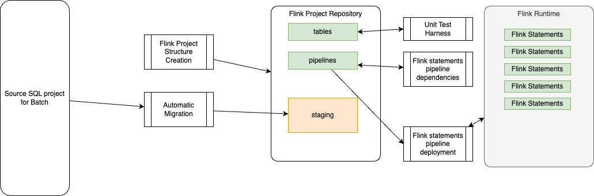

# Lab: Migration using AI

The current AI based migration implementation supported by this tool enables migration of:

* dbt/Spark SQL to Flink SQL
* ksqlDB to Flink SQL

The approach uses LLM agents local or remote. After this lab you should be able to use the `shift_left` tool to partially automate your SQL migration to Flink SQL.

The core idea is to leverage LLMs to understand the source SQL semantics and to translate them to Flink SQLs. 

**This is not production ready, the LLM can generate hallucinations, and one to one mapping between source like ksqlDB or Spark to Flink is sometime not the best approach.** We expect that this agentic solution could be a strong foundation for better results, and can be enhanced over time.

???+ warning "Lab Environment"
	The Lab was developed and tested on Mac. `shift_tool` runs on Mac, Linux and Windows WSL.

## Prerequisites

Be sure to have done the [Setup Lab](./setup_lab.md) to get shift_left cli operational.

For the AI based migration the following needs to be done:

1. [Install Ollama](https://ollama.com/download/mac)
	```sh
	# Verify the ollama cli:
	ollama list 
	ollama --help
	```

1. Download the `qwen3-coder:30b` model:
	```sh
    ollama pull qwen3-coder:30b
	```

1. Add or update the following environments variables in your `set_env_var`
	```sh
	export SL_LLM_BASE_URL=http://localhost:11434/v1
	export SL_LLM_MODEL=qwen3-coder:30b
	export SL_LLM_API_KEY=not_needed_key
	# and the following variables will be use to control `confluent` cli during statement deployment
	export CCLOUD_ENV_ID=env-
	export CCLOUD_ENV_NAME=
	export CCLOUD_KAFKA_CLUSTER=<name of the kafka cluster>
	export CLOUD_REGION=us-west-2
	export CLOUD_PROVIDER=aws
	export CCLOUD_CONTEXT=login-<your email>-https://confluent.cloud
	export CCLOUD_COMPUTE_POOL_ID=<compute pool id>
	```

1. Start Ollama server:
	```sh
	ollama serve
	```

1. As an alternate if you have OpenAI API key, you can change those environment variable to refect openAI end points and key. There is also OpenRouter.ai , where you can define an API key: [https://openrouter.ai/](https://openrouter.ai/), to get access to larger models, like `qwen/qwen3-coder:free` which is free to use for few requests per day (pricing conditions may change).

## Migration Context

As described in the [introduction](../index.md), at a high level, data engineers need to take a source project, define a new Flink project, perform migrations, run Flink statement deployments, manage pipelines, and write and execute tests:

<figure markdown='span'>

<capture>Shift Left project system context</capture>
</figure>

For automatic migration, LLMs alone might not be sufficient to address complex translations in an automated process. Agents help by specializing in specific steps with feedback loops and retries.

???- info "Complexity of language translation"
      For any programming language translation, we need to start with a corpus of source code. This can be done programmatically from the source language, then for each generated code, implement the semantically equivalent Flink SQL counterparts.

      The goal of corpus creation is to identify common ksqlDB or Spark SQL constructs (joins, aggregations, window functions, UDFs, etc.), then manually translate a smaller, diverse set of queries to establish translation rules. Using these rules, we can generate permutations and variations of queries. It is crucial to test the generated Flink SQL against a test dataset to ensure semantic equivalence.

      Build query pairs to represent the source-to-target set as a corpus. For each query pair, include the relevant table schemas. This is vital for the LLM to understand data types, column names, and relationships. It is not recommended to have different prompts for different parts of a SQL statement, as the LLM's strength comes from the entire context. However, there will still be problems for SQL scripts that have many lines of code, as a 200+ line script will reach thousands of tokens.

      To improve result accuracy, it is possible to use Supervised Fine-tuning techniques:

      * Fine-tune the chosen LLM on the generated code. The goal is for the LLM to learn the translation patterns and nuances between ksqlDB or Spark SQL and Flink SQL.
      * Prompt Engineering: Experiment with different prompt structures during fine-tuning and inference. A good prompt will guide the LLM effectively. The current implementation leverages this type of prompt: e.g., "Translate the following Spark SQL query to Flink SQL, considering the provided schema. Ensure semantic equivalence and valid Flink syntax."
      * For evaluation assessment, it is recommended to add a step to the agentic workflow to validate the syntax of the generated Flink SQL. Better validation involves assessing semantic equivalence by determining if the Flink SQL query produces the same results as the ksqlDB or Spark SQL query on a given dataset.

      For validation, it may be relevant to have a knowledge base of common translation errors. When the Validation Agent reports an error, the Refinement Agent attempts to correct the Flink SQL. It might feed the error message back to the LLM with instructions to fix it. The knowledge base should be populated with human-curated rules for common translation pitfalls.

      It may be important to explain why a translation was done a certain way to better tune prompts. For complex queries or failures, human review ("human in the loop") and correction mechanisms will be essential, with the system learning from these corrections.

### Limitations

LLMs cannot magically translate custom UDFs. This will likely require manual intervention or a separate mapping mechanism. The system should identify and flag untranslatable UDFs.

Flink excels at stateful stream processing. Spark SQL's batch orientation means that translating stateful Spark operations (if they exist) to their Flink streaming counterparts would be highly complex and would likely require significant human oversight or custom rules.

### Spark SQL to Flink SQL

While Spark SQL is primarily designed for batch processing, it can be migrated to Flink real-time processing with some refactoring and tuning. Spark also supports streaming via micro-batching. Most basic SQL operators (SELECT, FROM, WHERE, JOIN) are similar between Spark and Flink. Some Spark SQL built-in functions need different mapping to Flink built-in functions or may be some UDFs. 


* Example command to migrate one Spark SQL script
  ```sh
  # set SRC_FOLDER to one of the spark source folder like tests/data/spark-project
  # set STAGING to the folder target to the migrated content
  shift_left table migrate customer_journey $SRC_FOLDER/sources/src_customer_journey.sql $STAGING --source-type spark
  ```

### ksqlDB to Flink SQL

ksqlDB has SQL constructs to do stream processing, but this is not an ANSI SQL engine. It is highly integrated with Kafka and uses specific keywords to define such integration. LLM may have limited access to ksql code during the training, so results may not be optimal. 

The migration and prompts need to support more examples outside of the classical SELECT and CREATE TABLE statements.

* Example command to migrate one of ksqlDB script:
  ```sh
  shift_left table migrate w2_processing $SRC_FOLDER/w2_processing.ksql $STAGING --source-type ksql --product-name tax
  ```

## Migration Workflows

We propose two different migrations to illustrate ksql to Flink SQL query migration using the Confluent KsqlDB tutorials and one Spark to Flink SQL.

You should have cloned the `flink_project_demo` repository during [the setup](setup_lab.md/#2--a-demonstration-project).

### 1. Project Initialization

* Start a Terminal
* Create a new Flink git project to keep your migrated Flink statements (e.g., my-flink-demo):

```bash
# May be create a temporary folder
mkdir $HOME/Code
# Initialize project structure
shift_left project init <your-project> </path/to/your/folder>
# example 
shift_left project init my-flink-demo $HOME/Code
```

You should get the following project structure, which represents a `start schema` structure.
```sh
my-flink-demo
├── .git
├── docs
├── pipelines
│   ├── common.mk
│   ├── dimensions
│   ├── facts
│   ├── intermediates
│   ├── sources
│   └── views
└── staging
.gitignore
```

* Update the your environment variables, to reflect the project name you just created, taking as source the `set_env_var` file under tutorial/setup:
	```sh
	# .... other secrets omitted
	export FLINK_PROJECT=$PWD/../my-flink-demo/
	export PIPELINES=$FLINK_PROJECT/pipelines
	export STAGING=$FLINK_PROJECT/staging
	export SRC_FOLDER=$PWD/../flink_project_demos/ksql_tutorial/sources
	export CONFIG_FILE=$PWD/tutorial/setup/config.yaml
	```
* The deployment organization is illustrated in the following figure: The cloned flink_project_demo includes ksql sources queries to migrate, and referenced by the SRC_FOLDER environment variable, the tool will save migrated to Flink SQL files to the STAGING folder.

<figure markdown='span'>

<capture>ksql project organization</capture>
</figure>

### 2. KSQL to Flink SQL Lab

The following steps will help you migrate some of the ksql Tutorial queries, as introduced by [Confluent ksql Queries](https://developer.confluent.io/confluent-tutorials/splitting/ksql/) to Confluent Cloud Flink SQL. Those queries are defined as sources in the [Flink project demonstration git repository](https://github.com/jbcodeforce/flink_project_demos/tree/main/ksql_tutorial/README.md) 

#### 2.1 Migration Executions

* Be sure environment variables are set in your Terminal session:
	```sh
	source tutorial/setup/set_env_var
	```

* Migrate a basic splitting ksql query
	```sh
 	shift_left table migrate acting_events $SRC_FOLDER/routing/splitting.ksql $STAGING --source-type ksql 
	```

	The command generates:
	```sh
	my-flink-demo
	├─ staging/default/acting_events/sql-scripts
    │   ├── ddl.acting_events_drama.sql
    │   ├── ddl.acting_events_fantasy.sql
    │   ├── ddl.acting_events_other.sql
    │   ├── dml.acting_events_drama.sql
    │   ├── dml.acting_events_fantasy.sql
    │   └── dml.acting_events_other.sql
	```

	The `default` folder is the name of the data product, it can be set in the cli. We will see this in the next migration

* Looking at the shift_left logs: the shift_left cli create a folder in $HOME/.shilt_left.logs for each execution. The name of the file (e.g. `.shift_left/logs/12-02-25-18-09-34-i9kb` )is given at each execution trace:
	```sh
	---------------------------------------- SHIFT_LEFT 0.1.46 ----------------------------------------
	| CONFIG_FILE     : /Users/jerome/Documents/Code/my-flink-demo/config.yaml
	| LOGS folder     : /Users/jerome/.shift_left/logs/12-02-25-18-09-34-i9kb
	| Session started : 2025-12-02 18:09:34
	```

	It this then possible to see more details of the migration process.

* Run a second example:
	```sql
	shift_left table migrate shipped_orders $SRC_FOLDER/joins/stream_stream.ksql $STAGING --source-type ksql --product-name orders
	```

	which should create:
	```
	orders
	└── shipped_orders
        ├── Makefile
        ├── sql-scripts
        │   ├── ddl.orders.sql
        │   ├── ddl.shipments.sql
        │   ├── ddl.shipped_orders.sql
        │   └── dml.shipped_orders.sql
        ├── tests
        └── tracking.md
	```

#### 2.2 Validation and Deployment

There are two ways to validate the deployment, using `confluent` cli or use the Confluent Cloud Flink Workspace

=== "confluent"
	```bash
	confluent login 
	# Deploy to Confluent Cloud for Flink
	cd ${STAGING}/default/acting_events

	# Deploy DDL statements
	make create_flink_ddl

	# Which may generate a trace like:
	+---------------+--------------------------------------+
	| Creation Date | 2025-12-03 02:25:39.17975            |
	|               | +0000 UTC                            |
	| Name          | dev-usw2-default-ddl-acting-events   |
	| Statement     | CREATE TABLE IF NOT EXISTS           |
	|               | acting_events (     name STRING,     |
	|               |     title STRING,     genre          |
	|               | STRING,     PRIMARY KEY (name)       |
	|               | NOT ENFORCED ) DISTRIBUTED BY        |
	|               | HASH(name) INTO 1 BUCKETS WITH (     |
	|               |    'changelog.mode' = 'append',      |
	|               |  'kafka.retention.time' = '0',       |
	|               | 'kafka.producer.compression.type' =  |
	|               | 'snappy',     'scan.bounded.mode' =  |
	|               | 'unbounded',     'scan.startup.mode' |
	|               | = 'earliest-offset',                 |
	|               | 'value.fields-include' = 'all',      |
	|               | 'value.json-registry.schema-context' |
	|               | = '.flink-dev',     'value.format' = |
	|               | 'json-registry' );                   |
	| Compute Pool  | lfcp-xvrvmz                          |
	| Status        | COMPLETED                            |
	| Status Detail | Command completed                    |
	|               | successfully.                        |
	+---------------+--------------------------------------+
	# Deploy DML statements  
	make create_flink_dml
	```

=== "Workspace"
	In the Flink Workspace copu/paste one of the ddl or dml
	

???- warning "Known Issues"
	12/2/2025: The makefile creation needs to be improved as the LLM may generate multiple ddls and dmls. 

### 3. Spark to Flink SQL Lab

The concept is to take one of the fact table and migrate it.
<figure markdown='span'>

</figure>

#### 3.1 Change environment variable

Change the SRC_FOLGER to point to the existing Spark project about customer 360 analytics: (adapt the path below)

```sh
export SRC_FOLDER=$HOME/Documents/Code/flink_project_demos/customer_360/c360_spark_processing
```

#### 3.2 Migrate a fact table

Migrate the fact table:

```sh
 shift_left table migrate fct_customer_360_profile  $SRC_FOLDER/facts/fct_customer_360_profile.sql  $STAGING --source-type spark --product-name c360
```

Which should create the following content:

```
staging
├──c360
    ├── fct_customer_360_profile
    │   ├── Makefile
    │   ├── sql-scripts
    │   │   ├── ddl.support_tickets_raw.sql
    │   │   └── dml.fct_customer_360_profile.sql
    │   ├── tests
    │   └── tracking.md
```

#### 3.3 Validate on Confluent Cloud

Same as above Flink Workspace or confluent cli may be used for deployment.


## 4. Prepare for pipeline management

When the migration is done, and validated with via statement deployment, it is important to move from Staging to Pipelines. As all the table management will be done by shift_left from the pipeline management.

The move will be done depending of where the flink sql is a source processing, a dimension, a fact or event a view. Most of the shift left pipelines are processing raw data from topics created by CDC processes. Those topics are sources to the sources processing.

The following rule of thumb can be used:

| <div style="width:400px">Type of processing | Candidate Folder |
| ------------------ | ---------------- |
| Deduplication, filtering | sources |
| Joins between sources | dimensions |
| Joins between dimensions, aggregates | facts |
| Golden records directly queryable by final BI | views |

* Organize the Flink statements into pipeline folders, possibly using sources, intermediates, dimensions, and facts classification. Think about data products. A candidate hierarchy may look like this:
  ```sh
  my-flink-app

  ├── pipelines
  │   ├── common.mk
  │   ├── dimensions
  │   │   ├── data_product_a
  │   ├── facts
  │   │   ├── data_product_a
  │   ├── intermediates
  │   │   ├── data_product_a
  │   ├── sources
  │   │   ├── data_product_a
  │   │       ├── src_stream
  │   │       │   ├── Makefile
  │   │       │   ├── pipeline_definition.json
  │   │       │   ├── sql-scripts
  │   │       │   │   ├── ddl.src_stream.sql
  │   │       │   │   └── dml.src_stream.sql
  │   │       │   ├── tests
  │   ├── views
          └── data_product_a
  
  ```

Once folders are moved to the pipelines it is possible to build a table inventory:

* Run after new tables are created
  ```sh
  shift_left table build-inventory
  ```

As Flink statements have dependencies, it is important to use shift_left to manage the creation of the dependencies metadata automatically:

* Build all the metadata
  ```sh
  shift_left pipeline build-all-metadata 
  ```


* Then for any given table, Data Engineer may want to understand the execution plan
  ```sh
  shift_left pipeline build-execution-plan --table-name <>
  ```


## 5. Next

*This will be detailed within another lab*

* Add unit tests per table (at least for the complex DML ones) ([see test harness](../coding/test_harness.md))
	```sh
	shift_left table init-unit-tests c360_dim_users --nb-test-cases 1
	```
* Add source data into the first tables of the pipeline: under a sources table and tests folder

* Verify the created records within the sink tables.
