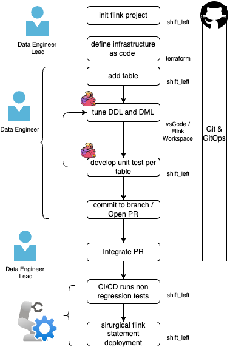
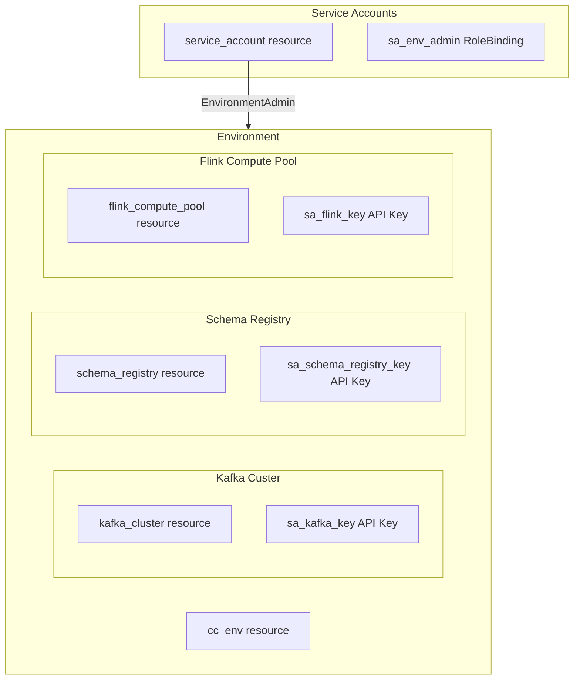
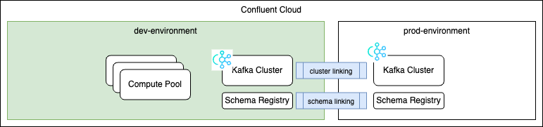
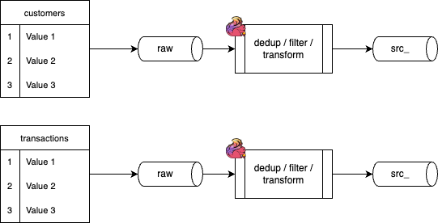

# Lab: Project Management

This lab focuses on starting a Confluent Flink project at scale, using best practices gathered during different real-life projects.

At the highest level, the SDLC for flink project, may include the following activities:

<figure markdown='span'>

</figure>

This labs introduces such activities.

##  Prerequisite

You have followed [the setup lab](setup_lab.md) to get shift_left CLI configured and running. Ensure `CONFIG_FILE`, `PIPELINES`, are set as described.

In this lab, we are addressing the folling 

- [Initialize a Project](#initialize-a-project) using infrastructure as code and CLI.
- [Add tables](#add-a-source-table) to add source processing, or building dimensions and facts using a data product approach.
- [Adding unit tests](#adding-unit-tests) to run on Confluent Cloud.
- [Project Admin Work](#project-admin-work) like building a table inventory, managing table metadata,working on Flink statements, assess table or data product execution plans, find orphan tables. 

## Initialize a Project

* Select a folder from where to create the Flink project
* Execute the project init command:
	```sh
	shift_left project init <project_name> <project_path>
	# Example for a default Kimball project
	shift_left project init dsp .
	```


The created folder structure looks like:
```sh
dsp
├── docs
├── IaC
│   └── environments
│       ├── dev
│       │   ├── confluent_tf_graph.md
│       │   ├── confluent.tf
│       │   ├── outputs.tf
│       │   ├── providers.tf
│       │   ├── terraform.tfvars.example
│       │   └── variables.tf
│       └── prod
├── pipelines
│   ├── common.mk
│   ├── dimensions
│   ├── facts
│   ├── intermediates
│   ├── sources
│   └── views
└── staging
```

## Leveraging Infrastructure As Code

The approach is to use Terraform to create Confluent Cloud Environment,  Kafka Cluster, Schema Registry and Compute pool. The created files are under the IaC folder and include:

| File | Purpose |
| --- | --- |
| providers.tf | Terraform provider configuration (Confluent, etc.) |
| confluent.tf | Confluent Cloud resources (environment, Kafka, Schema Registry, compute pool) |
| variables.tf | Input variables (e.g. region, cluster name) |
| outputs.tf | Output values (resource IDs, API keys) | 

To be able to run the terraform, a SRE needs to create, in the Confluent Console,  a service account, and the confluent cloud key and secrets for the terraform cli to use.

It is possible to reuse existing environment, schema registry and kafka cluster by setting their ids in the `terraform.tfvars` file.

```sh
existing_environment_id     	= "env-xxxxx"  # Leave null to create new environment
existing_kafka_cluster_id   	= "lkc-xxxxx"  # Leave null to create new cluster
existing_schema_registry_id 	= "lsrc-xxxxx"  # Leave null to use auto-provisioned Schema Registry
existing_service_account_id 	= "sa-xxxxx"   # Leave null to create new service account
existing_flink_compute_pool_id 	= "lfcp-xxxxx"  # Uncomment and set ID to reuse existing
```

The elements created are:





In most environment, it will be possible to get the production data to the dev Kafka Cluster. Below is a typical architecture for development using [cluster link](https://docs.confluent.io/cloud/current/clusters/index.html) and [schema linking](https://docs.confluent.io/cloud/current/sr/schema-linking.html).

<figure markdown='span'>

</figure>

This means testing Flink statements on real-life data, is very valuable to verify if the statement works, but also assess data quality and data skew.

## Add a source table

The goal for source tables, is to remove duplication, filter records, and maybe do transformation from the raw topic. If the raw topic is coming from a CDC, the record structure matches the table structure in the SQL database (CDC software like Debezium also includes envelop like `before` and `after` fields). Some column may be VARCHAR with a json object inside. It may be relevant to extract those information as new column in a Flink table. Each source table is published to its own raw topic, so there will be one Flink statement per raw topic:

<figure markdown='span'>

</figure>

As an example, this tutorial creates some table for a data product for a customer 360 profiling. The final solution is visible in [this git repo](https://github.com/jbcodeforce/flink_project_demos/tree/main/customer_360/c360_flink_processing)

* As a Data Engineer the environment variables should be set to point to the created project
	```sh
	export FLINK_PROJECT=$HOME/Code/dsp
	export PIPELINES=$FLINK_PROJECT/pipelines
	export STAGING=$FLINK_PROJECT/staging
	export CONFIG_FILE=$FLINK_PROJECT/config.yaml   # see Setup Lab
	```
* The command to add a table in the context of the `c360` data product is:
	```sh
	shift_left table init src_customers $PIPELINES/sources --product-name c360
	```

* Now the folder tree looks like this:
```sh
├── pipelines
│   ├── common.mk
│   ├── dimensions
│   ├── facts
│   ├── intermediates
│   ├── sources
│   │   └── c360
│   │       └── src_customers
│   │           ├── Makefile
│   │           ├── sql-scripts
│   │           │   ├── ddl.src_c360_customers.sql
│   │           │   ├── dml.src_c360_customers.properties
│   │           │   └── dml.src_c360_customers.sql
│   │           ├── tests
│   │           └── tracking.md
```

*The approach to have DDL and DML in different files, to separate the table creation from the insertion logic, is to avoid droping the table each time there is a change to the logic, which happen quite often during Flink SQL development.*


### Update the DDL content

Change the DDL content in the file: `ddl.src_c360_customers.sql` to the following content:

```sql
CREATE TABLE IF NOT EXISTS src_c360_customers (
	customer_id STRING,
	first_name STRING,
	last_name STRING,
	email STRING,
	phone STRING,
	date_of_birth DATE,
	gender STRING,
	registration_date TIMESTAMP(3),
	customer_segment STRING,
	preferred_channel STRING,
	address_line1 STRING,
	city STRING,
	state STRING,
	zip_code STRING,
	country STRING,
	age_years BIGINT,
	days_since_registration BIGINT,
	generation_segment STRING,
	missing_email_flag BIGINT,
	missing_phone_flag BIGINT,
PRIMARY KEY(customer_id) NOT ENFORCED
) DISTRIBUTED BY HASH(customer_id) INTO 1 BUCKETS
WITH (
'changelog.mode' = 'upsert',
'key.avro-registry.schema-context' = '.flink-dev',
'value.avro-registry.schema-context' = '.flink-dev',
'key.format' = 'avro-registry',
'value.format' = 'avro-registry',
'kafka.retention.time' = '0',
'kafka.producer.compression.type' = 'snappy',
'scan.bounded.mode' = 'unbounded',
'scan.startup.mode' = 'earliest-offset',
'value.fields-include' = 'all'
);
```

The table is upsert changelog mode with a primary key, so records will be deduplicated automatically by the Flink engine. As multiple Kafka Clusters are defined in Confluent Cloud environment, and there is one schema registry in the environement, this is good practice to isolate the schema-context in the schema registry. [See product schema-context documentation](https://docs.confluent.io/platform/current/schema-registry/schema-contexts-cp.html).


### Update the DML content

Do the same for the `dml.src_c360_customers.sql`:

```sql
INSERT INTO src_c360_customers
SELECT 
    customer_id,
    first_name,
    last_name,
    email,
    phone,
    date_of_birth,
    gender,
    registration_date,
    customer_segment,
    preferred_channel,
    address_line1,
    city,
    state,
    zip_code,
    country,
    TIMESTAMPDIFF(YEAR, CAST(date_of_birth AS TIMESTAMP_LTZ(3)), event_ts) age_years,
    TIMESTAMPDIFF(DAY, CAST(registration_date AS TIMESTAMP_LTZ(3)), event_ts) as days_since_registration,
     CASE
        WHEN TIMESTAMPDIFF(YEAR, CAST(date_of_birth AS TIMESTAMP_LTZ(3)), event_ts)  < 25 THEN 'Gen Z'
        WHEN TIMESTAMPDIFF(YEAR, CAST(date_of_birth AS TIMESTAMP_LTZ(3)), event_ts)  < 40 THEN 'Millennial'
        WHEN TIMESTAMPDIFF(YEAR, CAST(date_of_birth AS TIMESTAMP_LTZ(3)), event_ts) < 55 THEN 'Gen X'
        ELSE 'Boomer+' END AS generation_segment,
    CASE
        WHEN email IS NULL
        OR email = '' THEN 1
        ELSE 0 END AS missing_email_flag,
     CASE
        WHEN phone IS NULL
        OR phone = '' THEN 1
        ELSE 0 END AS missing_phone_flag
FROM customers_raw
```

It is possible for a Data Engineer to use VsCode to develop those SQL statements using the [Confluent VScode extension](https://docs.confluent.io/cloud/current/client-apps/vs-code-extension.html). 

The natural way to develop DML is to use the Confluent Cloud Workspace and build the SQL iteratively, by looking at data, build CTEs and then final `insert into`
<figure markdown='span'>

</figure>

Copy/paste the above DML will fail as the `customers_raw` is not created. As seen in previous section, in real-life the Kafka dev cluster may have real data created by replicating source topics, like a `customers_raw` topic. In this tutorial we need to create the table, we will do that in next section.

The `shift_left` tool has also created a Makefile for each table so Data engineer may use `make` to deploy DDL and DML. The makefile encapsulates the  `confluent cli` commands to simplify memorizing the commands with simple common verbs to work on Flink statement:

```sh
make create_flink_ddl

make create_flink_dml

make describe_flink_ddl

make pause_flink_dml
make resume_flink_dml

make drop_table
```

Those verbs are the same for all tables.

## Adding unit tests

`shift_left` includes a test harness command to introspecte the SQL and to create synthetic data.

* The first thing to do is to get a table inventory up-to-date so the tool can search parent definition of the table under tests. 
	```sh
	shift_left table build-inventory
	```

	This command creates an inventory.json under the $PIPELINES folder. This file is a map <table_name, reference_data>:
	```json    
	"src_c360_customers": {
        "table_name": "src_c360_customers",
        "product_name": "c360",
        "type": "source",
        "dml_ref": "pipelines/sources/c360/src_customers/sql-scripts/dml.src_c360_customers.sql",
        "ddl_ref": "pipelines/sources/c360/src_customers/sql-scripts/ddl.src_c360_customers.sql",
        "table_folder_name": "pipelines/sources/c360/src_customers"
    },
	```

	That file does not need to be commited to the git remote, as the CI/CD process will recreate it at each Pull Requests.


* Run the following command:
	```sh
	shift_left table init-unit-tests src_customers --nb-test-cases 1
	```

This will create a set of files under the tests folder:

```sh
│   ├── sources
│   │   └── c360
│   │       ├── src_customers
│   │       │   ├── Makefile
│   │       │   ├── pipeline_definition.json
│   │       │   ├── sql-scripts
│   │       │   │   ├── ddl.src_c360_customers.sql
│   │       │   │   └── dml.src_c360_customers.sql
│   │       │   ├── tests
│   │       │   │   ├── ddl_customers_raw.sql
│   │       │   │   ├── insert_customers_raw_1.sql
│   │       │   │   ├── README.md
│   │       │   │   ├── test_definitions.yaml
│   │       │   │   └── validate_src_c360_customers_1.sql
```

### Run unit tests

Execute unit tests for a table by sending data to `_ut` topics and validating results. By default runs insert SQL and foundation steps; use `--run-all` to also run validation SQL. The test suite report is saved as JSON under the session log directory.

| Option | Default | Description |
|--------|---------|-------------|
| `table_name` | (required) | Table to run tests for |
| `--test-case-name` | (all) | Run only this test case (e.g. `_1`) |
| `--run-all` | `False` | Also run validation SQL |
| `--compute-pool-id` | config | Flink compute pool (env: `CPOOL_ID`) |
| `--post-fix-unit-test` | config or `_ut` | Suffix for UT topics (e.g. `_ut`, `_foo`). Must start with `_`, then 2–3 alphanumeric characters |

```sh
# Run all unit tests for the table (inserts and foundations only)
shift_left table run-unit-tests src_c360_customers

# Run a specific test case and include validation
shift_left table run-unit-tests src_c360_customers --test-case-name _1 --run-all

# Use a dedicated compute pool and topic suffix
shift_left table run-unit-tests src_c360_customers --compute-pool-id <pool_id> --post-fix-unit-test _ut
```

Related commands:

- **run-validation-tests** (or **validate-unit-tests**): Run only the validation SQL for the table. Same options as run-unit-tests.
- **delete-unit-tests**: Remove Flink statements and Kafka topics created for the table's unit tests. Options: `--compute-pool-id`, `--post-fix-unit-test`.

To deploy DDL and DML to Confluent Cloud (create/run Flink statements), see [Pipeline Management](../pipeline_mgr.md) and [Blue/Green Deployment](../blue_green_deploy.md).

## Project Admin Work

### Build table inventory

The following command will create a json file under the $PIPELINES folder of all the tables defined in the repository.
```sh
shift_left table build-inventory
```

### Validate config

Check that the config file (from `CONFIG_FILE`) is valid before running other project or pipeline commands.

```sh
shift_left project validate-config
```

### Build Table RelationShips

For each table created by Flink statement, it is easy by parsing the SQL statement to know the direct parents using the JOINS, FROM clauses. The following command creates a `pipeline_definition.json` file for each table that includes the parent list and also assess the complexity of the statement so we could compute the global complexity of a data product.

```sh
shift_left pipeline build-all-metadata
```

When crawling the complete repository the tool updates each table's pipeline_definition.json children list when this table is parent of another. 

This element is crucial to manage a end-to-end pipeline. The following example comes from this [repository with a customer 360 data analytics product](https://github.com/jbcodeforce/flink_project_demos/tree/main/customer_360/c360_flink_processing)

```json
{
   "table_name": "dim_c360_customer_transactions",
   "product_name": "c360",
   "type": "intermediate",
   "dml_ref": "pipelines/intermediates/c360/int_customer_transactions/sql-scripts/dml.int_c360_customer_transactions.sql",
   "ddl_ref": "pipelines/intermediates/c360/int_customer_transactions/sql-scripts/ddl.int_c360_customer_transactions.sql",
   "path": "pipelines/intermediates/c360/int_customer_transactions",
   "complexity": {
      "number_of_regular_joins": 0,
      "number_of_left_joins": 0,
      "number_of_right_joins": 0,
      "number_of_inner_joins": 3,
      "number_of_outer_joins": 0,
      "complexity_type": "Medium",
      "state_form": "Stateful"
   },
   "parents": [
      {
         "table_name": "src_c360_tx_items",
         "product_name": "c360",
         "type": "source",
         "dml_ref": "pipelines/sources/c360/src_tx_items/sql-scripts/dml.src_c360_tx_items.sql",
         "ddl_ref": "pipelines/sources/c360/src_tx_items/sql-scripts/ddl.src_c360_tx_items.sql",
         "path": "pipelines/sources/c360/src_tx_items"
      },
      {
         "table_name": "src_c360_transactions",
         "product_name": "c360",
         "type": "source",
         "dml_ref": "pipelines/sources/c360/src_transactions/sql-scripts/dml.src_c360_transactions.sql",
         "ddl_ref": "pipelines/sources/c360/src_transactions/sql-scripts/ddl.src_c360_transactions.sql",
         "path": "pipelines/sources/c360/src_transactions"
      },
      {
         "table_name": "src_c360_customers",
         "product_name": "c360",
         "type": "source",
         "dml_ref": "pipelines/sources/c360/src_customers/sql-scripts/dml.src_c360_customers.sql",
         "ddl_ref": "pipelines/sources/c360/src_customers/sql-scripts/ddl.src_c360_customers.sql",
         "path": "pipelines/sources/c360/src_customers"
      },
      {
         "table_name": "src_c360_products",
         "product_name": "c360",
         "type": "source",
         "dml_ref": "pipelines/sources/c360/src_products/sql-scripts/dml.src_c360_products.sql",
         "ddl_ref": "pipelines/sources/c360/src_products/sql-scripts/ddl.src_c360_products.sql",
         "path": "pipelines/sources/c360/src_products",
      }
   ],
   "children": [
      {
         "table_name": "c360_fct_customer_profile",
         "product_name": "c360",
         "type": "fact",
         "dml_ref": "pipelines/facts/c360/fct_customer_360_profile/sql-scripts/dml.c360_fct_customer_profile.sql",
         "ddl_ref": "pipelines/facts/c360/fct_customer_360_profile/sql-scripts/ddl.c360_fct_customer_profile.sql",
         "path": "pipelines/facts/c360/fct_customer_360_profile",
      }
   ]
}
```

Here is a graph view for a view table of a data analytics product:

<figure markdown='span'>

</figure>

This graph can be built for any table using a command like:

```sh
shift_left pipeline report <table_name>
#
shift_left pipeline report  customer_analysis_c360 --open
```

### Get Table Use Cross Data Product

When project grows in number of Flink Statements so table, it will be interesting to get the list of tables that may be used by more than one product. The command writes the list to `table_cross_products.txt` under `~/.shift_left/`.

```sh
shift_left project report-table-cross-products
```

### List tables with one child

Report tables that have exactly one child table. Useful for pipeline simplification or refactoring. The list is written to `tables_with_one_child.txt` under `~/.shift_left/`.

```sh
shift_left project list-tables-with-one-child
```

Table with single descendant may be good candidate to become CTEs for the child table.

### Getting the list of compute pools

Getting current CFU utilization and the list of all compute pools

```sh
shift_left project list-compute-pools
```

The response looks like:
```json
ComputePoolList(
    created_at=datetime.datetime(2026, 2, 2, 10, 52, 10, 327409),
    pools=[
        ComputePoolInfo(
            id='lfcp-....',
            name='dev-src-sdp-shipments',
            env_id='env-....',
            max_cfu=30,
            region='us-west-2',
            status_phase='PROVISIONED',
            current_cfu=1
        ),
        ComputePoolInfo(
            id='lfcp-....',
            name='data-generation',
            env_id='env-....',
            max_cfu=50,
            region='us-west-2',
            status_phase='PROVISIONED',
            current_cfu=0
        )]
```

### Getting the list of statements running in a compute pool

List Flink statements in a given compute pool. Output includes statement name, status (e.g. RUNNING), compute pool ID, and catalog/database.

```sh
shift_left project get-statement-list <compute_pool_id>
```

Here is an extracted content for one statement:

```json
'dev-usw2-c360-dml-src-c360-tx-items': StatementInfo(
	name='dev-usw2-c360-dml-src-c360-tx-items',
	status_phase='RUNNING',
	status_detail='',
	sql_content='INSERT INTO src_c360_tx_items\nSELECT \n    item_id,\n    transaction_id,\n    product_id,\n    quantity,\n    unit_price,\n    
line_total,\n    discount_applied\nFROM (\n    SELECT *,\n        ROW_NUMBER() OVER (\n            PARTITION BY item_id \n            ORDER BY 
`$rowtime` DESC\n        ) AS row_num\n    FROM transaction_items_raw\n)\nWHERE row_num = 1',
	compute_pool_id='lfcp-xvrvmz',
	compute_pool_name=None,
	created_at=datetime.datetime(2026, 1, 27, 17, 56, 29, 286807, tzinfo=TzInfo(0)),
	principal='u-xg2ndz',
	sql_catalog='j9r-env',
	sql_database='j9r-kafka'
),
```

### Housekeep statements

Clean up or manage Flink statements in two mutually exclusive ways.

**Cleanup by filter:** Delete statements matching name prefix, status, and age. Defaults: prefix `workspace`, statuses `COMPLETED` and `FAILED`, age `0` days. The prefix cannot start with reserved words: `dev`, `stage`, `prod`.

| Option | Default | Description |
|--------|---------|-------------|
| `--starts-with` | `workspace` | Delete only statements whose name starts with this string |
| `--status` | `COMPLETED`, `FAILED` | One of: `COMPLETED`, `FAILED`, `STOPPED` |
| `--age` | `0` | Delete only statements at least this many days old |

```sh
# Default: delete COMPLETED/FAILED statements named like "workspace*"
shift_left project housekeep-statements

# Delete COMPLETED statements named like "workspace*" older than 7 days
shift_left project housekeep-statements --starts-with workspace --status COMPLETED --age 7
```

Here is an example of output:
```sh
20260202_10:56:43 Statement list has 90 statements
20260202_10:56:43 Clean statements starting with [ workspace ] in ['COMPLETED'] state, with a age >= [ 0 ]
20260202_10:56:43 delete workspace-2025-12-20-010600-83d7913f-0db7-4509-be27-9ed218b29687 COMPLETED
20260202_10:56:43 delete workspace-2025-12-20-010600-a46b44d5-ed97-4b14-9228-f924a7a9c0d4 COMPLETED
```

**Pool-specific actions (with `--compute-pool-id`):** Run an action on statements in a single compute pool. Requires `--action`. Do not use `--starts-with`, `--status`, or `--age` in this mode.

| Option | Description |
|--------|-------------|
| `--compute-pool-id` | Target compute pool ID |
| `--action` | One of: `PAUSE`, `RESUME`, `DELETE` |
| `--statement-name` | Optional; limit to one statement. Required when `--action` is `RESUME` |

- **PAUSE:** Pause RUNNING statements (skips non-running).
- **RESUME:** Resume STOPPED statements; requires `--statement-name`.
- **DELETE:** Delete all statements in the pool (optionally filtered by `--statement-name`).

```sh
# Pause all running statements in a pool
shift_left project housekeep-statements --compute-pool-id <pool_id> --action PAUSE

# Resume a specific stopped statement
shift_left project housekeep-statements --compute-pool-id <pool_id> --action RESUME --statement-name <name>

# Delete all statements in a pool
shift_left project housekeep-statements --compute-pool-id <pool_id> --action DELETE
```

### List modified files

List files modified in the current git branch compared to a base branch. By default filters for SQL files and files modified since a given date. Writes affected table names to a file under `~/.shift_left/` (default: `modified_flink_files.txt`). Use this to decide which Flink statements to redeploy in a blue-green deployment.

| Option | Default | Description |
|--------|---------|-------------|
| `branch_name` | (required) | Base branch to compare (e.g. `main`, `origin/main`) |
| `--project-path` | `.` | Git repository path |
| `--file-filter` | `.sql` | File extension to include |
| `--since` | `2025-12-01` | Only files modified on or after this date (YYYY-MM-DD) |

```sh
# Compare current branch to main, SQL files only
shift_left project list-modified-files main

# Limit to files changed since a date
shift_left project list-modified-files origin/main --since 2026-01-01
```

### Orphan and unused tables

During the life cycle of the project, it may be possible that some tables were created and not deleted. Getting the list of topics in a given Kafka cluster may give a first level of information but this is not enough.
The git repository includes an inventory of all the tables and getting the list of tables can be done as seen before.

To find Flink SQL tables that are not referenced by any running DML statement,
the command reads the table inventory and pipeline metadata (parent/child from `pipeline_definition.json`), compares them to running Flink statements, and reports tables that appear unused. Optionally it compares Kafka topics to list topics that have no corresponding running statement.

Use this to identify tables or topics that can be retired or to spot tables that are unused but still have children (indirect use).

| Option | Default | Description |
|--------|---------|-------------|
| `inventory_path` | `PIPELINES` | Pipeline path where tables are defined |
| `--include-topics` / `--no-topics` | `True` | Include unused Kafka topics in the report |
| `--output-file` | `~/.shift_left/unused_tables_<timestamp>.txt` | Path for the results file |

Output includes a summary count, a table of unused tables (name, type, product, has children, path), and if requested a list of unused topics. Source tables and tables that have children are called out because they may be used indirectly. Results are also written to the output file.

```sh
# Use PIPELINES; include topics; default output file
shift_left project assess-unused-tables

# Custom path and output file; skip topic check
shift_left project assess-unused-tables $PIPELINES --no-topics --output-file ./unused.txt
```

Example of report:

The full report includes an "Unused Tables" section (table name, type, product, has children, path) and, when `--include-topics` is set, an "Unused Topics" section. Below is an example of the topics table:

```sh

┏━━━━━━━━━━━━━━━━━━━━━━━┓
┃ Topic Name            ┃
┡━━━━━━━━━━━━━━━━━━━━━━━┩
│ app_usage_raw         │
│ append_tx             │
│ customers             │
│ customers_dedup       │
│ customers_faker       │
│ customers_filteres    │
│ customers_raw         │
│ discounts_faker       │
│ group_hierarchy       │
│ groups_salted         │
│ loyalty_program_raw   │
│ page_views_1m         │
│ products_raw          │
│ src_tx_customers      │
│ src_tx_discounts      │
│ src_tx_transactions   │
│ suites_versioned      │
│ support_ticket_raw    │
│ test_a                │
│ transaction_items_raw │
│ transactions          │
│ transactions_faker    │
│ truck_loads           │
│ tx_raw                │
│ unique_orders         │
│ users                 │
│ users_salted          │
│ users_transform       │
└───────────────────────┘
```

### Drop all tables from a list

As a continuation of assessing orphans, user needs to validate false-positive and update the reported text file accordingly. Once done the following command will call drop table on each of those table

```sh
shift_left project delete-unused-tables toremove.txt
```
