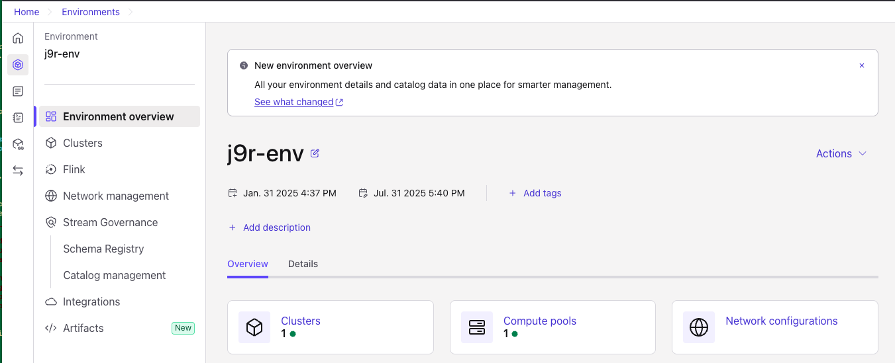
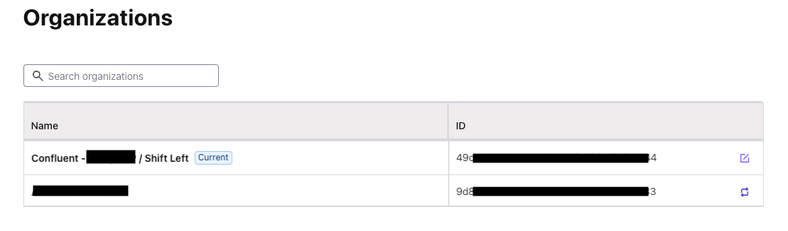
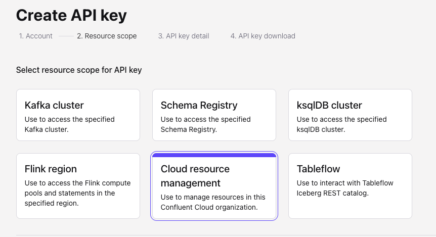
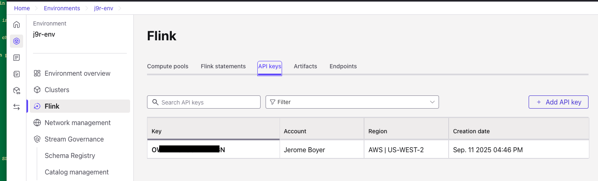

# Lab: Setup Shift_left tool

This Lab focuses on how to get started withthe shift_left tool. This tools is not yet a public pipy module so cloning the repository and do some minimum installation are needed.

To install the CLI, which is based on Python, use a Python virtual environment like venv and a Python module manafer like `pip` or [uv](https://docs.astral.sh/uv/). All the development is based on `uv` so we recommend to use it.

## 1 - Preparation

We assume you have a Confluent Cloud account, an environment sets up, a Kafka Cluster available. **shift_left** is now available on *[PyPi](https://pypi.org/project/shift_left/)*.

1. Clone this repository if you want to run the AI processing to be able to tune the system prompts: 
  ```sh
  git clone  https://github.com/jbcodeforce/shift_left_utils.git
  cd shift_left_utils
  ```

* On Windows - [enable WSL2](https://learn.microsoft.com/en-us/windows/wsl/install). The shift_left tool was developed on Mac and tested on Linux. Windows WSL should work. Powershell will not work as of now (11/2025).
* All Platforms - [install git](https://git-scm.com/book/en/v2/Getting-Started-Installing-Git)
* `make` is used to encapsulate the confluent cli, to make it easier for Data Engineers to deploy Flink statement during development: It is not used by `shift_left` tool, but `shift_left` creates the Makefile with the `shift_left table init` command (see [the recipe section](./recipes.md/#table-related-tasks)). 
    * [install make for windows](https://gnuwin32.sourceforge.net/packages/make.htm)
    * Mac OS: ```brew install make``` 
    * Linux: ```sudo apt-get install build-essential```

* All Platforms - [install confluent cli](https://docs.confluent.io/confluent-cli/current/install.html). This is not mandatory to run shift_left tool only if you want to use `make`.

* Create virtual environment:
=== "uv"
	* Once uv installed, verify the version. It should be fine to be greater or equal to 0.9.13
	```sh
	uv self version
	> ...uv 0.9.13
	```

    * Create a new virtual environment in any folder:
	 ```sh
	 # can be in the `shift_left` folder
	 uv venv --python 3.12
	 ```
	 This will create a `.venv` folder.
    * Activate the environment:
        ```sh
        source .venv/bin/activate
        ```

    * Install the cli:
        ```sh
        uv pip install shift_left
        ```

=== "Using Python and pip"
	* Install [python 3.12.xx](https://www.python.org/downloads/)
    * Create a Python virtual environment:
        ```sh
        python -m venv .venv
        ```
    * Activate the environment:
        ```sh
        source .venv/bin/activate
        ```
    * Be sure to use the pip install in the virtual environment:
        ```sh
        python -m pip --version
        ```
    * Install the `shift_left` CLI using the command:
        ```sh
        pip install shift_left
        ```

## 2- A Demonstration Project

1. [Optional] Clone a git repository with data as a product project done in Flink and in Spark. This project includes different demonstrations, but we will use the [Customer c360 analytics project](https://jbcodeforce.github.io/flink_project_demos/c360/) to support the current labs.
	```sh
	cd ..
	git clone https://github.com/jbcodeforce/flink_project_demos
	```

## 3- Get Confluent Cloud Information

The `shift_left` tool will access Confluent Cloud REST endpoint and will do operations on behalf of your Confluent user. You need to set environment variables and config file. 

1. Get the `shift_left` config file template to the tutorial folder:
	```sh
	# From the `shift_left_utils` folder
	curl  https://raw.githubusercontent.com/jbcodeforce/shift_left_utils/refs/heads/main/src/shift_left/src/shift_left/core/templates/config_tmpl.yaml  -o tutorial/setup/config.yaml
	```

### 3.1 Get Environment id from Confluent Cloud

=== "UI"
	Go to Environments from the left menu, select the environment you want to use
	

	Select the Details tab for the ID, Provider and region 
	

	and update the config.yaml
	```yaml
	 confluent_cloud:
		environment_id:  env-<TO_FILL>
	```

=== "Confluent Cloud CLI"
	```sh
	confluent login
	confluent environment list
	
	     ID     |           Name           | Stream Governance Package |
	------------+--------------------------+----------------------------
     env-nxxxx  | j9r-env                  | ADVANCED      
	```
	and update the config.yaml
	```yaml
	 confluent_cloud:
		environment_id:  env-<TO_FILL>
	```

### 3.2 Get Organization ID

=== "UI"
	Go to the contextual menu on the top right side, and then Organization settings, then copy the ID
	
	and update the config.yaml
	```yaml
	 confluent_cloud:
		organization_id: <TO_FILL>
	```

=== "Confluent Cloud CLI"
	```sh
	confluent login
	confluent organization list
	```
	Copy the ID and update the config.yaml
	```yaml
	 confluent_cloud:
		organization_id: <TO_FILL>
	```

### 3.3 Get Kafka Cluster Information

=== "UI"
	Go to Environments > Clusters > Select on Kafka Cluster > Cluster Settings > General tab
	
	and update the config.yaml
	```yaml
	kafka:
	   bootstrap.servers: <To FILL with endpoint>
	   cluster_id: <TO_FILL WITH Cluster ID>
	confluent_cloud:
		region:  <TO_FILL with Region>
		provider:  <TO_FILL with Provider>
	flink:
		catalog_name: <TO FILL with environment_name>
  		database_name: <TO FILL with cluster_name>
	```

=== "Confluent CLI"

	For the cloud provider and region
	```sh
	confluent kafka cluster list
        ID     |   Name     |  Cloud | Region    |
	-----------+------------+--------+-----------+
	lkc-3xxxxx | j9r-kafka  | aws    | us-west-2 |
	```
	and update the config.yaml
	```yaml
	kafka:
	   bootstrap.servers: <To FILL with endpoint>
	   cluster_id: <TO_FILL WITH ID>
	confluent_cloud:
		region:  <TO_FILL with Region>
		provider:  <TO_FILL with Cloud>
	flink:
		catalog_name: <TO FILL with environment_name>
  		database_name: <TO FILL with cluster_name>
	```

## 4- Get Confluent Cloud Keys and Secrets

### 4.1 Confluent Cloud API Keys and Secrets
=== "UI"
	Go to the contextual menu on the top right side, and then `Add API Key` button:
	

	Select User or Service Account
	
	
	Then resource scope
	

	Set a name and description and download the created API.

=== "Confluent CLI"
	List existing keys for your user
	```sh
	 confluent api-key list | grep username
	```

	Create a Cloud api
	```
	confluent api-key create --resource cloud
	```

* Edit the `tutorial/setup/set_env_var` file for the following variables:
	```sh
	export SL_CONFLUENT_CLOUD_API_KEY=
	export SL_CONFLUENT_CLOUD_API_SECRET=
	```

### 4.2 Kafka Cluster API Keys and Secrets

=== "UI"
	Go to Environments > Cluster > API Keys > Select the Create 
	

=== "Confluent CLI"
	List existing keys for your user
	```sh
	 confluent api-key list | grep username | grep kafka
	```

	Create a Kafka api for a cluster id:
	```sh
	confluent api-key create  --resource lkc-123456
	```

* Edit the `tutorial/setup/set_env_var` file for the following variables:
	```sh
	export SL_KAFKA_API_KEY=
	export SL_KAFKA_API_SECRET=
	```

### 4.3 Kafka Flink API Keys and Secrets

=== "UI"
	Go to Environments > Flink > API Keys tab
	

=== "Confluent CLI"
	List existing keys for your user
	```sh
	 confluent api-key list | grep username | grep kafka
	```

	Create a Kafka api for a cluster id:
	```sh
	confluent api-key create  --resource lkc-123456
	```

* Edit the `tutorial/setup/set_env_var` file for the following variables:
	```sh
	export SL_FLINK_API_KEY=
	export SL_FLINK_API_SECRET=
	```

## 5- Finalize environment variables

Shift_left uses the CONFIG_FILE and PIPELINES environment variables all the time. So it is important to set them correctly. The following setting should work for the different labs of this tutorial.

```sh
export FLINK_PROJECT=$PWD/../flink_project_demos/customer_360/c360_flink_processing
export PIPELINES=$FLINK_PROJECT/pipelines
export STAGING=$FLINK_PROJECT/staging
export SRC_FOLDER=$FLINK_PROJECT/../c360_spark_processing
export CONFIG_FILE=$PWD/tutorial/setup/config.yaml
```

* Set your terminal shell with those environment variables:
	```sh
	source tutorial/setup/set_env_var
	```

## 6- Validate the configuration

The shift_left CLI works with 3 top level commands: `project`, `table` and `pipeline`. With the project the `validate_config` helps to debug the config.yaml specified by the CONFIG_FILE environment variables.

```sh
shift_left version
shift_left project validate-config
```

A CONFIG_FILE matches a specific environment, kafka cluster and Flink. So when working with different environments or different Kafka Clusters within an environment, it is recommended to use different config.yaml and environment variables.

???- warning "Security access"
    The config.yaml and environment variable files should ignored in Git. 
